# Lecture 10: Geometry 1 (Introduction)

环境贴图： https://www.cnblogs.com/KillerAery/p/15106770.html#%E5%A4%A9%E7%A9%BA%E7%9B%92skybox

球面环境贴图：https://zhuanlan.zhihu.com/p/84494845

Bump Mapping：【GAMES101-现代计算机图形学课程笔记】Lecture 10 Geometry 1 （介绍） - marsggbo的文章 - 知乎 https://zhuanlan.zhihu.com/p/147354628

# Applications of Texture

- #### In modern GPUs, texture  = memory + range query (filtering)

  - #### General method to bring data to fragment calculations 

  - Many applications

    - #### Environment Lighting

    - #### Store microgeometry

    - #### Procedural textures

    - #### Solid modeling
    
    - #### Volume rendering
    
    - #### ...

### Environment Map

###### 		现实世界的环境光是非常复杂的，存在大量的经过多次反射后到达着色物体后再到达人眼的间接光（例如光线照在窗户上，窗户再反射到杯子上，杯子再将光线返回到人眼），这个过程中会把反射经过的物体颜色按一定权重混合在一起（因此看到杯子混合了窗户的颜色），最后再着色物体形成近似 “镜面反射” 的效果（本质上就算接受了复杂环境光的结果 也被称作为 “环境映射" Environment Mapping）

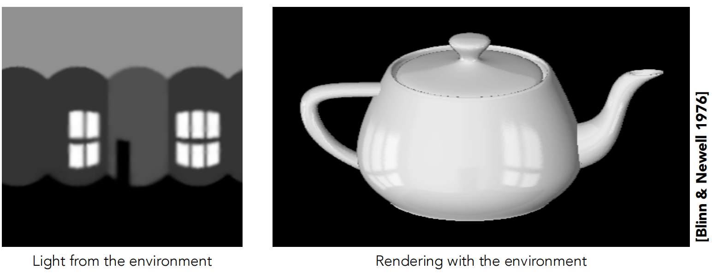

###### 																		左图中展示的为环境中的光线，右图为在物体上展示的环境光线效果

###### 		为了实现接受环境光的效果，我们可以用一个贴图来存放环境光信息，即 环境贴图 Environment Map 或 反射贴图 Reflection Map，再给物体着色的时候不仅采样普通纹理，也采样环境贴图，按一定比例混合这两者的颜色（例如物体材质越光滑，镜面反射效果越强）

### Environmental Lighting

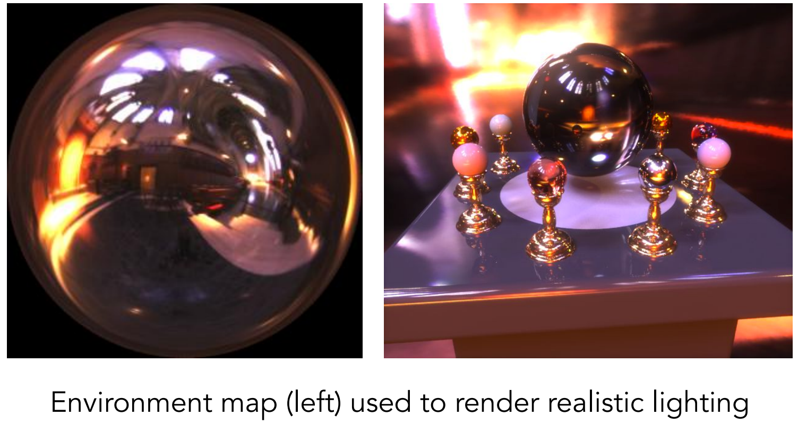

### Spherical Environment Map

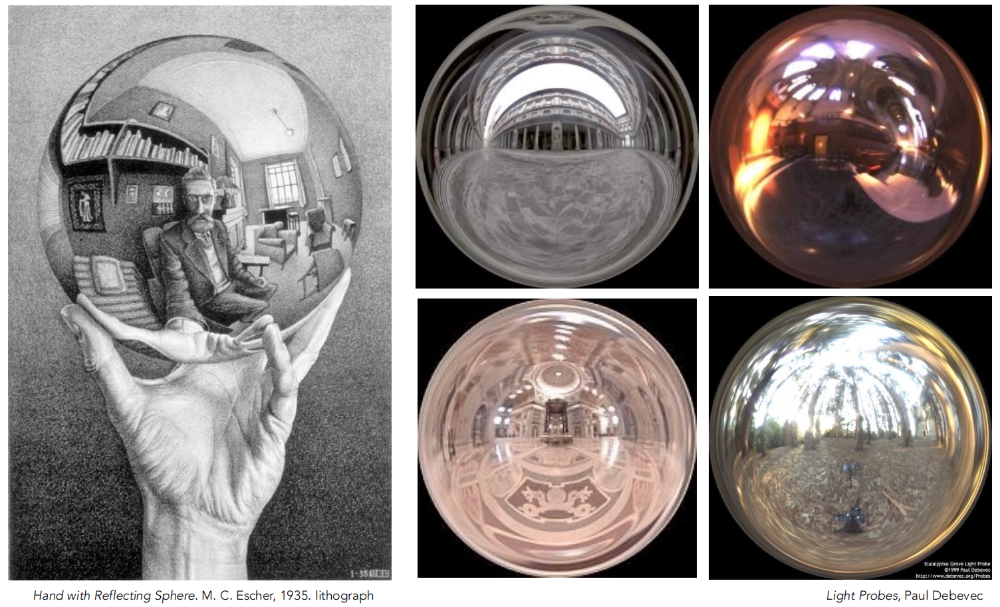

### Spherical Map — Problem

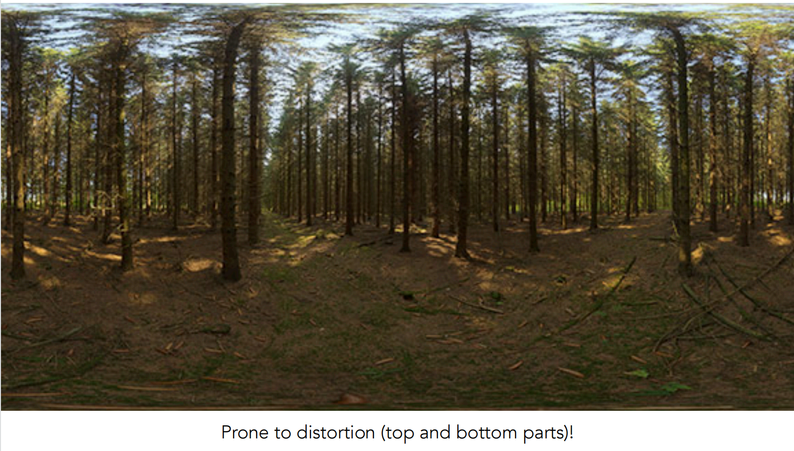

###### 																									球面贴图带来的问题，易于失真，在贴图上下可以看出

###### 在某些情况下，我们可能需要将空间中的曲面 （一般是指凸多面体）映射到纹理平面，即 :   $f: \R^3 \rightarrow \R^2; \ (x,y,z) \rightarrow (uv)$

###### 那么就需要借助 球形贴图 Spherical Map 或者 立方体贴图 Cube Map

### Spherical Map

###### 	球形贴图映射的思路：

   1. ###### 假设一个单位求包围了物体中心，当物体中心看向物体表面的某个位置 $(x,y,z)$ 时，从物体中心朝这个位置发出一条射线，此时射线会与单位球相交于某点。

			1. ###### 根据射线与单位球体的交点坐标 $(x_o,y_o,z_o)$ ，推算出焦点所在的偏航角与俯仰角 $(yaw, pitch)$，然后来映射成在球形贴图对应的 $(u,v)$ 坐标点。

###### 

### Cube Map

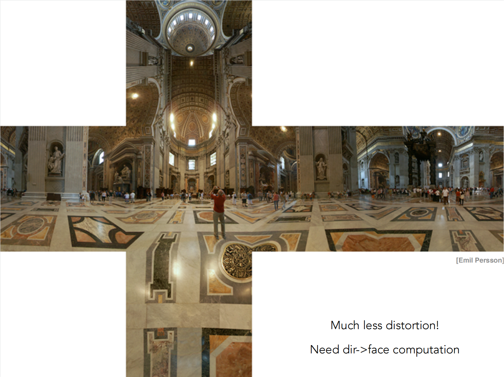

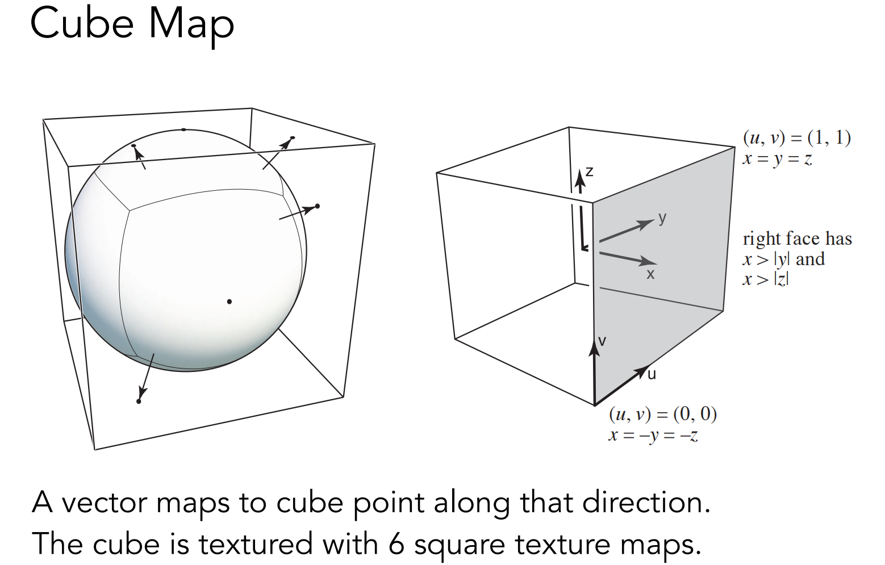

###### 	立方体贴图映射的思路：

  1. ###### 假设一个单位立方体包围了物体中心，当物体中心看向物体表面某个位置 $(x,y,z)$ 时，从物体中心朝这个位置发出一条射线与立方体交于某点。

  2. ###### 根据射线与单位立方体的交点坐标 $(x_o,y_o,z_o)$，在 $x_o,y_o,z_o$ 中取绝对值最大的那个分量，根据它的符号来判定来确定要映射在哪一个面。

  3. ###### 在确定映射第几个面后，剩余另外两个分量便是来映射成在第几张立方体贴图中的 $(u,v)$ 的坐标点。

### Textures can affect shading!

#### 	Texture doesn't have to only represent colors

  - #### What of ot stores the height / normal ?

  - #### Bump / normal mapping

  - #### Fake the detailed geometry

​										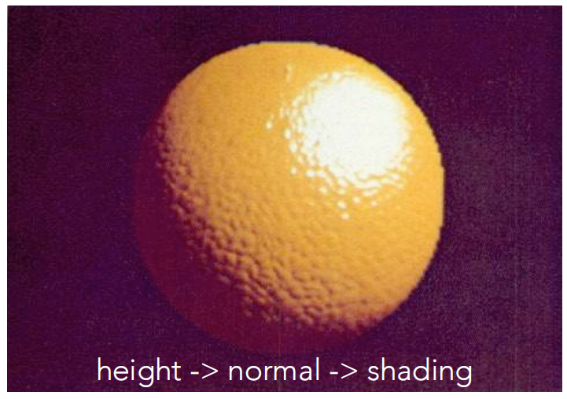

### Bump Mapping

#### 	Adding surface detail without adding more triangles

- ##### Perturb ***surface normal*** per pixel  (for shading computations only)

- ##### ***Height shift*** per texel defined by a texture

- ##### How to modify normal vector?

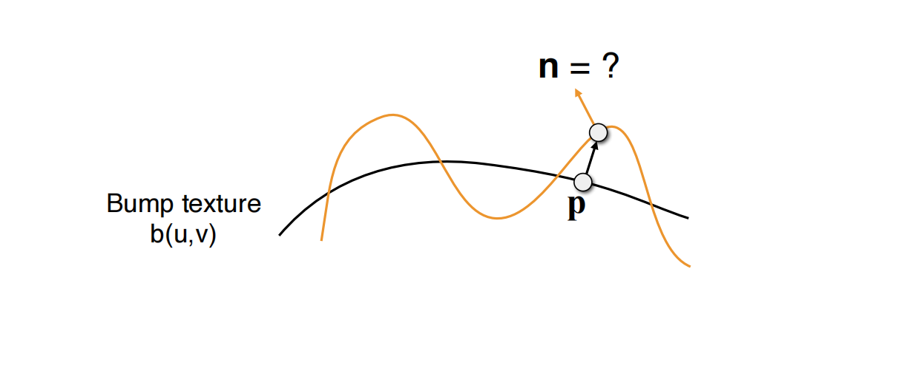

### How to perturb the normal (in flatland)

- #### Original surface normal $n(p) = (0, 1)$

  从上图中（黄色曲线线代表法线贴图，黑色曲线代表平面）可知，P点的原始法线方向是垂直于P点向上的。

- #### Derivative at $p$ is $dp = c \times [h(p+1) -h(p)]$

  下图中的蓝色曲线代表法线贴图，那么P点横向移动一个单位后，向上会移动 $dp$ （假设P点会朝着切线方向运动）切线方向即为该点的梯度，则可以由梯度公式得到 $dp$ ，其中 c 是一个常量，切线可以表示为 $(1, dp)$ 。perturb 后的法线方向是切线逆时针旋转 $90^{\circ}$ ，得到的法线向量为 $(-dp，1,)$

- #### Perturbed noraml is then $n(p)=(-dp,1).normalized()$ 

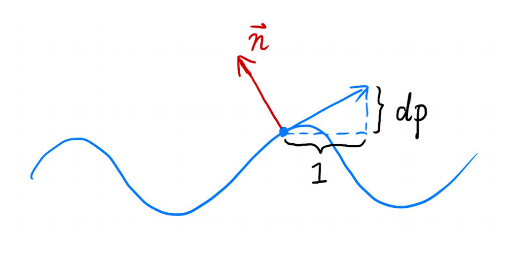

### How to perturb the normal (in 3D)

- #### Original surface normal  $n(p) = (0, 0, 1)$

- #### Derivatives at p are

  - #### $\frac{dp}{du}= c1*[h(u+1)-h(u)]$

  - #### $\frac{dp}{dv}= c1*[h(v+1)-h(v)]$

- #### Perturbed normal is  $n(p) = (-\frac{dp}{du}, -\frac{dp}{dv}, 1).normalized()$

​	

### Displacement Mapping  - a more advanced approach

#### 	Uses the same texture as in bumping mapping

#### 	Actually moves the vertices

​											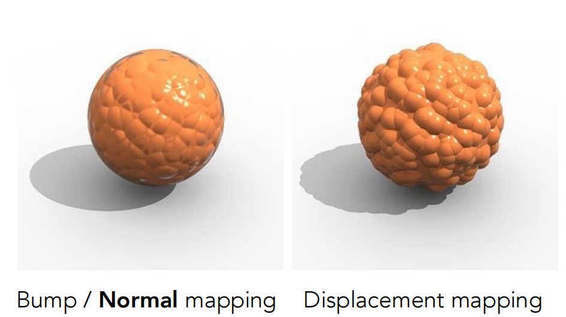	

​		唯一贴图和法线贴图使用的纹理是一样的，只不过位移贴图不再变换法线方向，而是真实的对每个三角形的顶点做一定的位移。

​		左图是法线贴图，可以看出并没有改变物体形状，轮廓与阴影都是圆形，所以这种方式改变法线造成了视觉上的假象。

​		右图是位移贴图，可以看出轮廓与阴影的凹凸感非常明显，这是真实的对物体的形状进行了改变。

​		上面的对比可以看出位移贴图虽然效果更好，但是由于需要将物体细分为更多的三角形，才能更准确的描述出凹凸特点，但是会增加计算量。

### 3D Procedural Noise + Solid Modeling

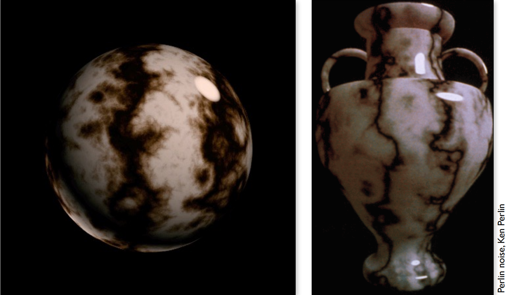

### Provide Precomputed Shading

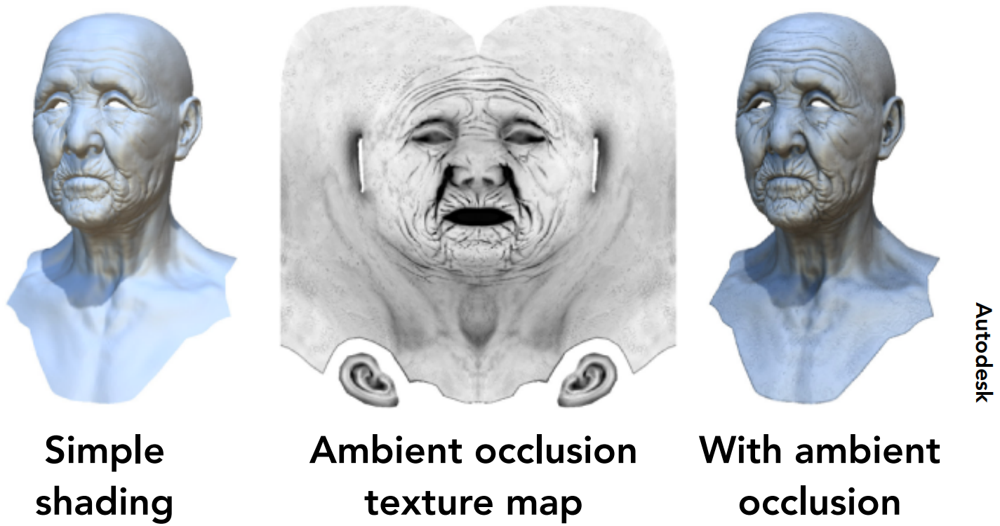

### 3D Textures and Volume Rendering

​	     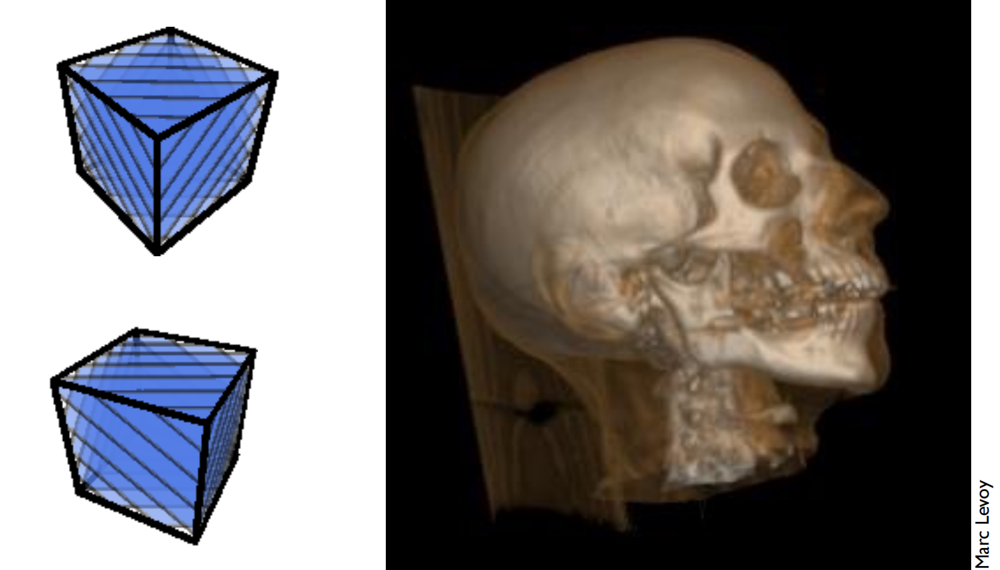	

### Bump Mapping

	#### Adding surface detail without adding more triangles

### Displacement Mapping  

#### a more advanced approach

### 3D procedural Noise + Solid Modeling

### Provide Precomputed Shading

### 3D Texture and Volume Rendering

# Introduction to Geometry

几何： https://www.cnblogs.com/KillerAery/p/14890890.html

## 	Example of geometry

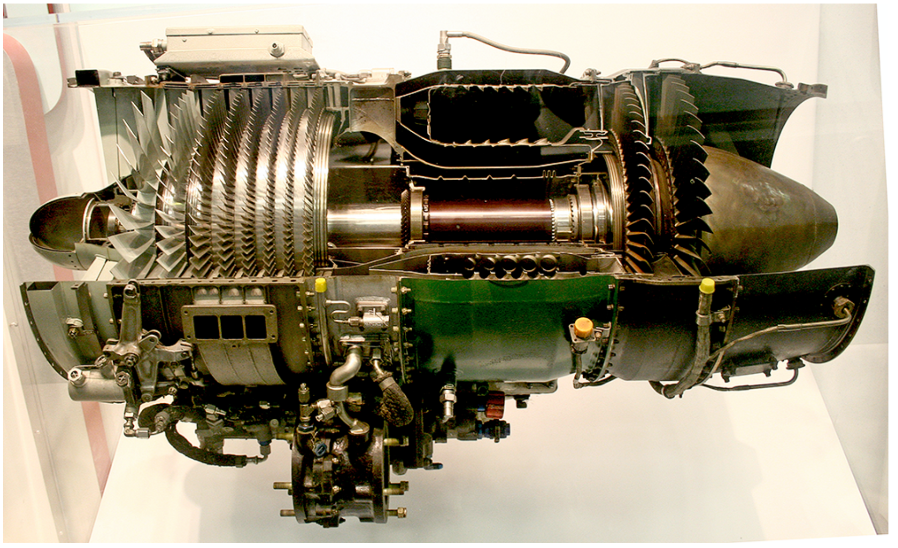

​	

### Many Ways to Represent Geometry

#### Implicit

- ##### algebraic surface
- ##### level sets
- ##### distance funcitons
- ...

#### Explicit

- ##### point cloud
- ##### polygon mesh
- ##### subdivsion, NURBS
- ...

#### Each choice best suited to a different task/type of geometry

### "Implicit" Representations of Geometry

#### 		Based on classifying points

#### 			Points satisfy some specified relationship

#### 		E.g. sphere: all point in 3D, where  $x^2 + y^2 + z^2 =1$

#### 		More generally, $f(x,y,z)= 0$

​	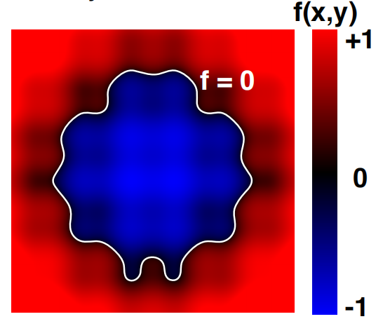

​	

### 	Implicit Surface — Sampling Can Be Hard

#### 		$f(x,y,z)=(2-\sqrt{x^2+y^2})^2 + z^2 -1$

​		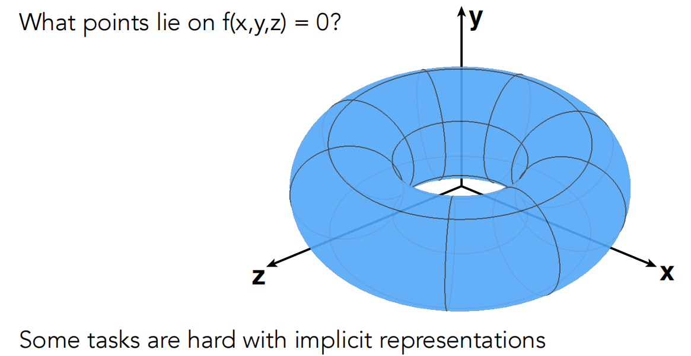

### Explicit Representations of Geometry

#### Distance Functions （Implicit）

An Example: Blending a moving boundary

### Level Set Methods (Also implicit)

#### Fractals

​	