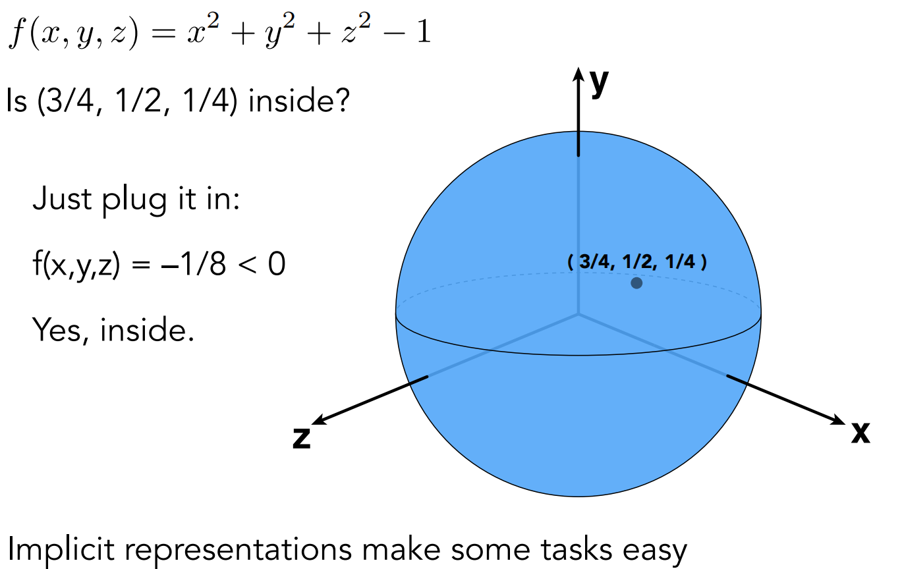
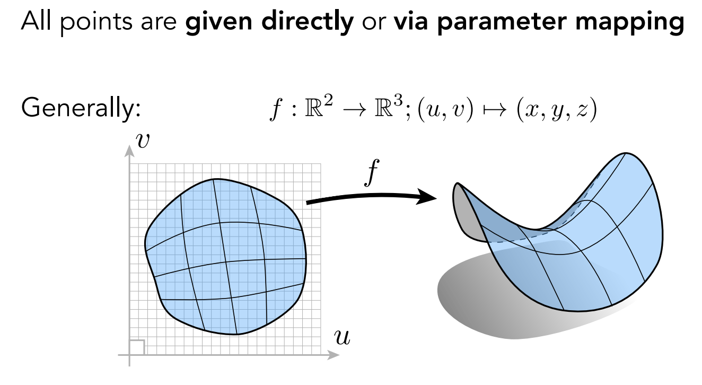
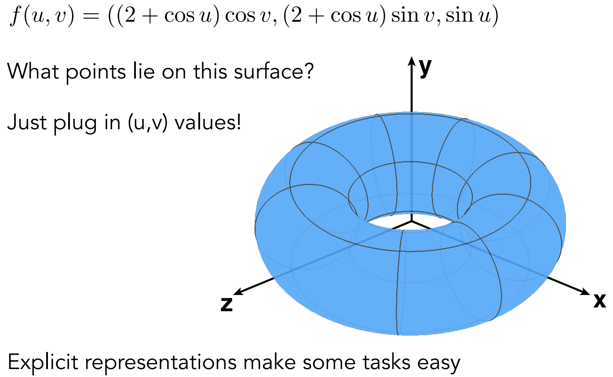
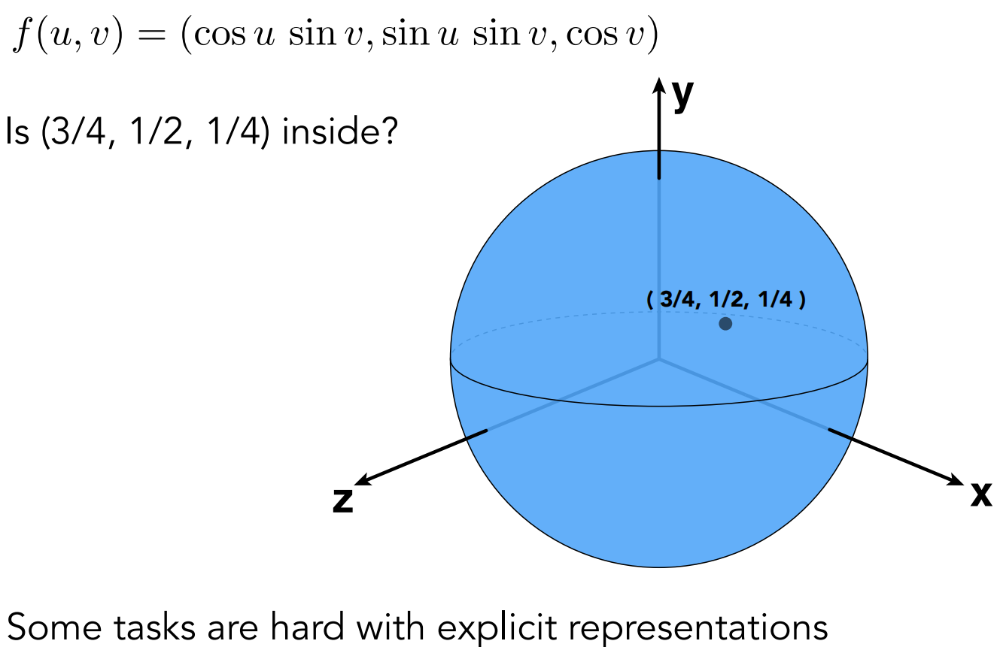
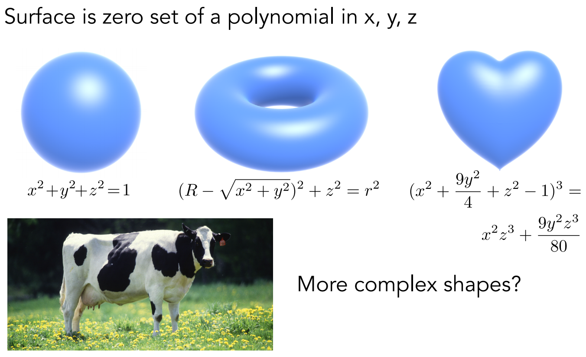
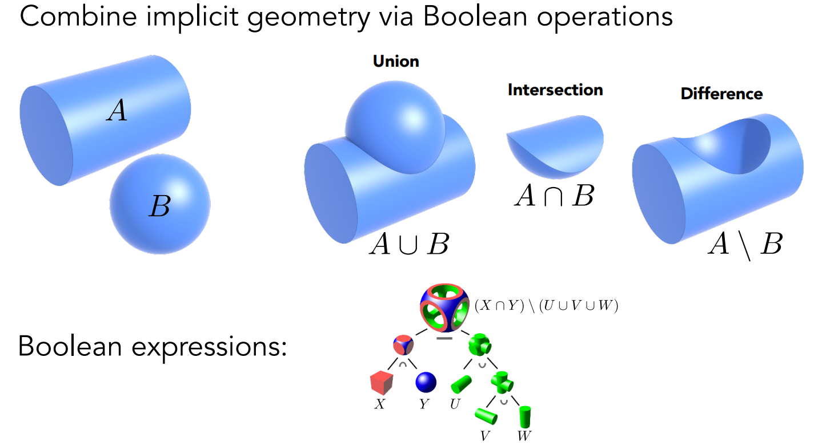
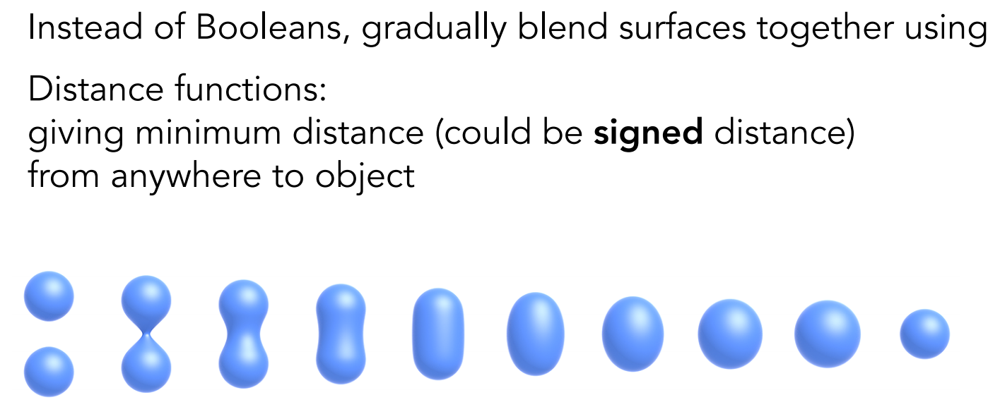
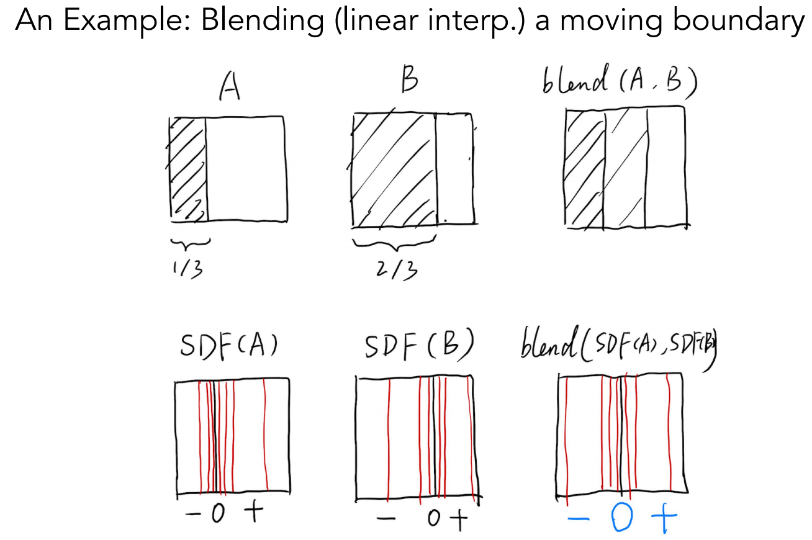
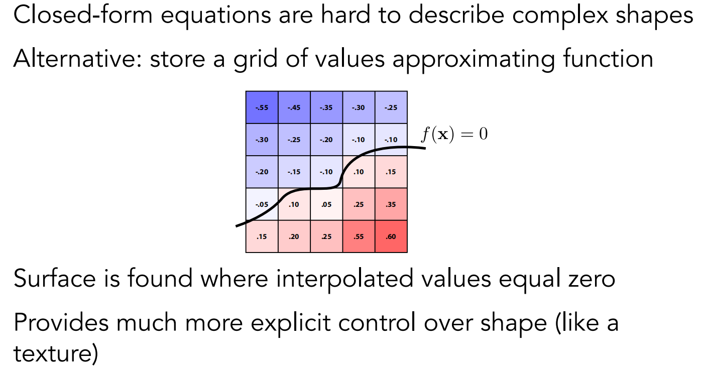
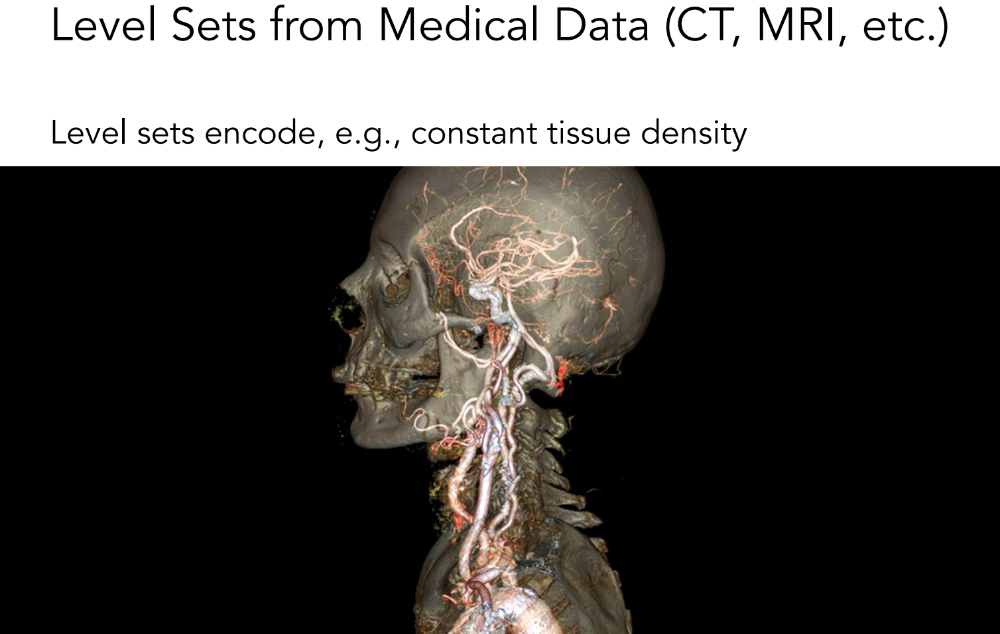

# Lecture 10: Geometry 1 (Introduction)

环境贴图： https://www.cnblogs.com/KillerAery/p/15106770.html#%E5%A4%A9%E7%A9%BA%E7%9B%92skybox

球面环境贴图：https://zhuanlan.zhihu.com/p/84494845

Bump Mapping：【GAMES101-现代计算机图形学课程笔记】Lecture 10 Geometry 1 （介绍） - marsggbo的文章 - 知乎 https://zhuanlan.zhihu.com/p/147354628

# Applications of Texture

- #### In modern GPUs, texture  = memory + range query (filtering)

  - #### General method to bring data to fragment calculations 

  - Many applications

    - #### Environment Lighting

    - #### Store microgeometry

    - #### Procedural textures

    - #### Solid modeling
    
    - #### Volume rendering
    
    - #### ...

### Environment Map

###### 		现实世界的环境光是非常复杂的，存在大量的经过多次反射后到达着色物体后再到达人眼的间接光（例如光线照在窗户上，窗户再反射到杯子上，杯子再将光线返回到人眼），这个过程中会把反射经过的物体颜色按一定权重混合在一起（因此看到杯子混合了窗户的颜色），最后再着色物体形成近似 “镜面反射” 的效果（本质上就算接受了复杂环境光的结果 也被称作为 “环境映射" Environment Mapping）

###### 																		左图中展示的为环境中的光线，右图为在物体上展示的环境光线效果

###### 		为了实现接受环境光的效果，我们可以用一个贴图来存放环境光信息，即 环境贴图 Environment Map 或 反射贴图 Reflection Map，再给物体着色的时候不仅采样普通纹理，也采样环境贴图，按一定比例混合这两者的颜色（例如物体材质越光滑，镜面反射效果越强）

### Environmental Lighting

### Spherical Environment Map

### Spherical Map — Problem

###### 																									球面贴图带来的问题，易于失真，在贴图上下可以看出

###### 在某些情况下，我们可能需要将空间中的曲面 （一般是指凸多面体）映射到纹理平面，即 :   $f: \R^3 \rightarrow \R^2; \ (x,y,z) \rightarrow (uv)$

###### 那么就需要借助 球形贴图 Spherical Map 或者 立方体贴图 Cube Map

### Spherical Map

###### 	球形贴图映射的思路：

   1. ###### 假设一个单位求包围了物体中心，当物体中心看向物体表面的某个位置 $(x,y,z)$ 时，从物体中心朝这个位置发出一条射线，此时射线会与单位球相交于某点。

			1. ###### 根据射线与单位球体的交点坐标 $(x_o,y_o,z_o)$ ，推算出焦点所在的偏航角与俯仰角 $(yaw, pitch)$，然后来映射成在球形贴图对应的 $(u,v)$ 坐标点。

### Cube Map

###### 	立方体贴图映射的思路：

  1. ###### 假设一个单位立方体包围了物体中心，当物体中心看向物体表面某个位置 $(x,y,z)$ 时，从物体中心朝这个位置发出一条射线与立方体交于某点。

  2. ###### 根据射线与单位立方体的交点坐标 $(x_o,y_o,z_o)$，在 $x_o,y_o,z_o$ 中取绝对值最大的那个分量，根据它的符号来判定来确定要映射在哪一个面。

  3. ###### 在确定映射第几个面后，剩余另外两个分量便是来映射成在第几张立方体贴图中的 $(u,v)$ 的坐标点。

### Textures can affect shading!

#### 	Texture doesn't have to only represent colors

  - #### What of ot stores the height / normal ?

  - #### Bump / normal mapping

  - #### Fake the detailed geometry

​										

### Bump Mapping

#### 	Adding surface detail without adding more triangles

- ##### Perturb ***surface normal*** per pixel  (for shading computations only)

- ##### ***Height shift*** per texel defined by a texture

- ##### How to modify normal vector?

### How to perturb the normal (in flatland)

- #### Original surface normal $n(p) = (0, 1)$

  从上图中（黄色曲线线代表法线贴图，黑色曲线代表平面）可知，P点的原始法线方向是垂直于P点向上的。

- #### Derivative at $p$ is $dp = c \times [h(p+1) -h(p)]$

  下图中的蓝色曲线代表法线贴图，那么P点横向移动一个单位后，向上会移动 $dp$ （假设P点会朝着切线方向运动）切线方向即为该点的梯度，则可以由梯度公式得到 $dp$ ，其中 c 是一个常量，切线可以表示为 $(1, dp)$ 。perturb 后的法线方向是切线逆时针旋转 $90^{\circ}$ ，得到的法线向量为 $(-dp，1,)$

- #### Perturbed noraml is then $n(p)=(-dp,1).normalized()$ 

### How to perturb the normal (in 3D)

- #### Original surface normal  $n(p) = (0, 0, 1)$

- #### Derivatives at p are

  - #### $\frac{dp}{du}= c1*[h(u+1)-h(u)]$

  - #### $\frac{dp}{dv}= c1*[h(v+1)-h(v)]$

- #### Perturbed normal is  $n(p) = (-\frac{dp}{du}, -\frac{dp}{dv}, 1).normalized()$

​	

### Displacement Mapping  - a more advanced approach

#### 	Uses the same texture as in bumping mapping

#### 	Actually moves the vertices

​												

​		唯一贴图和法线贴图使用的纹理是一样的，只不过位移贴图不再变换法线方向，而是真实的对每个三角形的顶点做一定的位移。

​		左图是法线贴图，可以看出并没有改变物体形状，轮廓与阴影都是圆形，所以这种方式改变法线造成了视觉上的假象。

​		右图是位移贴图，可以看出轮廓与阴影的凹凸感非常明显，这是真实的对物体的形状进行了改变。

​		上面的对比可以看出位移贴图虽然效果更好，但是由于需要将物体细分为更多的三角形，才能更准确的描述出凹凸特点，但是会增加计算量。

### 3D Procedural Noise + Solid Modeling

### Provide Precomputed Shading

### 3D Textures and Volume Rendering

​	     	

### Bump Mapping

	#### Adding surface detail without adding more triangles

### Displacement Mapping  

#### a more advanced approach

### 3D procedural Noise + Solid Modeling

### Provide Precomputed Shading

### 3D Texture and Volume Rendering

# Introduction to Geometry

几何： https://www.cnblogs.com/KillerAery/p/14890890.html

计算机表示物体形状的基本方法、贝塞尔曲线、B样条曲线、NURBS 曲线、Catmull-Rom 样条曲线 - zhiwei的文章 - 知乎 https://zhuanlan.zhihu.com/p/587486358

## 	Example of geometry

​	

### Many Ways to Represent Geometry

#### Implicit

- ##### algebraic surface
- ##### level sets
- ##### distance funcitons
- ...

#### Explicit

- ##### point cloud
- ##### polygon mesh
- ##### subdivsion, NURBS
- ...

#### Each choice best suited to a different task/type of geometry

------

### "Implicit" Representations of Geometry

#### 			Based on classifying points

#### 				Points satisfy some specified relationship

#### 			E.g. sphere: all point in 3D, where  $x^2 + y^2 + z^2 =1$

#### 			More generally, $f(x,y,z)= 0$

​		

​	 	隐式表示指的是通过点之间的某种特殊关系来构建几何体，例如三维空间中球体的表达式 $x^2 + y^2 + z^2 =1$ ，这代表三维空间中一个球体表面上的任意一个点的坐标都满足这个表达式。

​		 更通用的表达式是 $f(x,y,z)= 0$ ，满足这个公式则表示该点在这个隐式定义的物体表面上。

​		 隐式表示也有明显的缺点，只观察公式无法得知对应的物体是什么几何形状。

​		 并且，很难通过表达式计算出  满足 $f(x,y,z)= 0$ 表达式的点坐标，因为这变成了一个方程的求根问题了。

### 	Implicit Surface — Sampling Can Be Hard

​		

#### 		$f(x,y,z)=(2-\sqrt{x^2+y^2})^2 + z^2 -1$

​		

​	

### Implicit Surface — Inside/Outside Tests Easy

​			  使用隐式表示可以很方便的判断一个点是否在物体的内部还是物体的外部，根据隐式表达式，当  $f(x,y,z) \lt 0$ 时，这个点就在几何体的内部。当 $f(x,y,z) \gt 0$ 时，这个点就在几何体的外部。

------

### Explicit Representations of Geometry

​		 显式表示指的是几何体的所有点通过直接或者参数映射的方式给出，这样显式表示的几何体可以直观的看出它的形状。例如上图，是直接将左边uv坐标系中的点通过某种映射关系直接映射到三维坐标系的某个坐标点了，所以可以直观显示。

​		 显式表示与隐式表示相反，由于已经知道了构成几何体表面的点有哪些，可以直观的判断出某个点是否在几何体的表面上。

​		 显式表示也有明显的缺点，如果我们想知道三维空间中某个点的位置是否在几何体内，这其实是进行将三维参数反映射（得出 三维坐标映射为二维坐标的表达式，逆过程）为二维参数的操作，这是非常困难的，当隐式表示则很容易处理这种问题。

### Explicit Surface — Sampling Is Easy

### Explicit Surface — Inside/Outside Test Hard

### Best Representation Depand on the Task!

### Alegbraic Surfaces (Implicit)

### Constructive Silid Geometry (Implicit)

​	通过布尔运算生成新的几何体，但是不清楚为什么两个隐式几何体为什么可以进行布尔运算。它的数学依据在哪里。

------

[符号距离函数(SDF)](https://www.zhihu.com/column/c_1431297491883384833) https://zhuanlan.zhihu.com/p/420700051

SDF(signed distance field)基础理论和计算 - gzhao01的文章 - 知乎 https://zhuanlan.zhihu.com/p/536530019

计算机图形学九：隐式曲面(代数形式,CSG, 距离函数,分型几何)与显式曲面 - 孙小磊的文章 - 知乎 https://zhuanlan.zhihu.com/p/144392820

### Distance Functions （Implicit）符号距离函数

​	  通过距离函数也可以得到几何形体混合的效果，为了得到下图中的Blend效果，需要了解 SDF 即 Single Distance Function 符号距离函数（符号的意思指距离可以有正有负）

An Example: Blending a moving boundary

​		对于符号距离函数来说本质上就是一种定义距离的函数，比如在空间中一点到各个几何物体表面的的距离，对这些距离做各种各样的运算操作最后得到的一个函数就最终的距离函数了。

​			这样的一个二维平面为例，定义平面中每一个点的SDF为该点到阴影区域右边界的垂直距离，在阴影内部为负，外部为正。图中展示了A和B两种阴影的SDF，有了SDF(A) , SDF(B) 之后对这两个距离函数选择性的做一些运算得到最终的距离函数，这里采用最简单的 SDF = SDF(A)  + SDF(B) 举例，最终得到的 SDF 为 0 的 点集 即为 blend 之后的曲面，对该例来说，就是两道阴影中的一条线。

​			对于上面两个球体的 blend，只需要合理定义空间中的任意一个点的 SDF，再令 SDF 为 0 即可得到混合后的边界，也就可以得到 blend 后的效果了。

### Level Set Methods (Also implicit) 水平集

​		上面的距离函数需要定义出一个解析表达式，但是有时候我们不一定能够求出这个解析式。那么针对这种情况我们可以用level set（水平集）来表示几何形状。

​		我们看下面的例子来解释什么是level set。其实就是我们给每个格子设定一个值，然后找出值为的地方连起来就得到了level set，连接起来也就形成物体表面。

​	

​		上面例子是在2D平面的levelset，我们也可以在3D上生成level set，这在医学数据上用的比较多。此时的一个大致思路是我们给三维定义出一个密度level set，因为不同器官组织的密度是不一样的，那么我们通过选取不同的levelset，也就得到了不同的器官或组织的表面形状了。

​	