# Lecture 11 Geometry 2 (Curves and Surfaces)

## Explicit Representations

### Curves

1.  #### Bezier Curves
2. #### De Casteljau's algorithm
3. #### B-splines, etc.

#### Surfaces

1. #### Bezier surfaces
2. #### Triangles & quads
   
   - #### Subdivision, simplification, regularization

## Explicit Representations in Computer Graphics

### Many Explicit Representations in Graphics

#### 		triangle meshes , Bezier surfaces , subdivision surfaces , NURBS , point clouds ... 

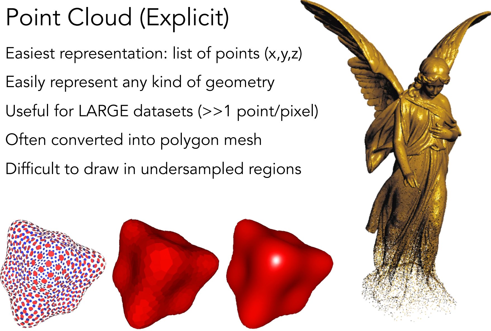

### Polygon Mesh (Explicit)

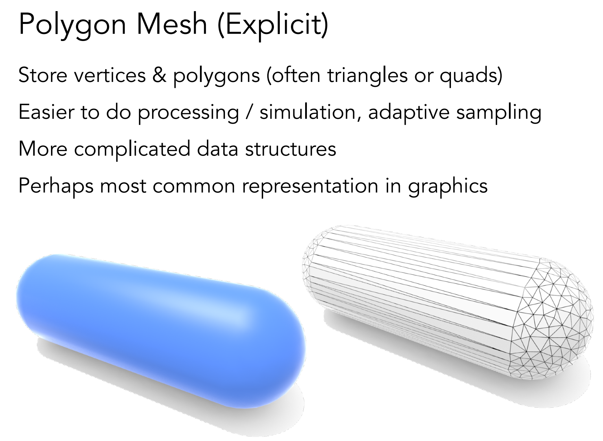

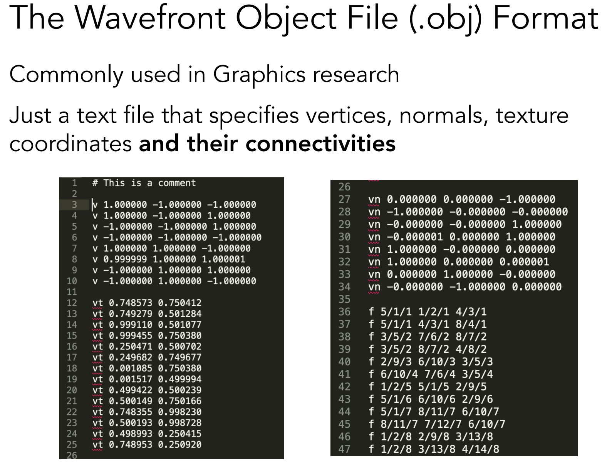

------

## Curves

#### 			图形学为什么需要曲线和曲面

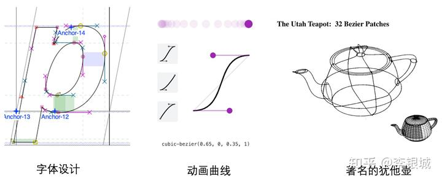

​						在生活中存在着各种各样光滑的曲线或曲面，例如汽车的表面，钢球等。在建模的时候，我们通常使用很多小三角形面来逼近曲面，因此放大了看，这些面其实是凹凸不平的。

​						如何把纸上书写的文字、绘制的图案在计算机中显示和存储？ 最简单的方法是用像素点来表示，也就是拍照的方式。但这种方法无法矢量化，例如无法表示大小不同的文字和茶壶，并且此种方法占用的存储空间大，且边缘可能会不平滑。

​						因此，早期的人们就想到了使用曲线来拟合纸上的图案或者现实世界中的物体，那我们应该怎么表达这些光滑的曲线或曲面呢，先看一下它的**几种表达方式**：

#### 曲线的显示表示 (Explicit representation)

​			常用的显式表示比如 体素Voxel， 点云Point Cloud，三角面片Mesh 等。

​			例如 $y = x^2$ 画出来的图其实就是一条曲线

​			                             								   

​						                                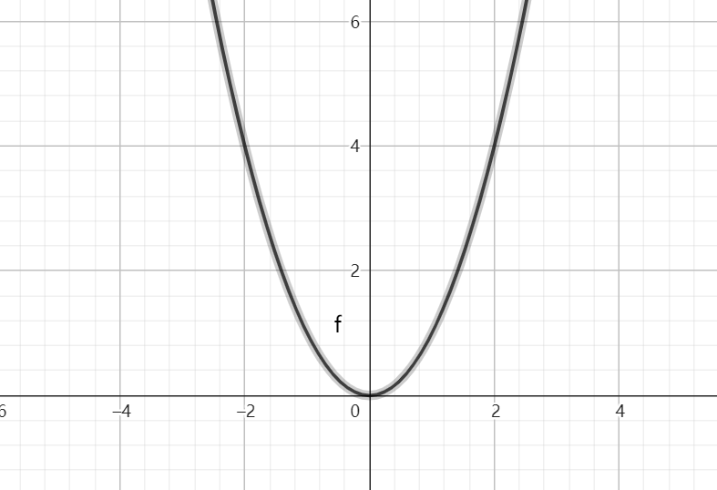  

​			当然还有 $y = x^3 +7$ 等函数，可以画出各式各样的曲线。这种 $y= f(x)$ 的表达方式，我们称之为二维空间中曲线的**显示表示**。即 **以自变量 $(x)$ 来表达因变量 $(y)$ 的值**。	

​			

#### 曲线的隐式表示 (Implicit representation)

​			比较常用的隐式表示有 Signed Distance Function（SDF），占用场 Occupancy Field ，神经辐射场 Neural Radiance Field （NeRF）

​			函数 $f(x)=y$ 是自变量 $x$ 的集合到因变量 $y$ 集合的映射，也就是每个 $x$ 对应一个 $y$  。 

​			场的定义是向量到向量或数的映射，空间中的场可以认为是 “空间中点” 到 “点的属性”的映射，也就是每个点对应这个点的属性。以磁场为例，磁场就是空间中每个点都具有一个磁感应矢量 $B$ 。在其它情况下，点不一定对应到向量，也可以对应到标量或者其他属性，只要是空间中点到属性的映射都是空间场。（一般使用坐标 $(x,y,z)$表示空间中的点，所以点到属性的映射实际上是 $(x,y,z)$ 对应属性 $s$ ，如场 $F:(x,y,z)\rightarrow s$ 这里的  $s$ 可以是向量也可以是标量。

​			

​			Signed Distance Function （SDF）

​			SDF表示一个点到一个曲面的最小激励，同时用正负区分点在曲面内外。点在曲面内部则规定距离为负值，点在曲面外部则规定距离为正值，点在曲面上则距离为0 。

​			$SDF(x)=s:x \in \mathbb{R^3} s \in \mathbb{R}$

​			首先看2D中SDF的形式：

​			Signed Distance Function 表示带符号的距离函数，但还有不带符号的距离函数Unsigned Distance Function，2D中的Unsigned Distance Function表示如下：图片来自 知乎 gzhao01

 			这里的黑色就是表示的形状，在Unsigned Distance Function下，形状内部的点的距离被定义为0，而形状外部的点代表这个点到形状的最短距离。

​			 相较于Unsigned Distance Function， Signed Distance Function增加了正和负的概念，内部和外部的点的绝对值代表点到形状的距离，这时内部的点不再都是0，而是用负值表示，外部的点用正值表示。

​				图中红色表示在形状外部的点，绿色代表在形状内部的点，黑色代表边界，可以看出黑色两侧的点的值的正负发生了变化，也就是说 SDF = 0表示的曲线可以代表形状的边界。

​				理解了二维的SDF，就可以类推到三维的SDF，可以想象一个空间，空间中有正值和负值的点，而正负值的交界处就可以认为是空间曲面。

​				图中一部分点（蓝色）的 SDF小于0，另一部分点（红色）的SDF值大于0，而大于 0 小于 0 的点之间的边界，也就是需要表示的曲面，也就是说，曲面可以使用 SDF = 0 函数表示。

​				

​			隐式表示，就是利用**隐式方程**来刻画一条曲线，在二维空间中一个隐式的曲线可以通过 $f(x,y)=0$ 来表达，例如圆的隐式方程即为： $x^2 + y^2 -r^2 =0$ ，用它即可表示一个半径为 $r$ 的圆。

​	隐式表示的实际用途与有向距离场

​	 https://blog.csdn.net/weixin_43117620/article/details/131980822

#### 曲线的参数形式表示 (Parametric form)

​			该形式也是图形学里最关心和最常用的形式。一个曲线的参数形式是通过一个自变量 （参数 t）来表达曲线上每个点的空间坐标，它也可以算作是**显示表示**的一种。

​			在三维空间中，我们可以用如下三个显示的函数，来表示一条空间曲线。

- ​	$x = x(t)$
- ​	$y = y(t)$
- ​	$z = z(t)$

​			$t = 0$ 即代表曲线的起点， $t =1$ 代表曲线的终点，因此可以用 $t (0 \le t \le 1)$ 代表曲线上的任意一点 $P(t)$ , 然后将 $t$ 的值带入三个显示的方程，即可求出曲线上点 $P$ 的坐标：

​			$P(t) = (x(t), y(t), z(t))$

​	    参数曲线并不是唯一的，一个给定个点曲线或者曲面可以通过不同的形式进行表达。给定一个表达式可以画出一个唯一的曲线，但是该曲线可能还有别的表达式表示。

​		参数形式有一个好处，例如上例中表达的是三维空间中的曲线，如果我们删除了当中的的 $z=z(t)$ 就变成了一个二维空间的曲线，改变维度非常方便，增加或减少对应维度显示方程即可。

​		在上面的参数方程中 $t$ 的范围是 $0-1$ ，每个取值即代表曲线上的一点，**那么只要 $t$ 值从 $0$ 到 $1$ ，点就会沿着曲线行走，就可以得到曲线轨迹，实现曲线的绘制**。

​		还可以对每个点求导，即 $\frac{dP(t)}{dt} =(\frac{dx(t)}{dt},\frac{dy(t)}{dt},\frac{dz(t)}{dt})$， 得到的结果被视为曲线的绘制速度，该导数指向曲线的切线。

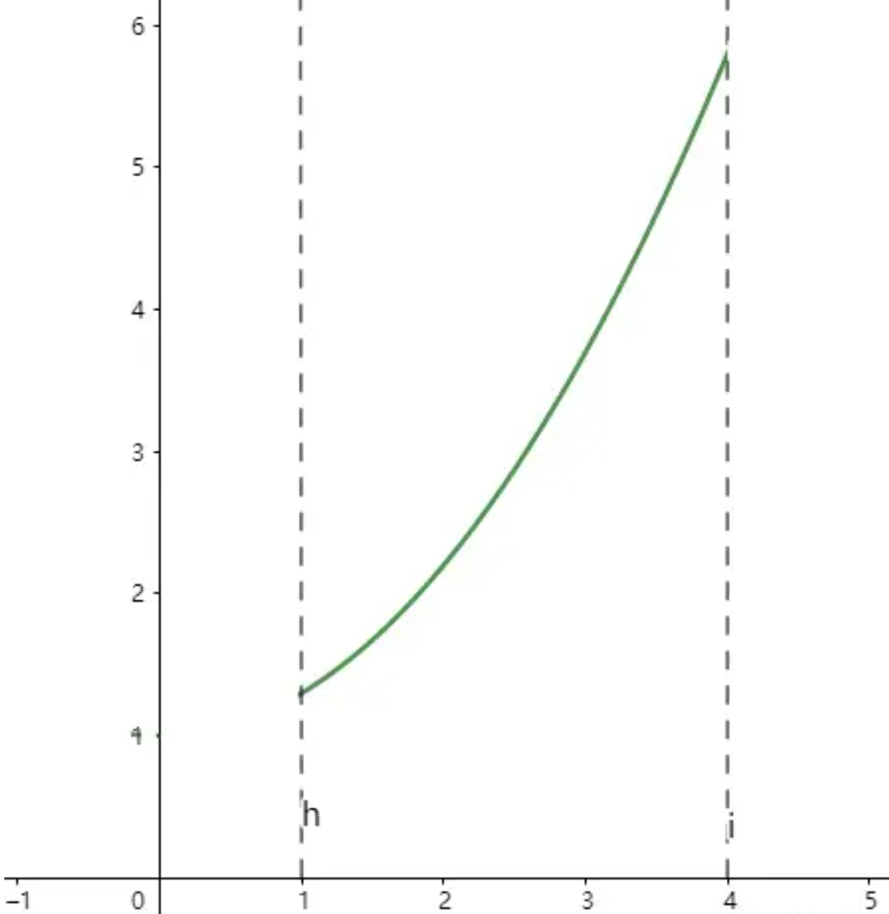

​			例如这个二维的例子，比如这个曲线方程 $y=0.3x^2+1$，其中 $x$ 的取值范围为 $1-4$ 。

​			如果要使用参数的形式来表达这个曲线方程：首先应该看 $x$ 与 $t$ 的关系，因为 $x$ 从 $1-4$， 而 $t$

值为 $0-1$，因此可以得到方程 $x=3t +1$ 。再将 $x$ 使用 $x= 3t-1$ 进行代替，得到 $y=0.3(3t+1)^2+1= 2.7t^2 + 1.8t + 1.3$

因此上图曲线的参数形式为：

$x=3t+1$

$y=2.7t^2+1.8t+1.3$

通过代入不同的 $t$ 值，即可得到该曲线 $P(0)=(1, 1.3) \ P(1)=(4, 5.8)$

### 参数形式与多项式

曲线的参数形式写成一个多项式的形式。例如上面的二维曲线，

------

## Bézier Curve 贝塞尔曲线

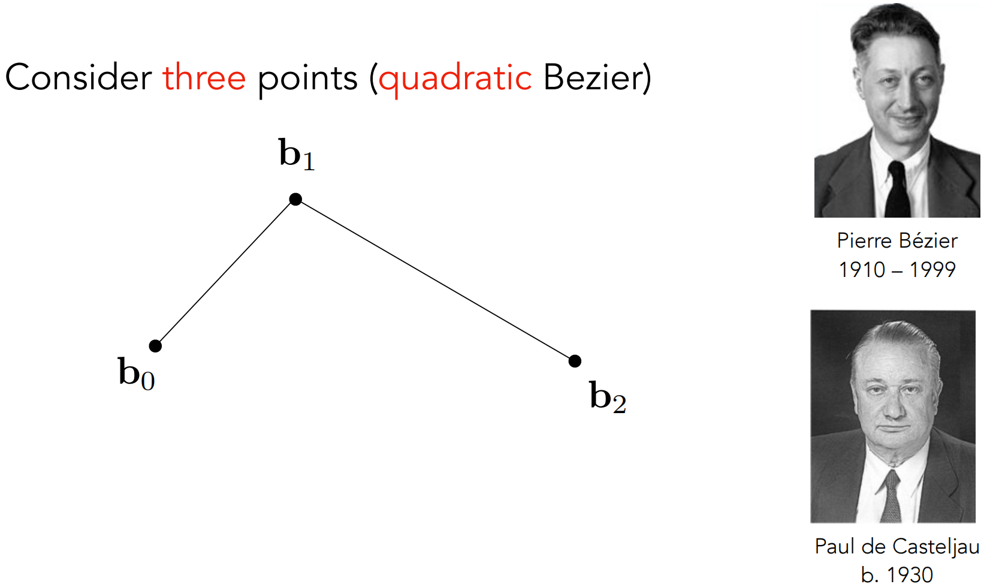

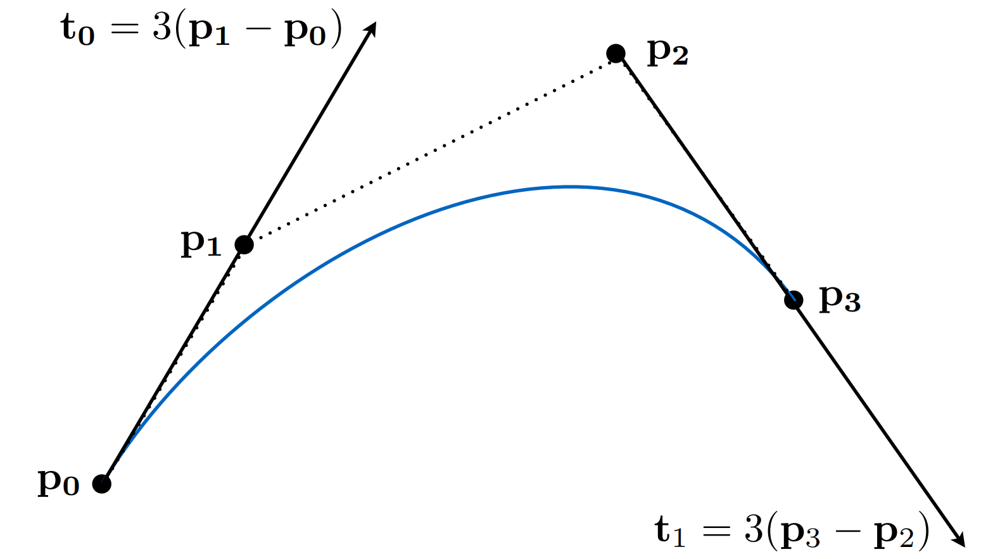

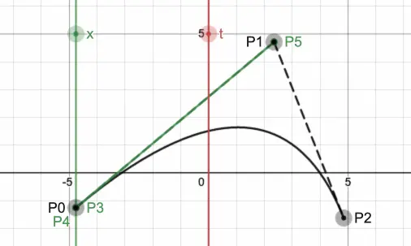

​		理解贝塞尔曲线 - 李银城的文章 - 知乎 https://zhuanlan.zhihu.com/p/576515173

​		贝塞尔曲线与曲面（Bezier Curve and Surface）的详细介绍与代码实现 - 王江荣的文章 - 知乎 https://zhuanlan.zhihu.com/p/366678047

​		参数方程 - 杨树森的文章 - 知乎 https://zhuanlan.zhihu.com/p/57867267

###  贝塞尔曲线原理

贝塞尔曲线由**两个端点和若干个控制点**组成，通过改变控制点位置就可以改变整条曲线的形状。

N个控制点对应着N-1阶的贝塞尔曲线，并且可以通过**递归**的方式来绘制（注意，“递归”二字是重点）。

一阶贝塞尔曲线：

​	只有两个端点，就是一条直线，根据插值，得出两点线段上的点坐标

​	$P_0=\overrightarrow{OP_0}  \ \ B=\overrightarrow{OB} \ \ P_1=\overrightarrow{OP_1}$

​	$\overrightarrow{P_0B}=t\overrightarrow{P_0P_1}$

​	$\overrightarrow{OB}-\overrightarrow{OP_0}=t(\overrightarrow{OP_1}-\overrightarrow{OP_0})$

​	$B-P_0=t(P_1-P_0)$

​	$B(t)=(1-t)P_0-tP_1$

   $P^1(t)=(1-t)P_0 + tP_1$

一阶贝塞尔曲线也称**[线性贝塞尔曲线](https://www.zhihu.com/search?q=线性贝塞尔曲线&search_source=Entity&hybrid_search_source=Entity&hybrid_search_extra={"sourceType"%3A"article"%2C"sourceId"%3A"537332427"})**，就是一条直线。

【软件理论】（一）从贝塞尔(Bézier)曲线到NURBS曲线(非均匀有理B样条)的浅谈 - 小狼啊小狼的文章 - 知乎
https://zhuanlan.zhihu.com/p/537332427

https://mp.weixin.qq.com/s?__biz=MzkwOTM1MTQ4NQ==&mid=2247484809&idx=1&sn=abef51e46c0021b8924aad98c75dc613&chksm=c13d4adbf64ac3cd5961b7eee6489bb5ef6ae82d037c89936d2de0fe591e135836e0734fb456#rd

贝塞尔曲线与曲面（Bezier Curve and Surface）的详细介绍与代码实现 - 王江荣的文章 - 知乎
https://zhuanlan.zhihu.com/p/366678047

在B-spline中，如何理解knot和breakpoint？彼此之间联系和区别是什么？ - 及时物语的回答 - 知乎
https://www.zhihu.com/question/52199904/answer/1868504566

webGL入门-四阶贝塞尔曲线绘制 - Axiny的文章 - 知乎
https://zhuanlan.zhihu.com/p/33193050

#### 		Defining Cubic Bezier Curve With Tangents  三次贝塞尔曲线与切线

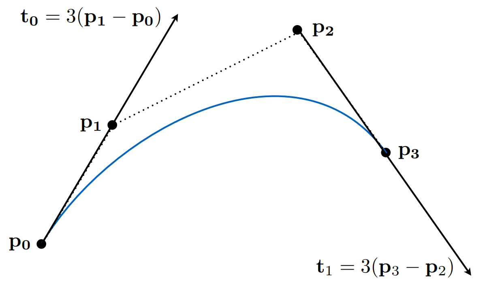

### Cubic Bezier Curve - de Casteljau

#### Four input points in total

#### Same recursive linear interpolations

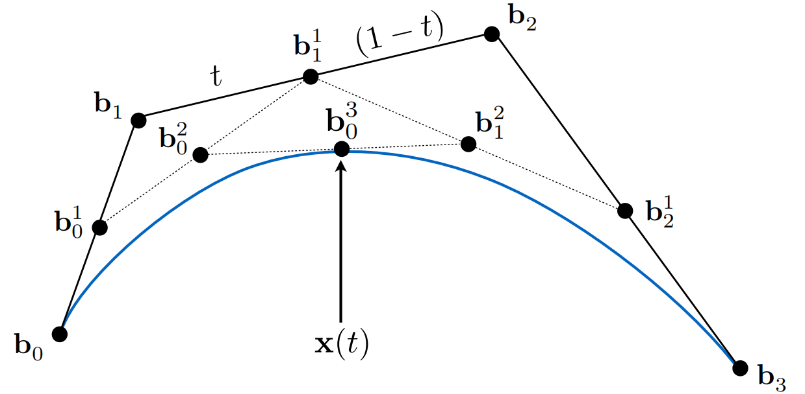

一共四个控制点 $b_0 \ b_1 \ b_2 \ b_3$，在两点间进行插值后得到 $b^1_0 \ b^1_1 \ b^1_2$ 三点，再不断递归进行插值操作，得到贝塞尔曲线。

​								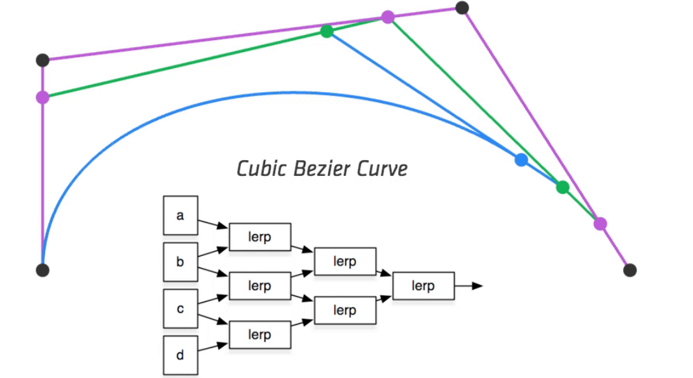		

### Evaluating Bezier Curves (de Casteljau Algorithm)

#### Bezier Curves - de Casteljau Algorithm

#### 	consider three points (quadratic Bezier) 二次贝塞尔曲线

### Bezier Surfaces

