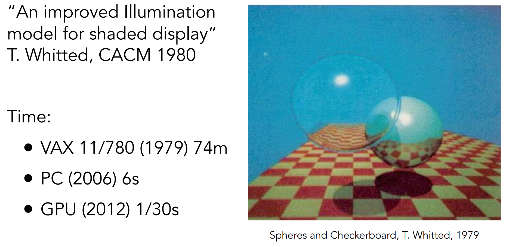
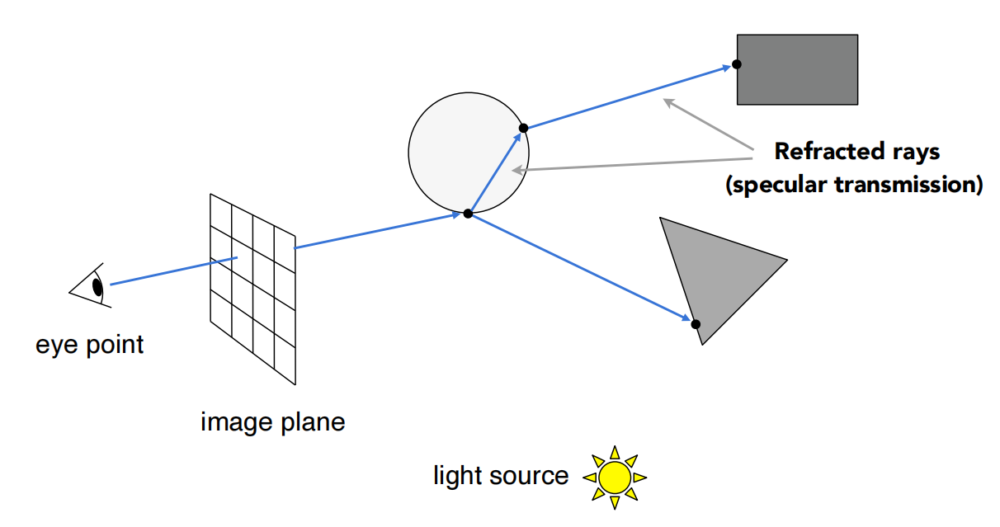

# Lecture 11 Geometry 2 (Curves and Surfaces)

#### Explicit Representations

#### Curves

1.  Bezier Curves
2. De Casteljau's algorithm
3. B-splines, etc.

#### Surfaces

1. Bezier surfaces
2. Triangles & quads
   - Subdivision, simplification, regularization

## Explicit Representations in Computer Graphics

### Many Explicit Representations in Graphics

#### 	triangle meshes , Bezier surfaces , subdivision surfaces , NURBS , point clouds ... 

------

## Curves

### 		Camera Paths

### 		Vector Fonts

#### 			图形学为什么需要曲线和曲面

​						在生活中存在着各种各样光滑的曲线或曲面，例如汽车的表面，钢球等。在建模的时候，我们通常使用很多小三角形面来逼近曲面，因此放大了看，这些面其实是凹凸不平的。

​						如何把纸上书写的文字、绘制的图案在计算机中显示和存储？ 最简单的方法是用像素点来表示，也就是拍照的方式。但这种方法无法矢量化，例如无法表示大小不同的文字和茶壶，并且此种方法占用的存储空间大，且边缘可能会不平滑。

​						因此，早期的人们就想到了使用曲线来拟合纸上的图案或者现实世界中的物体，那我们应该怎么表达这些光滑的曲线或曲面呢，先看一下它的**几种表达方式**：

​						      						 					

#### 曲线的显示表示 (Explicit representation)

​			例如 $y = x^2$ 画出来的图其实就是一条曲线

​														

​			当然还有 $y = x^3 +7$ 等函数，可以画出各式各样的曲线。这种 $y= f(x)$ 的表达方式，我们称之为二维空间中曲线的**显示表示**。即 **以自变量 (x) 来表达因变量 (y) 的值**。	

​			

#### 曲线的隐式表示 (Implicit representation)

​			隐式表示，就是利用**隐式方程**来刻画一条曲线，在二维空间中一个隐式的曲线可以通过 $f(x,y)=0$ 来表达，例如圆的隐式方程即为： $x^2 + y^2 -r^2 =0$ ，用它即可表示一个半径为 $r$ 的圆。

#### 曲线的参数形式表示 (Parametric form)

​			该形式也是图形学里最关心和最常用的形式。一个曲线的参数形式是通过一个自变量 （参数 t）来表达曲线上每个点的空间坐标，它也可以算作是**显示表示**的一种。

​			在三维空间中，我们可以用如下三个显示的函数，来表示一条空间曲线。

- ​	$x = x(t)$
- ​	$y = y(t)$
- ​	$z = z(t)$

​			$t = 0$ 即代表曲线的起点， $t =1$ 代表曲线的终点，因此可以用 $t (0 \le t \le 1)$ 代表曲线上的任意一点 $P(t)$ , 然后将 $t$ 的值带入三个显示的方程，即可求出曲线上点 $P$ 的坐标：

​			$P(t) = (x(t), y(t), z(t))$

to be continuous ...

------

## Bezier Curve 贝塞尔曲线

​		理解贝塞尔曲线 - 李银城的文章 - 知乎 https://zhuanlan.zhihu.com/p/576515173

​		贝塞尔曲线与曲面（Bezier Curve and Surface）的详细介绍与代码实现 - 王江荣的文章 - 知乎 https://zhuanlan.zhihu.com/p/366678047

​		参数方程 - 杨树森的文章 - 知乎 https://zhuanlan.zhihu.com/p/57867267

#### 		Defining Cubic Bezier Curve With Tangents  三次贝塞尔曲线与切线

​			

### Evaluating Bezier Curves (de Casteljau Algorithm)

#### Bezier Curves - de Casteljau Algorithm

#### 	consider three points (quadratic Bezier) 二次贝塞尔曲线

​	

### Bezier Surfaces

