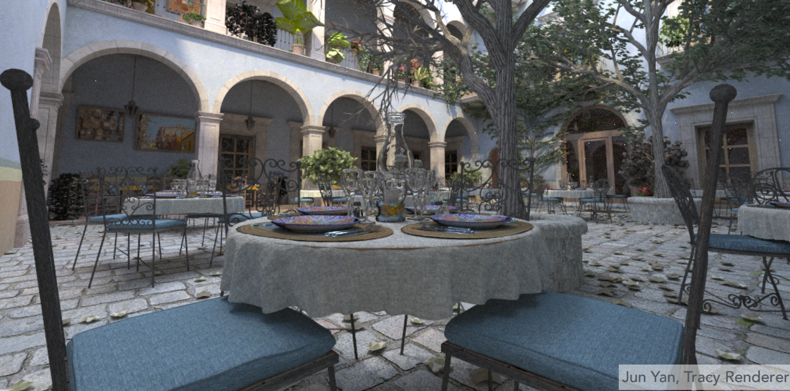

# Lecture 13 Ray Tracing 1 (Whitted-Style Ray Tracing) 递归光线追踪 

## Why Ray Tracing?

- #### Rasterization couldn't handle global effects well  

  ###### (global effects 全局效果) 光栅化无法处理全局效果，无法做到针对阴影，光照的变化产生变化。

  - ##### (Soft) shadows 软阴影
  - ##### And especially when the light bounces $\textcolor{red}{ more \ than \ once} $ (多于一次的光线反射)
  - ##### Indirect illumination 间接光照

- #### Rasterization is fast, but quality is relatively low

###### 										 可以看出 在地面上是不存在车辆的阴影的，图像的真实性降低了

###### 

- #### Ray tracing is accurate, but is very slow 光线追踪是精确的（还原物理定律的），但是很慢

  - ##### Rasterization: $\textcolor{red}{ real-time}$, ray tracing: $\textcolor{blue}{offline}$ (相较于光栅化的实时性，光纤追踪并不追求实时性)
  - ##### ~10K CPU core hours to render one frame in production

## Basic Ray-Tracing Algorithm  

### Light Rays

#### 	Three ideas about light rays

1. #####  Light travels in straight lines (though this is wrong)

2. #####  Light rays do not "collide" (碰撞) with each other if they cross (though this is still wrong)

3. #####  Light rays travel from the light sources to the eye (but the physics is invariant under path reversal - reciprocity) (光路可逆，眼睛发出的光可以沿原路线同样返回光源)

### "And if you gaze long into an abyss, the abyss also gazes into you."  — Friedrich Wilhelm Nietzsche

​			

###### 			视觉发射学说：在以前人们认为，眼睛可以发出一种叫做 feeling rays 的射线来感知世界，这与计算机中的光线追踪理论相同。（虽然这是错的，眼睛并不会发出光线，只是接受光线）

### Ray Casting

#### Appel 1968-Ray casting

 1. ##### Generate an image by casting on ray per pixel  (假设向场景中看去，眼前放了一个成像平面，通过成像平面上的每个像素投射一条射线到场景，找到射线和场景内的物体的交点 )

 2. ##### Check for shadows by sending a ray to the light (通过从交点向灯光连线来判断该位置是否处于阴影)

###### 	光线投射（Ray Casting），作为光线追踪算法中的第一步，其理念起源于1968年，由Arthur Appel在一篇名为《 Some techniques for shading machine rendering of solids》的文章中提出。其具体思路是从每一个像素射出一条射线，然后找到最接近的物体挡住射线的路径，而视平面上每个像素的颜色取决于从可见光表面产生的亮度。

光线投射解释：https://www.zhihu.com/tardis/bd/art/461963117?source_id=1001

​						   https://blog.csdn.net/ranran125/article/details/100076854

### Ray Casting - Generation Eye Rays

1. 只考虑眼睛是一个位置位于一点的针孔相机(Pinhole Camera Model)，不考虑实际相机处理、镜头等。
2. 从眼睛(eye point)开始，穿过成像平面(image plane)上的像素向场景中投射光线(eye ray)，记录与场景内物体的最近的交点(closest scene intersection point)，这一步其实已经完美解决了深度测试的问题。

### Ray Casting - Shading Pixels (Local Only)

​		从交点向光源连线(shadow ray)判断该点是否能被光源照亮，如果该连线中间没有物体阻挡，则说明该点可以被光源照亮。有了法线、入射方向、出射方向等数据就可以利用着色模型(如Blinn Phong模型)计算该点的着色，写入该像素。

### Recursive (Whitted-Style) Ray Tracing

###### 	1979年，Turner Whitted在光线投射的基础上，加入光与物体表面的交互，让光线在物体表面沿着反射，折射以及散射方式上继续传播，直到与光源相交。这一方法后来也被称为经典光线跟踪方法、递归式光线追踪（Recursive Ray Tracing）方法，或 Whitted-style 光线跟踪方法。

###### 											随着计算能力的提升，递归光线计算模型的计算时间越来越短

##### 			 在Whitted风格光线追踪中，光线进行了多次弹射，在每一个弹射点都去计算着色的值，最后将所有的值   都加到该像素中 (考虑能量守恒，比如该例子中碰到球体后反射的光线占60%，折射的光线占40%）

## Ray-Surface Intersection 射线与物体表面的交叉点

### Ray Equation

​                  	

###### 								射线方程可以看为从光源开始的以自变量为 $t$ 的函数，$d$ 是射线向量方向

### Ray Intersection With Sphere

#### 	Ray: $r(t)=o+td,0\le t< \infin$

#### 	Sphere: $p:(p-c)^2-R^2=0$

#### 	 What is an intersection?

#### 		The intersection p must satisfy both $\textcolor{red}{ ray \ equation \ and  \ sphere  \ equation}$

###### 									对方程 $(o+td-c)^2-R^2=0$ 转为代数式，得到的新的方程式： 

​													$d^2t^2+2(o-c)dt+(o-c)^2-R2= 0$

###### 									有了系数之后，就可以用求根方程计算在P点相交时射线方程的 $t$ 值

### Ray Intersection With Implicit Surface 射线与隐式表面的交点

​						光线与一般隐式表面相交$\begin{cases} Ray: r(t)=o+td,0\le t< \infin \\ General \ implicit:f(p) =0 \end{cases} \Rightarrow f(o+td)=0 \Rightarrow t=...$

​						

### Ray Intersection With Triangle Mesh 射线与三角网格交点

#### Triangle is in a plane 

- #### Ray-plane intersection 计算射线与平面的交点

- #### Test if hit point is inside triangle 使用三角形的端点与点交点的三次叉乘向量方向来判断交点是否在三角形内

​											

#### 	Plane Equation

#### 		Plane is defined by normal vector and a point on plane

###### 			一个平面可以由该平面的一个法向量 $N$ 与平面上的一个点  $p'$ 定义

#### 												

#### 		

#### 	Plane Equation (if p satisfies it, then p is on the plane): 

###### 		  平面上的任意一点 $p$ 可以用以下方程表示

​		

###### 					$p'$ 点位于平面上，$N$ 是平面的法向量，那么根据点积的定义，如果 $p$ 点存在于平面上，那么必然与法		向量的点积值为0，因为 $cos(\frac{\pi}{2}) =0$	

​			

------

### Möller Trumbore Algorithm		

### 		

#### 引理1： 三阶方阵的行列式等于三个列向量的混合积

##### 	$a⋅(b×c)=b⋅(c×a)=c⋅(a×b)=a⋅−(c×b)=b⋅−(a×c)=c⋅−(b×a)= \begin{vmatrix}  a_{1}&b_{1}&c_{1} \\  a_{2}&b_{2}&c_{2}\\  a_{3}&b_{3}&c_{3} \end{vmatrix}$

​	

​	对于二阶方阵 $A=\begin{bmatrix} a_{1}&b_{1} \\ a_{2}&b_{2}\end{bmatrix}$ 来说，$A$ 的列向量所构成的平行四边形的面积就是  $det(A)$ ，这是行列式的几何意义。推广到三阶行列式中，就是三阶方阵的列向量构成的六面体的体积（三个向量构成了六面体的边），这三个列向量 $a \ b\ c$ 围成的平行六面体的体积等于这三个列向量的混合积：$V= a \cdot(b \times c)$

##### 1.两个向量的叉乘的结果是这两个向量所在平面的法向量，并且模长等于这两个向量所围成的面积。

##### 2.两个向量的点乘是将一个向量投影到另一个向量，然后模长相乘。

#####     因此，根据三阶行列式的定义式我们就会发现，三阶行列式就是所围成的六面体的体积。

​	

#### 	引理2： 克拉默法则

​		如果一个线性方程组 $\mathbf{Ax = c}$, 其中A是可逆方阵，$\mathbf{x,c}$都是列向量，那么方程有解，且 $x$ 的每一个解

### 														$x_i = \frac{\det{A_i}}{\det{A}}$

​		其中 $A_i$ 是被等号右边的值构成的列向量取代了第 $i$ 列的矩阵。

​		

​		

##### 			对于求出的重心坐标表示的三角形所在平面的一点$(1-b_1-b_2), b_1 , b_2$ 值都为$\textcolor{red}{非负}$的则该点在三角形内

##### 			重心坐标的推导：[Barycentric coordinate 重心坐标与其推导.md](..\Lecture9\Barycentric coordinate 重心坐标与其推导.md) 

​			

#### 			推导过程

​							根据三角形重心坐标的定义得到（大写字母为向量 $\overrightarrow{O}, \ \overrightarrow{D}, \ \overrightarrow{P_0}, \ \overrightarrow{P_1}, \ \overrightarrow{P_2}$）：

​							 $O+tD=(1-b_1-b_2)P_0+b_1P_1+b_2P_2$

​							移项得到：

​					 		$O- P_0=(P_1-P_1)b_1+(P_2-P_0)b_2-tD$

​							 观察一下上面的括号以及等式左边的内容，都是已知的**点**，因此点的加减可以用向量来表示，令:

​							 $E1=P1−P0$

​							 $ E2=P2−P0$

​							 $ S=O−P0 $

​							 得到：

​							 $S=E_1b_1+E_2b_2-tD$

​							 即：

​							 $\begin{bmatrix} -D & E_1&E_2 \end{bmatrix}\begin{bmatrix} t \\ b_1\\b_2 \end{bmatrix}=S$

​							这是一个形如$\mathbf{A}x=c$的等式，所以可以用克拉默法则：

#### 												$t= \frac{\begin{bmatrix} S & E_1&E_2 \end{bmatrix}}{\begin{bmatrix} -D & E_1&E_2 \end{bmatrix}}$

##### 							 							使用向量混合积可以得出分母部分：

​							$det\begin{bmatrix} -D & E_1&E_2 \end{bmatrix}=-D \cdot(E_1\times E_2)=E_1\cdot(D \times E_2)$		

​							令 $S_1=D\times E_2 \ 原式等于E_1\cdot E_2$

##### 														分子部分：

​							$det\begin{bmatrix} S & E_1&E_2 \end{bmatrix}=E_2 \cdot(S\times E_1)$		

​							令 $S_2=S\times E_1 \ 原式等于S_2\cdot E_2$

##### 														所以可得：

#### 					   						$t= \frac{S_2\cdot E_2}{E_1\cdot E_2}$

###### 							其他的两个参数 $b_1, b_2$ 也可以通过克拉默法则同样求出来。当这三个值$(1-b_1-b_2), b_1 , b_2$都非负时，代表交点在三角形中。			

Möller Trumbore算法解释:  https://www.blurredcode.com//2020/04/%E7%9B%B4%E7%BA%BF%E4%B8%8E%E4%B8%89%E8%A7%92%E5%BD%A2%E7%9B%B8%E4%BA%A4moller-trumbore%E7%AE%97%E6%B3%95%E6%8E%A8%E5%AF%BC/

------

### Accelerating Ray-Surface Intersection 快速光线表面求交

#### Simple ray-scene intersection

- ##### Exhaustively test ray-intersection with every triangle

- ##### Find the closest hit （i.e minimum t）

#### Problem:

- ##### Naive algorithm = #pixels x #triangles ( x #bounces )

- ##### Very slow!

#### For generality, we use the term objects instead of triangles later (but doesn’t necessarily mean entire objects)

###### 									总体来说光是进行光线与三角形的求交这样一个计算过程就一共要： **像素数量x三角形面数量x弹射次数**这么多次，如下图这样一个场景，一共就有10.7M的三角形面，你可以想象一共要多少次求交运算吗？				

### Bounding Volumes  包裹体 / 包围盒

#### 	Quick way to avoid intersections: bound complex object with a simple volume 

#### • Object is fully contained in the volume 

#### • If it doesn’t hit the volume, it doesn’t hit the object 

#### • So test BVol first, then test object if it hits

###### 将复杂物体放置于简单形状的包围盒内，如果光线与包围盒相交则再计算光线是否与物体相交。

### Ray-Intersection With Box

​		包围盒由三对平面相交构成的立方体，包围盒的每一对平面的方向与以物体轴心的坐标轴的x或y或z轴方向相同，所以被称为轴对齐包围盒Axis-Aligned Bounding Box。

### Ray Intersection with Axis-Aligned Box 光线与轴对齐包围盒相交

##### 		

##### 		以二维情况作为例子说明，假设平面空间内存在一个二维的包围盒，上图左1使用光线 $O+tD$ 与包围盒的 $y$ 轴平行的 $x_0, x_1$ 的无限距离平面求交，可以得到光线到达 $x_0$ 的时间 $t_{min}$ ,从 $x_1$ 出去的时间 $t_{max}$ , 同样对 $y_0,y_1$ 两个无限距离平面做同样的运算也可以得到两个 $t$ 值（上图左2）。那么光线在包围盒中就是对 左1 左2 两张图进行求交就得到了 左3 的图，也就是光线进入包围盒和离开包围盒的时间，那么光线在这片空间中的时间自然也就是进出各个面的光线时间求交。

​		

### Ray Intersection with Axis-Aligned Box

- #### Recall: a box (3D) = three pairs of infinitely large slabs

- #### Key ideas

  - ##### The ray enters the box $\textcolor{blue}{only \ when}$ it enters all pairs of slabs 

  - ##### The ray exits the box $\textcolor{red}{as \ long  \ as}$ it exits any pair of slabs 

- #### For each pair, calculate the $t_{min}$ and $t_{max} $ (negative is fine)

- #### For the 3D box, $t_{enter}$ = **max**{$t_{min}$}, $t_{exit}$ = **min**{$t_{max}$}

- #### If $t_{enter}$ < $t_{exit}$, we know the ray $\textcolor{orange}{stays\ a\ while}$ in the box (so they must intersect!) (not done yet, see the next slide)

##### 		注：只有当光线进入了所有平面才算是真正进入了盒子中 这里的 only when 实际上指的是，需要计算光线进入每个轴向的平面的时间 $t_{enter}$ ，而当光线离开了任意平面就是真正的离开了盒子 $t_{exit}$ 。

##### 				对进入盒体平面的时间，离开盒体平面的时间进行求交（与2D方法相同），$t_{enter}$ = **max**{$t_{min}$}, $t_{exit}$ = **min**{$t_{max}$} 就求出了真正的光线进入包围盒交点与离开包围盒交点。

##### 				在什么样的情况下会存在焦点呢？当 $t_{enter}$ < $t_{exit}$ 时，说明光线在包围盒中存在了一段时间，必然存在交点。但是，光线并不是无限距离的直线，而是存在原点的射线。

#### 	• However, ray is not a line

##### 		- Should check whether t is negative for physical correctness! 

#### 	• What if texit < 0?

##### 		 - The box is “behind” the ray — no intersection! 

#### 	• What if texit >= 0 and tenter < 0?

##### 		 - The ray’s origin is inside the box — have intersection! 

#### 	• In summary, ray and AABB intersect iff

##### 		- tenter < texit && texit >= 0

##### 		因为光线是射线，则需要判断 $t_{enter}$ 和 $t_{exit}$ 为负值的情况，那么当  $t_{enter}<0$ 包围盒的位置在光源之后，不会存在交点。 当  $t_{exit} \ge 0$  $t_{enter} <0$ , 此时光源位置就在包围盒中，不管方向如何，必然与包围盒有交点。 所以，$t_{enter}$ < $t_{exit}$ 且 $t_{exit} \ge 0$ 时，光线与轴对称包围盒存在交点。

​		

Ray-AABB原理解释：图解光线追踪中，轴对齐边界盒（AABB）算法 - miccall的文章：  https://zhuanlan.zhihu.com/p/35321344

AABB（轴对齐矩形边界框）绘制： https://blog.csdn.net/sinat_24229853/article/details/48662799

Ray-AABB代码实现： https://blog.csdn.net/u012325397/article/details/50807880			

​									  https://zhuanlan.zhihu.com/p/610258258

### Why Axis-Aligned? 为什么会选择轴向对称

##### 		为什么轴对齐包围盒容易计算，我们前面提到过光线与平面求交的计算，而这是通常情况，平面不一定与物体坐标轴对齐。而如果我们使用轴对齐的特性，如上图的第二幅图中，我们可以直接用水平分量x计算光线与平面相交的时间t，这会简便很多，减少了点积运算只需要进行一次减法和一次除法。

光线追踪： https://zhuanlan.zhihu.com/p/473901415

###  