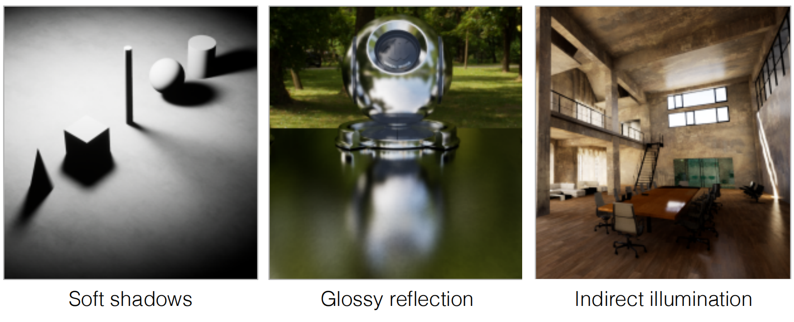
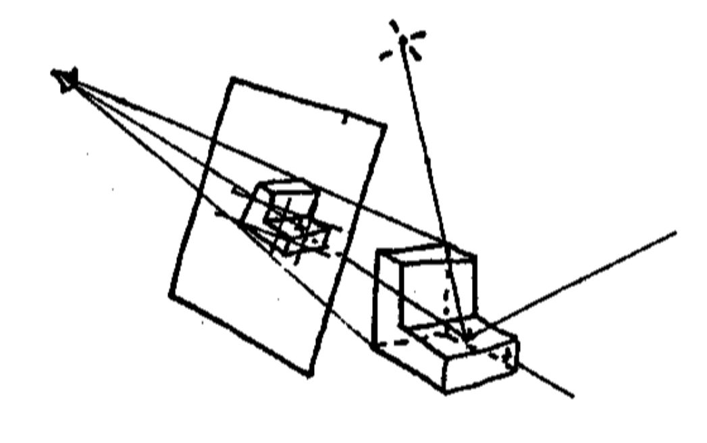
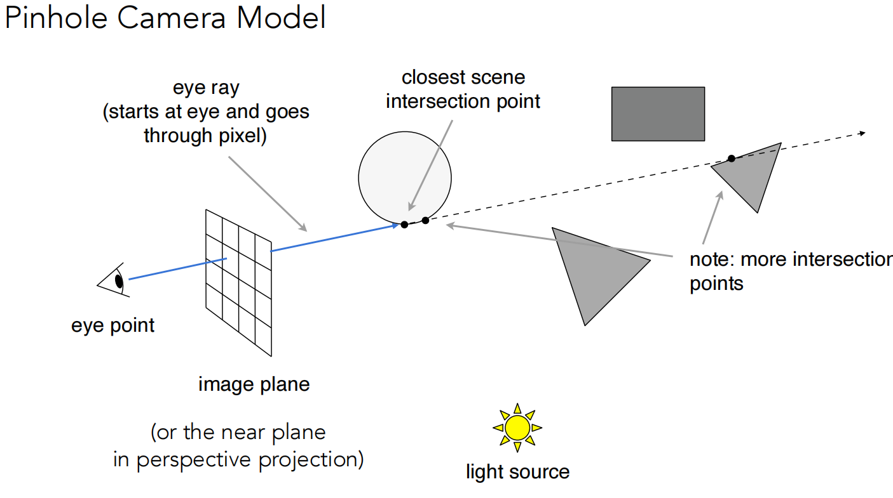

# Lecture 13 Ray Tracing 1 (Whitted-Style Ray Tracing) 递归光线追踪 

## Why Ray Tracing?

- #### Rasterization couldn't handle global effects well  

  ###### (global effects 全局效果) 光栅化无法处理全局效果，无法做到针对阴影，光照的变化产生变化。

  - ##### (Soft) shadows 软阴影
  - ##### And especially when the light bounces $\textcolor{red}{ more \ than \ once} $ (多于一次的光线反射)
  - ##### Indirect illumination 间接光照

- #### Rasterization is fast, but quality is relatively low

###### 										 可以看出 在地面上是不存在车辆的阴影的，图像的真实性降低了

###### 

- #### Ray tracing is accurate, but is very slow 光线追踪是精确的（还原物理定律的），但是很慢

  - ##### Rasterization: $\textcolor{red}{ real-time}$, ray tracing: $\textcolor{blue}{offline}$ (相较于光栅化的实时性，光纤追踪并不追求实时性)
  - ##### ~10K CPU core hours to render one frame in production

## Basic Ray-Tracing Algorithm  

### Light Rays

#### 	Three ideas about light rays

1. #####  Light travels in straight lines (though this is wrong)

2. #####  Light rays do not "collide" (碰撞) with each other if they cross (though this is still wrong)

3. #####  Light rays travel from the light sources to the eye (but the physics is invariant under path reversal - reciprocity) (光路可逆，眼睛发出的光可以沿原路线同样返回光源)

### "And if you gaze long into an abyss, the abyss also gazes into you."  — Friedrich Wilhelm Nietzsche

​			

###### 			视觉发射学说：在以前人们认为，眼睛可以发出一种叫做 feeling rays 的射线来感知世界，这与计算机中的光线追踪理论相同。（虽然这是错的，眼睛并不会发出光线，只是接受光线）

### Ray Casting

#### Appel 1968-Ray casting

 1. ##### Generate an image by casting on ray per pixel  (假设向场景中看去，眼前放了一个成像平面，通过成像平面上的每个像素投射一条射线到场景，找到射线和场景内的物体的交点 )

 2. ##### Check for shadows by sending a ray to the light (通过从交点向灯光连线来判断该位置是否处于阴影)

###### 	光线投射（Ray Casting），作为光线追踪算法中的第一步，其理念起源于1968年，由Arthur Appel在一篇名为《 Some techniques for shading machine rendering of solids》的文章中提出。其具体思路是从每一个像素射出一条射线，然后找到最接近的物体挡住射线的路径，而视平面上每个像素的颜色取决于从可见光表面产生的亮度。

光线投射解释：https://www.zhihu.com/tardis/bd/art/461963117?source_id=1001

​						   https://blog.csdn.net/ranran125/article/details/100076854

### Ray Casting - Generation Eye Rays

1. 只考虑眼睛是一个位置位于一点的针孔相机(Pinhole Camera Model)，不考虑实际相机处理、镜头等。
2. 从眼睛(eye point)开始，穿过成像平面(image plane)上的像素向场景中投射光线(eye ray)，记录与场景内物体的最近的交点(closest scene intersection point)，这一步其实已经完美解决了深度测试的问题。

### Ray Casting - Shading Pixels (Local Only)

​		从交点向光源连线(shadow ray)判断该点是否能被光源照亮，如果该连线中间没有物体阻挡，则说明该点可以被光源照亮。有了法线、入射方向、出射方向等数据就可以利用着色模型(如Blinn Phong模型)计算该点的着色，写入该像素。

### Recursive (Whitted-Style) Ray Tracing

###### 	1979年，Turner Whitted在光线投射的基础上，加入光与物体表面的交互，让光线在物体表面沿着反射，折射以及散射方式上继续传播，直到与光源相交。这一方法后来也被称为经典光线跟踪方法、递归式光线追踪（Recursive Ray Tracing）方法，或 Whitted-style 光线跟踪方法。

###### 											随着计算能力的提升，递归光线计算模型的计算时间越来越短

##### 			 在Whitted风格光线追踪中，光线进行了多次弹射，在每一个弹射点都去计算着色的值，最后将所有的值   都加到该像素中 (考虑能量守恒，比如该例子中碰到球体后反射的光线占60%，折射的光线占40%）

## Ray-Surface Intersection 射线与物体表面的交叉点

### Ray Equation

​                  	

 光线追踪： https://zhuanlan.zhihu.com/p/473901415

### Question 1:

#### 	Ray-Surface Intersection

​		Ray is defined by its origin and direction vector

​		Ray equation:

​			$r(t) =  o +td \quad 0 \le t \le \infin $

​			t is time , o is origin, d is diriction

​		

​		Sphere: $p: (p-c)^{2} -R^{2} = 0$

​		Solve for intersection:

​				 $(o +td-c)^{2} -R^{2} = 0$

​		

​		

###  