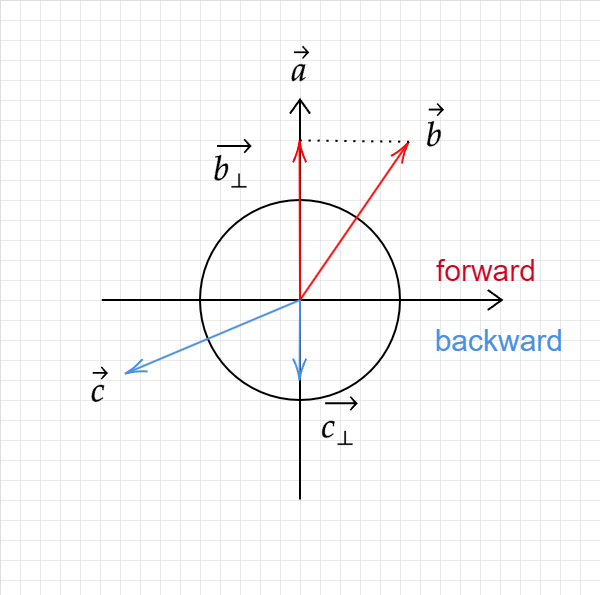

### Lecture 2： Review Of Linear Algebra

### A $\textcolor{red}{Swift}$ and $\textcolor{red}{Brutal}$ Introduction to Linear Algebra！

### Graphics' Dependencies

- #### Basic mathematics - Linear algebra, calculus, statistics
- #### Basic physics
- #### Misc  - Signal processing , Numerical analysis

#### Basic

### Vectors

- #### Usually written as  $\overrightarrow{a}$   or in bold $\bold{a}$

- #### Or using start point and end point $\overrightarrow{AB} = B -A$

- #### Vector has Direction and length

- #### No absolute staring position

### Vector Normalization

- #### Magnitude (length) of vector written as $\left\| \overrightarrow{a} \right\|$

- #### Unit vector

  - #### A vector with magnitude of  $1$

  - #### Finding the unit vector of a vector (normalization): $\hat{a} = \frac {\overrightarrow{a}} {\left\| \overrightarrow{a} \right\|}$

  - #### Used to represent directions

### Vector Addition

- #### **Geometrically: Parallelogram law & Triangle law**
- #### **Algebraically:  Simply add coordinates**

​	

### Cartesian Coordinate

- #### $X$ and $Y$ can be any (usually orthogonal unit) vectors

  

  #### $A = \begin{pmatrix} x \\ y\\ \end{pmatrix}$     $A^{T} = ({x},{y})$      $\textcolor{red}{\left\|{A}\right\|= \sqrt{x^2 + y^2}}$

  

  

### Vector Multiplication

- #### **Dot (scalar) product** : Find angle between two vectors 
- #### **Cross (vector) product** : 

#### 	 Dot (scalar) Product

#### 		$\overrightarrow{a} \cdot \overrightarrow{b} = \left\|\overrightarrow{a}\right\|\left\|\overrightarrow{b}\right\|\cos{\theta}$             $\cos{\theta}= \frac{\overrightarrow{a} \cdot \overrightarrow{b}}{\left\|\overrightarrow{a}\right\|\left\|\overrightarrow{b}\right\|}$

#### 		For unit vectors

#### 		$\cos{\theta} = \hat{a}\cdot\hat{b}$

​	

### Dot (scalar) product

- #### Properties

1. #### 	$\overrightarrow{a} \cdot \overrightarrow{b} = \overrightarrow{b} \cdot \overrightarrow{a} $

2. ####   $\overrightarrow{a} \cdot (\overrightarrow{b} + \overrightarrow{c}) = \overrightarrow{a} \cdot \overrightarrow{b} + \overrightarrow{a} \cdot \overrightarrow{c}$

3. ####  $(k\overrightarrow{a}) \cdot \overrightarrow{b} = \overrightarrow{a} \cdot (k\overrightarrow{b}) =  k(\overrightarrow{a} \cdot \overrightarrow{b})$

   

### Dot Product in Cartesian Coordinates

##### 	 Component-wise multiplication, then adding up

#### 	In 2D

#### 	     	$\overrightarrow{a} \cdot \overrightarrow{b} =  \begin{pmatrix} x_{a} \\ y_{a}\\ \end{pmatrix} \cdot \begin{pmatrix} x_{b} \\ y_{b}\\ \end{pmatrix} = x_{a}x_{b} + y_{a}y_{b}$

#### 	In 3D

#### 			$\overrightarrow{a} \cdot \overrightarrow{b} =  \begin{pmatrix} x_{a} \\ y_{a}\\ z_{a}\\ \end{pmatrix} \cdot \begin{pmatrix} x_{b} \\ y_{b}\\ z_{a} \\ \end{pmatrix} = x_{a}x_{b} + y_{a}y_{b} + z_{a}z_{b}$

### Dot Product in Graphics

- #### Find angle between two vectors.

  #### (e.g. cosine of angle between light source and surface)

- #### Finding projection of one vector on another.

### Dot product for Projection

#### 	$\overrightarrow{b_{\bot}}$ : Projection of  $\overrightarrow{b}$   onto  $\overrightarrow{a}$

  - #### $\overrightarrow{b_{\bot}}$ must be along $\overrightarrow{a}$   $\textcolor{red}{(or\ along\ \hat{a})}$

    - #### $\overrightarrow{b_{\bot}} = k\hat{a}$

  - #### What's its magnitude $k ?$

    - ####  $k = \left\| \overrightarrow{b}_{\bot} \right\| = \left\| \overrightarrow{b} \right\| \cos{\theta}$

### Dot Product in Graphics

- #### Measure how close two directions 

- #### Decompose a vector

- #### Determine forward or backward	

### Cross Product

$\overrightarrow{a} \times \overrightarrow{b} = Area \ of \ parallelogram$

$\overrightarrow{a} \times \overrightarrow{b} = -\overrightarrow{a} \times \overrightarrow{b}$

$ \left\|\overrightarrow{a}\right\|\left\|\overrightarrow{b}\right\| = \left\|\overrightarrow{a}\right\|\left\|\overrightarrow{b}\right\|\sin{\theta}$

- Cross product is orthogonal to two initial vectors
- Direction determined by $\textcolor{red}{right-hand \ rule}$
- Useful in constructing coordinate systems (3D system)

Cross product Properties   (for $\textcolor{red}{right-hand \ rule}$  constructed coordinate system)

$\overrightarrow{x} \times \overrightarrow{y} = \overrightarrow{+z}$                 $\overrightarrow{a} \times \overrightarrow{a} = \overrightarrow{0}      \ parallelogram \ area \ is \ zero$

$\overrightarrow{y} \times \overrightarrow{x} = \overrightarrow{-z}$                $\overrightarrow{a} \times (\overrightarrow{b} + \overrightarrow{c}) = \overrightarrow{a} \times \overrightarrow{b} + \overrightarrow{a} \times \overrightarrow{c}$

$\overrightarrow{y} \times \overrightarrow{z} = \overrightarrow{+x}$                 $\overrightarrow{a} \times (k\overrightarrow{b}) = k (\overrightarrow{a} \times \overrightarrow{b})$

$\overrightarrow{z} \times \overrightarrow{y} = \overrightarrow{-x}$

$\overrightarrow{z} \times \overrightarrow{x} = \overrightarrow{+y}$

$\overrightarrow{x} \times \overrightarrow{z} = \overrightarrow{-y}$

Cross Product: Cartesian Formula

$\overrightarrow{a} \cdot \overrightarrow{b} =  \begin{pmatrix} y_{a}z_{b}-y_{b}z_{a} \\ z_{a}x_{b} - z_{b}x_{a}\\ x_{a}y_{b}-x_{b}y_{a}\\ \end{pmatrix} $

Cross Product in Graphics

- Determine Left / Right 
- Determine Inside / Outside  (e.g.  a point in the triangle)

### Standard introduction

### Deeper understanding with $\textcolor{blue}{linear \   transformations}$ 

Matrices

- In Graphics, pervasively used to represent transformations
  - Translation, rotation, shear, scale, etc.

#### What is a matrix	

- Array of numbers (m x n = m rows, n columns)

  ​			$\begin{pmatrix} 1 & 3\\ 5 & 2 \\ 0 & 4 \\\end{pmatrix}$	

- Addition and Multiplication by a scalar are trivial: element by element

​	**Matrix - Matrix Multiplication**

​	(number of) columns is A must = # row in B	

​	(M x N) (N x P) = (M x P)

​	Element (i,j) in the product is the $\textcolor{red}{Dot Product}$ of $ \textcolor{blue}{row \ i \ from \ A}$ and  $ \textcolor{green}{column\ j \ from \ B}$

​	 $e.g.$             $\begin{pmatrix} 1 & 3\\ 5 & 2 \\ 0 & 4 \\\end{pmatrix}$     $\begin{pmatrix} 3 & 6 & 9 & 4\\ 2 & 7 &8 &3 \\ \end{pmatrix} = K_{Matrix}$ 

​					what is number $ n_{(i,j)}$  of $K_{Matrix}$ ?

​					$A \ row_{i} \begin{pmatrix} 1 & 3\\\end{pmatrix} \cdot B \ col_{j} \begin{pmatrix} 3 \\ 2 \end{pmatrix} = 1*3 +3 *2 = 9$

​	**Properties**

​		-**Non-commutative**     (AB and BA are different in general)

​		-**Associative and distributive**

​				(AB)C = A(BC)

​				A(B + C) = AB + AC

​				(A + B)C = AC + BC

#### Transpose of a Matrix

​		**Switch row and columns ($ ij \rightarrow ji $)**

​			$\begin{pmatrix} 1 & 3\\ 5 & 2 \\ 0 & 4 \\\end{pmatrix}^T = \begin{pmatrix} 1 & 5 & 0\\ 3 & 2 &4\\\end{pmatrix}$	 

​	Property 

​			$(AB)^T = B^TA^T$

Identity Matrix and Inverses

​	

​		Identity Matrix	$I_{3 \times3}  =\begin{pmatrix} 1 & 0&0\\ 0&1&0\\ 0 &0&1 \\\end{pmatrix}$

​		Inverses Matrix multiplication Matrix  get Identity Matrix.

​			$AA^{-1} = A^{-1}A = I \ identity \ matrix$

​			$(AB)^{-1} = B^{-1}A^{-1}$

​			

​		Vector multiplication in Matrix form

​			Cross product

​				$\overrightarrow{a} \cdot \overrightarrow{b} =  \begin{pmatrix} y_{a}z_{b}-y_{b}z_{a} \\ z_{a}x_{b} - z_{b}x_{a}\\ x_{a}y_{b}-x_{b}y_{a}\\ \end{pmatrix} = A* b =  \begin{pmatrix}0 &-z_{a}&y_{a} \\ z_{a}&0&-x_{a}\\ -y_{a}& x_{a}&0\\ \end{pmatrix} \begin{pmatrix} x_{b}\\ y_{b}\\ z_{b} \\\end{pmatrix}$

​																					dual matrix of vector a

​	

