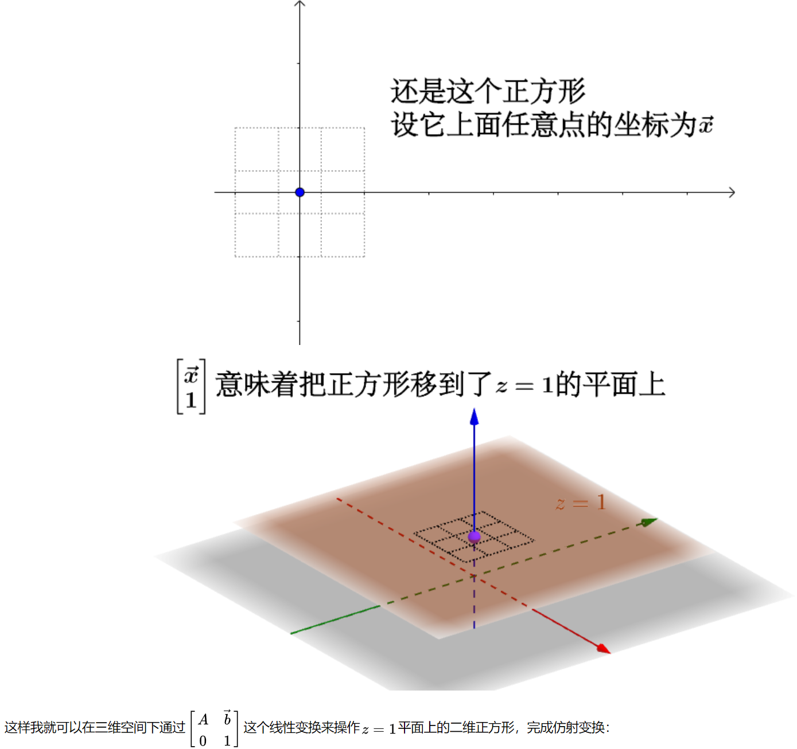
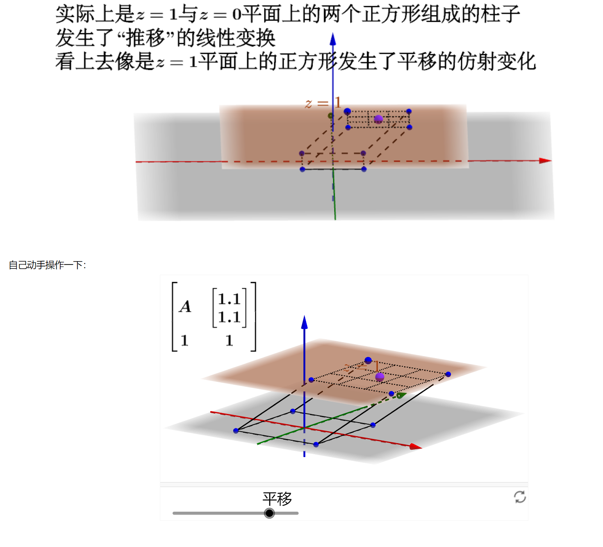
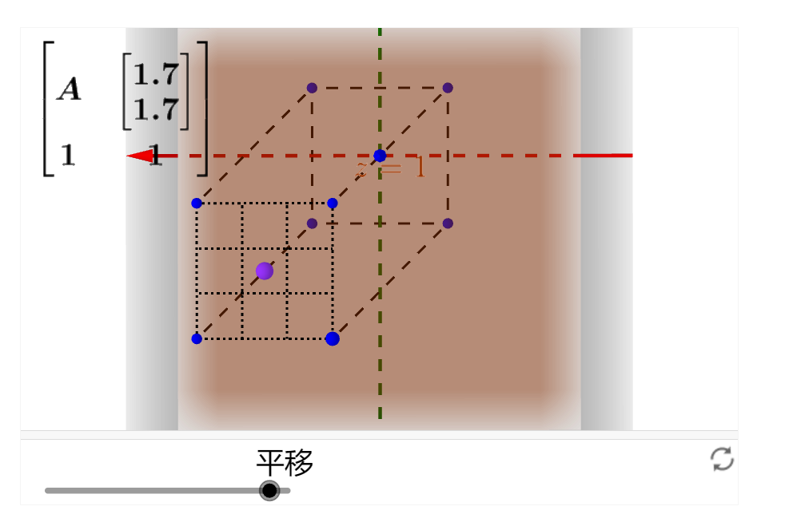

## Lecture 3 : Transformation

### what is Linear Transformation?

- #### all lines must remain lines, without getting curved.

- #### the origin must remain fixed in place

### 2D transformations

- 	#### Representing transformations using matrices

- #### Rotation, Scale, Shear

​	

### 2D Scale

#### Scale Transform

​		$ x' = sx    \ \ \ y' = sy$      

#### 	Scale transform uniform zoom picture width and height.

#### 	Scale Matrix

​	 $\begin{bmatrix} x' \\ y' \end{bmatrix} = \begin{bmatrix} s & 0 \\  0 & s \end{bmatrix}\begin{bmatrix} x \\ y \end{bmatrix}$

​		

#### 	Scale (Non-Uniform)

​	 $\begin{bmatrix} x' \\ y' \end{bmatrix} = \begin{bmatrix} s_{x} & 0 \\  0 & s_{y} \end{bmatrix}\begin{bmatrix} x \\ y \end{bmatrix}$

​	

#### Reflection Matrix

##### 	Horizontal reflection:   $ x' = -x    \ \ \ y' = y$

##### 	        	 	$\begin{bmatrix} x' \\ y' \end{bmatrix} = \begin{bmatrix} -1 & 0 \\  0 & 1 \end{bmatrix}\begin{bmatrix} x \\ y \end{bmatrix}$     

##### 	Vertical reflection:   $ x' = x    \ \ \ y' = -y$

​	 $\begin{bmatrix} x' \\ y' \end{bmatrix} = \begin{bmatrix} 1 & 0 \\  0 & -1 \end{bmatrix}\begin{bmatrix} x \\ y \end{bmatrix}$     

### Shear Matrix

##### 	For example:  this picture Horizontal shift is $a$

##### 												  course: Horizontal shift is 0 at y = 0

##### 																Horizontal shift a at y = 1

##### 																Vertical shift is always 0

​			$\begin{bmatrix} x' \\ y' \end{bmatrix} = \begin{bmatrix} 1 & a \\  0 & 1 \end{bmatrix}\begin{bmatrix} x \\ y \end{bmatrix}$    	

​	

#### Rotate (about the origin(0,0) , CCW (counterclockwise) by default)

##### 	   CCW and ACW  is counterclockwise and Anticlockwise

$cos\theta \ and \ sin\theta \ $ is $\hat{i}$ (base vector) in x-axis

 $-sin\theta \ and \ con\theta \ $ is $\hat{j}$ (base vector) in y-axis 

#### 		$R_{\theta} = \begin{bmatrix} cos_{\theta} & -sin_{\theta} \\ sin_{\theta} & cos_{\theta}  \end{bmatrix}$

#### Linear Transforms = Matrices $\textcolor{red}{(of \ the \ same \ dimension)}$

#### 	$ x' = ax + by $              $\begin{bmatrix} x' \\ y' \end{bmatrix} = \begin{bmatrix} a & b \\  c & d \end{bmatrix}\begin{bmatrix} x \\ y \end{bmatrix}$

#### 	$y' = cx + dy$     		  $x' = M x$

####      

#### why Homogeneous Coordinates?

- ##### Translation cannot be represented in matrix form   $\begin{bmatrix} x' \\ y' \end{bmatrix} = \begin{bmatrix} a & b \\  c & d \end{bmatrix}\begin{bmatrix} x \\ y \end{bmatrix} + \begin{bmatrix} t_{x} \\ t_{y} \end{bmatrix}$ $\textcolor{red}{(So, translation \ is \ NOT\ linear\ transform!\ this\ is\ Affine\ Transformations)}$
- #### But we don't want translation to be a special case.
- #### Is there a unified way to represent all transformations?

#### Solution: Homogenous Coordinates

#### 	Add  a third coordinate  $(w-coordinate)$

- ##### 2D point = $(x,y,1)^{T}$
- ##### 2D vector = $(x,y,0)^{T}$

#### Matrix representation of translations

##### $\begin{pmatrix} x' \\ y'\\w' \end{pmatrix} = \begin{pmatrix} 1 & 0&t_{x} \\  0 & 1 &t_{y} \\ 0&0&1\end{pmatrix}\cdot \begin{pmatrix} x \\ y \\1 \end{pmatrix} =\begin{pmatrix} x + t_{x} \\ y + t_{y} \\1 \end{pmatrix} $

   

#### Homogeneous Coordinates

**N维空间中的仿射变换可以转换成N+1维空间中的线性变换来实现**

**将仿射变换写作为线性变换**

$ \overrightarrow{y} =A\overrightarrow{x} + \overrightarrow{b} $    写作  $\begin{bmatrix} \overrightarrow{y} \\ 1 \end{bmatrix} = \begin{bmatrix} A & \overrightarrow{b} \\ 0 & 1 \end{bmatrix}\begin{bmatrix} \overrightarrow{x} \\ 1 \end{bmatrix}$

增加一个维度后，就可以在高维度通过线性变换来完成低维度的仿射变换

**沿Z轴看向平面，发现正方体的投影正好是完成了平移的仿射变化，最后去掉**$\begin{bmatrix} \overrightarrow{y} \\ 1 \end{bmatrix}$**中的1 回到2维平面，就得到了平移的结果**

https://www.zhihu.com/tardis/bd/ans/157400568

##### Valid operation if w-coordinate of result is 1 or 0

- ##### vector + vector = vector

- ##### point - point = vector

- ##### point + vector = point

- ##### point + point =	

#### 2D Transformations

##### 	Scale

##### 		$S(s_{x},s_{y}) = \begin{pmatrix} s_{x} & 0&0 \\  0 & s_{y} &0 \\ 0&0&1\end{pmatrix}$

##### 	Rotation

##### 		$R(\alpha) = \begin{pmatrix} cos\alpha & -sin\alpha&0 \\  sin\alpha & cos\alpha &0 \\ 0&0&1\end{pmatrix}$

##### 	Translation

##### 		$T(t_{x},t_{y})= \begin{pmatrix} 1 & 0&t_{x} \\  0 & 1 &t_{y} \\ 0&0&1\end{pmatrix}$		

​	

#### 3D transformations

##### 	Use homogeneous coordinates again:

- ##### 3D point = $(x,y,z,1)^{T}$

- ##### 3D vector = $(x,y,z,0)^{T}$

##### 	In general, $(x,y,z,w)(w!=0) is the \ 3D \ point:$

##### 			(x/w, y/w, z/w)	

##### 	Use 4X4 matrices for affine transformations

##### 			$\begin{pmatrix} x' \\ y'\\z' \\1 \end{pmatrix} = \begin{pmatrix} a&b&c  0&t_{x} \\  d & e&f &t_{y} \\ g&h&i&t_{z}\\ 0&0&0&1\end{pmatrix}\cdot \begin{pmatrix} x \\ y \\z\\1 \end{pmatrix}$			

​      