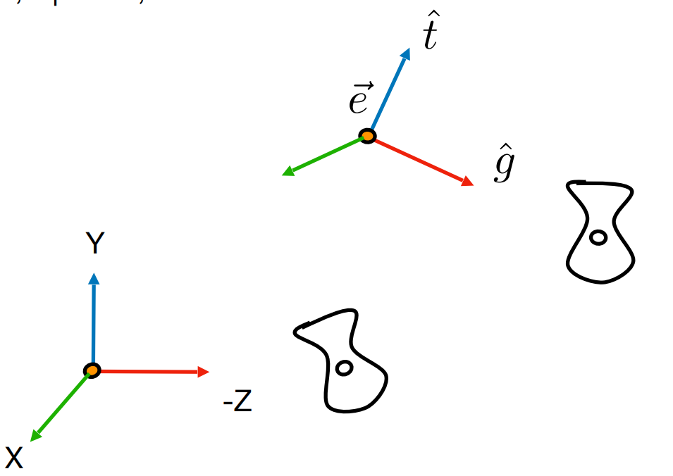

### Lecture 4 : 3D transformations

### Viewing transformation

- view / camera transformation
- projection transformation
- orthographic projection
- perspective projection

#### Use homogeneous coordinates again:

- #####     3D Point = $( x, y, z, 1)^T$
- #####     3D Vector = $( x, y, z, 0)^T$

  ##### In general, $(x,y,z,w)(w!=0)$ is the 3D point:   $(\frac{x}{w},\frac{y}{w},\frac{z}{w})$

### 3D Transformations

#### 	Use 4 X 4 matrices for affine transformations.

#### 	Linear Transform first and Translation last.

#### Transformations 

#### Scale

##### 			$S(s_{x},s_{y}, s_{z}) = \begin{pmatrix} s_{x} & 0&0 &0\\  0 & s_{y} &0&0 \\ 0&0& s_{z}&0\\ 0&0&0&1\end{pmatrix}$

##### 		

#### 	Translation

##### 			$	T(t_{x},t_{y},t_{z})= \begin{pmatrix} 1&0 & 0&t_{x} \\  0 & 1&0 &t_{y} \\ 0&0&1&t_{z}\\ 0&0&0&1\end{pmatrix}$		

##### 	Rotation

##### 		$R_{x}(\alpha) = \begin{pmatrix} 1&0&0&0 \\ 0&cos\alpha & -sin\alpha&0 \\   0&sin\alpha & cos\alpha &0 \\ 0&0&0&1\end{pmatrix}$

$R_{z}(\alpha) = \begin{pmatrix} cos\alpha & -sin\alpha&0&0 \\  sin\alpha & cos\alpha &0 &0\\0&0&1&0 \\0&0&0&1\end{pmatrix}$

special Rotation around $R_{y}$

$R_{y}(\alpha) = \begin{pmatrix} cos\alpha &0& -sin\alpha&0 \\ 0&1&0&0 \\-sin\alpha & 0&cos\alpha &0\\0&0&0&1\end{pmatrix}$

#### Why rotation $R_{y}$ not same $R_{x} \ and\ R_{z}$ formula ?

##### How to get $R_{y}$ formula ?

#### 使用中文： 已知旋转的坐标 （x',y'）与 (x,y) 相同，则可以推断出

### $cos(\theta+\gamma) = \frac {x'}{R_{(radius)}}$

### $sin(\theta+\gamma) = \frac {y'}{R_{(radius)}}$

#### 再通过和差公式得出

### $cos(\theta) \times cos(\gamma) -sin(\theta)\times sin(\gamma) = \frac {x'}{R_{(radius)}}$

### $sin(\theta) \times cos(\gamma) +cos(\theta)\times sin(\gamma) = \frac {y'}{R_{(radius)}}$

#### $cos(\theta) = \frac{x}{R}  \  sin(\theta)= \frac{y}{R}$

#### $\frac{x}{R} \times cos(\gamma) -\frac{y}{R}\times sin(\gamma) = \frac {x'}{R_{(radius)}}$

#### $\frac{y}{R} \times cos(\gamma) +\frac{x}{R}\times sin(\gamma) = \frac {y'}{R_{(radius)}}$

#### 左右同时除以半径R

#### $x \times cos(\gamma) -y\times sin(\gamma) = x'$

#### $y \times cos(\gamma) +x\times sin(\gamma) = y'$

#### $\begin{pmatrix} cos\alpha & -sin\alpha&0&0 \\  sin\alpha & cos\alpha &0 &0\\0&0&1&0 \\0&0&0&1\end{pmatrix} \cdot \begin{pmatrix}x\\y\\z\\1 \end{pmatrix} = \begin{pmatrix}x'\\y'\\z'\\1 \end{pmatrix}$

#### 推广到Y-axis的情况，通过右手定则可知 z轴到x轴得到的是 -y轴，需要进行逆时针旋转，旋转一个负数的角度得到正的Y轴方向。

### $cos(\theta-\gamma) = \frac {x'}{R_{(radius)}}$

### $sin(\theta-\gamma) = \frac {y'}{R_{(radius)}}$

通过和差公式得到

#### $R_{y}(\alpha) = \begin{pmatrix} cos\alpha &0& -sin\alpha&0 \\ 0&1&0&0 \\-sin\alpha & 0&cos\alpha &0\\0&0&0&1\end{pmatrix}$

### 3D Rotations

#### Compose any 3D rotation from $R_{x},R_{y},R_{z}?$

​	$R_{xyz}(\alpha,\beta,\gamma)=R_{x}(\alpha)R_{y}(\beta)R_{z}(\gamma)$

​	So-called **Euler anglers**

​	

### Rodrigues' Rotation Formula  

##### 罗德里斯旋转公式是由 本杰明·奥伦德·罗德里格 提出的旋转公式，罗德里格旋转公式是计算三维空间中，一个向量绕旋转轴旋转给定角度以后得到的新向量的计算公式。这个公式使用原向量，旋转轴及它们叉积作为标架表示出旋转以后的向量。可以改写为矩阵形式，被广泛应用于空间解析几何和计算机图形学领域，成为刚体运动的基本计算公式。

#### 	Rotation by angle $\alpha$ around axis $n$ 得到围绕一个旋转轴旋转任意角度后的向量

##### 	$R(n, \alpha)=cos(\alpha)I +(1-cos(\alpha))nn^{T} + sin(\alpha)\begin{pmatrix} 0 &-n_{z}&n_{y}&0 \\ n_{z}&0&-n_{x}&0 \\-n_{y}&n_{x}&0&0\end{pmatrix}$

#### 	How to prove this magic formula?

​	Rodrigues' Rotation Formula 可以表示为

​		$\overrightarrow{v'}=cos(\alpha)\overrightarrow{v} +(1-cos(\alpha))\overrightarrow{v_{||}} + sin(\alpha)(\hat{n}\times\overrightarrow{v})$

​	   其中 $\overrightarrow{v'}$  代表旋转后得到的向量， $\overrightarrow{v}$  代表原向量,  $\hat{n}$  代表旋转轴.

​		step 1:  考虑只存在垂直轴的特殊情况，原向量在与旋转轴 $\hat{n}$ 垂直的平面内旋转

​		

​					 通过叉乘构造一个新向量 $\hat{n} \times \overrightarrow{v}$   ，由于 $\hat{n}$ 为基向量的原因， 可知$\hat{n} \times \overrightarrow{v}$  的模长与 $\overrightarrow{v}$ 和由 $\overrightarrow{v}$  旋转而					 来的$\overrightarrow{v'}$ 一样

​					在这样的特殊情况下，可以使用向量加法合成 $\overrightarrow{v'}$ ：

​					$\overrightarrow{v'}=cos(\alpha)\overrightarrow{v}+sin(\alpha)(\hat{n}\times\overrightarrow{v})$

​			

​		step 2: 考虑一般的情况下旋转：

​				

​					 对  $\overrightarrow{v}$  进行分解，分解为与旋转轴 $\hat{n}$ 平行的 $\overrightarrow{v_{||}}$  ，和旋转轴$\hat{n}$ 垂直的 $\overrightarrow{v_{\bot}}$ 

​					根据点乘的分解方式  $\overrightarrow{v}= \overrightarrow{v_{||}} +\overrightarrow{v_{\bot}} $	可得 $\overrightarrow{v_{\bot}}= \overrightarrow{v} -\overrightarrow{v_{||}} $

​										同理可得 $\overrightarrow{v'}= \overrightarrow{v'_{||}} +\overrightarrow{v'_{\bot}} $

​					 可知绕 $\hat{n}$ 旋转之后投射到 $\hat{n}$ 的平行向量不变 所以可得  $\overrightarrow{v'}= \overrightarrow{v_{||}} +\overrightarrow{v'_{\bot}} $

​					 根据第一步对垂直轴情况的计算，可以将  $\overrightarrow{v'_{\bot}}$  替换为  $\overrightarrow{v_{\bot}}$  和 $\hat{n}$ 的表示形式，得到：

​					 $\overrightarrow{v'}=\overrightarrow{v_{||}} +  cos(\alpha)\overrightarrow{v_{\bot}}+sin(\alpha)(\hat{n}\times\overrightarrow{v_{\bot}})$

​					$\overrightarrow{v'}=\overrightarrow{v_{||}} +  cos(\alpha)(\overrightarrow{v} -\overrightarrow{v_{||}})+sin(\alpha)(\hat{n}\times\overrightarrow{v_{\bot}})$

​					通过代换  $\overrightarrow{v_{||}} =  cos(\alpha)\overrightarrow{v}$   可得：

​					$\overrightarrow{v'}=cos(\alpha)\overrightarrow{v} + (1 - cos(\alpha))\overrightarrow{v_{||}}+sin(\alpha)(\hat{n}\times\overrightarrow{v_{\bot}})$

​			

​					再进一步对 $\overrightarrow{v_{||}}$ 与  $\overrightarrow{v_{\bot}}$  进行替换：  $\overrightarrow{v_{||}}$  代表   $\overrightarrow{v}$  分解得到与旋转轴$\hat{n}$ 平行的部分，即在$\hat{n}$ 上的投影，所以可以把  $\overrightarrow{v_{||}}$  直接用$\hat{n}$ 和  $\overrightarrow{v}$  的点积表示，即：

​					$\overrightarrow{v_{||}}= (\hat{n}\cdot\overrightarrow{v})\hat{n}$

​					因叉积满足结合律与分配率，可得：

​					$(\hat{n}\times\overrightarrow{v})= \hat{n}\times\overrightarrow{v_{||}} + \hat{n}\times\overrightarrow{v_{\bot}}$      因为 $\hat{n}$ 与  $\overrightarrow{v_{||}}$  共线，所以可得 $ \hat{n}\times\overrightarrow{v_{||}}=0$ 

​					继而得之 $(\hat{n}\times\overrightarrow{v})= \hat{n}\times\overrightarrow{v_{\bot}}$

​					所以可以将上述两个结论代入step 2中的公式，得出罗德里格公式：

​					$\overrightarrow{v'}=cos(\alpha)\overrightarrow{v} + (1 - cos(\alpha))(\hat{n}\cdot\overrightarrow{v})\hat{n}+sin(\alpha)(\hat{n}\times\overrightarrow{v})$

​					

​					最后再将公式矩阵化， $\overrightarrow{v'} = R\overrightarrow{v}$  得出

​					$R(n, \alpha)=cos(\alpha)I +(1-cos(\alpha))nn^{T} + sin(\alpha)  \underbrace {\begin{pmatrix} 0 &-n_{z}&n_{y}&0 \\ n_{z}&0&-n_{x}&0 \\-n_{y}&n_{x}&0&0\end{pmatrix} }_{N}$

​					$I$ 是单位矩阵，     $nn^{T}$ 的值是旋转轴基向量 $\hat{n}$ 的模长， N 是  $\hat{n}$ 叉积的矩阵表示

​					

​							

### View / Camera Transformation

#### 	What is view transformation ?

#### 	Think about how to take a photo

- Find a good place and arrange people (model transformation)

- Find a good "angle" to put the camera (view transformation)

- Cheese! (projection transformation)

- #### 	MVP Transformation (model, view, projection)

​	

####  How to perform view transformation

- #### Define the camera first

  - ​	Position  $\overrightarrow{e}$

  - ​	Look-at / gaze direction  $\hat{g}$

  - ​    Up direction $\hat{t}$

- #### Key observation

  - ​	If the camera and all objects move together, the "photo" will be the same

- #### How about that we always transform the camera to

  - ​	The origin, up at Y, look at -Z
  - ​    And transform the objects along with the camera

- #### Transform the camera by $M_{view}$

  - ​    So it's located at the origin, up at Y, look at -Z

- #### $M_{view}$ in math ？

  - Translates e to origin                                     
  - Rotates g to -Z
  - Rotates t to Y
  - Rotates (g x t) To X
  - Difficult to write!

#### Let's write $M_{view}= R_{view}T_{view}$

##### 	First Translate e to origin	

#### $T_{view}= \begin{pmatrix} 1&0 & 0&-x_{e} \\  0 & 1&0 &-y_{e} \\ 0&0&1&-z{e}\\ 0&0&0&1\end{pmatrix}$

#### Rotate g to -Z. t to Y, (g x t) to X

#### Consider its inverse rotation: X to (g x t), Y to t. Z to -g

先计算出 X,Y,Z 到 t,g,(g x t) 的变换矩阵，再对该矩阵求逆得到转置后的矩阵，因为对于正交矩阵，逆等于转置。

​	$R_{view}^{-1}= \begin{pmatrix} x_{\hat{g}\times\hat{t}}&x_{t} & x_{-g}&0 \\ y_{\hat{g}\times\hat{t}}&y_{t} & y_{-g}&0 \\ z_{\hat{g}\times\hat{t}}&z_{t} & z_{-g}&0\\ 0&0&0&1\end{pmatrix} \rightarrow R_{view}= \begin{pmatrix} x_{\hat{g}\times\hat{t}}& y_{\hat{g}\times\hat{t}} &z_{\hat{g}\times\hat{t}}&0 \\x_{t}&y_{t} & z_{t}&0 \\ x_{-g} & y_{-g} & z_{-g}&0\\ 0&0&0&1\end{pmatrix}$

#### Summary

​		Transform objects together with the camera

​		Until camera's at the Origin, up at $Y$, look at $-Z$

### Project transformation

- #### Projection in Computer Graphics

  - #### 3D to 2D

  - #### Orthographic projection

  - #### Perspective projection

### Orthographic Projection

#### 	Camera located at origin, looking at -Z. up at Y

#### 	Drop Z coordinate

####		Translate and scale the resulting rectangle to [-1 , 1]

​	

#### In general

###### 	We want to map a cuboid [l, r] x [b, t] x [f, n] to the "canonical" cube [-1, 1]

###### 	首先将中心移到原点，再将立方体缩放至 [-1 , 1] 的范围内（归一化）。

​	

#### 	Transformation matrix

##### 		Translate (center to origin) first , then scale ( length / width / height to 2 )

#### 		$M_{ortho}= \begin{pmatrix} \frac{2}{r-l}&0 & 0&0 \\  0 & \frac{2}{t-b}&0 &0 \\ 0&0&\frac{2}{n-f}&0\\ 0&0&0&1\end{pmatrix} \begin{pmatrix} 0&0 & 0&-\frac{r+l}{2} \\  0 & 1&0 &-\frac{t+b}{2} \\ 0&0&1&-\frac{n+f}{2}\\ 0&0&0&1\end{pmatrix}$

​													归一化                                             原点居中

#### 		$M_{ortho}=M_{scale} \times M_{translate}$

###### 		Caveat:  Looking at /along -Z is making near and far not intuitive (n > f)

###### 		注意：相机朝向为-Z方向，所以 n 是大于 f 的,在OpenGL中因使用左手坐标系，则相反

​	

### Perspective Projection

- #### Most common is Computer Graphics, art, visual system

- #### Further objects are smaller

- #### Parallel lines not parallel; converge to single point

​	

How to do perspective projection

- First "squish" the frustum (视锥体) into a cuboid (n -> n, f -> f) ($M_{persp} \rightarrow M_{ortho}$)
- Do orthographic projection ($M_{ortho}$)

​	在这一步中，是将这个视锥体转化为一个 [-1, 1] [-1, 1] [-1, 1] 的正方体中（正交投影），可以先把远平面( f )压缩 ，把视锥体压缩成一个长方体，再通过正交投影矩阵就可以变换到正方体中。

#### 在把 frustum 视锥体 压缩成为 cuboid 立方体的过程中

1. 近平面 n 的所有点坐标不变
2. 远平面 f 的所有点坐标 z 不变 都是 f
3. 远平面 f 的中心点坐标值不变 (0, 0, f)

##### Find the relationship between transformed points (x', y', z') and the original points (x, y, z)

#### 从三角形相似性可以得出 $y' = \frac{n}{z}y$  同理 $x' = \frac{n}{z}x$ , 但是 此时的 Z‘ 会是什么值

所以，对于 frustum 远平面的一点 $(X,Y,Z,1)$ 在压缩后坐标为

#### 			$\begin{pmatrix}x\\y\\z\\1 \end{pmatrix} = \begin{pmatrix} \frac{nx}{z}\\\frac{ny}{z}\\ unknown \\1 \end{pmatrix}$				

现在 需要找到一个矩阵 $M_{persp \rightarrow ortho}$ 使得上面的转换成立

已知矩阵可以写为代数式的形式，则第一行可以视为

#### $Ax + By + Cz + D = \frac{nx}{z}$

在这个式子中，如果将 B C D 等于 0， 可以得出一个结果  

###  $A= \frac{n}{z}$

但是 $ \frac{n}{y} $ 是一个变量，无法将这个值放入矩阵，第二行也有一样的问题。

在 homogeneous coordinates 中， （x, y, z, 1）与 （kx, ky, kz, k !=  0）这两个点是完全等价，

如果将 k 的值取为 z ，可以消除分母 z 从而得到：

#### 			$M_{persp\rightarrow ortho}^{4\times4}\begin{pmatrix}x\\y\\z\\1 \end{pmatrix} = \begin{pmatrix} nx\\ny\\ unknown \\z \end{pmatrix}$

###### 现在 则可以得出 $Ax + By + Cz + D = nx$  的A已经是一个常量 n 了

 $Ex + Fy + Gz + H = ny$  得出 F 的值为 n，E，G，H的值都为 0

第四行   $Mx + Ny + Oz + P = z$  得出 O 等于 1， M= Y= P= 0 

此时 投影-> 正交矩阵的样子为

#### 			$ M_{persp\rightarrow ortho} \begin{pmatrix} n&0 & 0&0 \\  0 & n&0 &0 \\ ?&?&?&?\\ 0&0&1&0\end{pmatrix}$

​	此时，依然无法得知第三行到底是什么样子的，

> ## Any point on the near plane will not change

​	根据 近平面 n 的所有点坐标不变 我们可以得出矩阵

##### 			$\begin{pmatrix} n&0 & 0&0 \\  0 & n&0 &0 \\ ?&?&?&?\\ 0&0&1&0\end{pmatrix}\begin{pmatrix}x\\y\\n\\1 \end{pmatrix}=\begin{pmatrix}x\\y\\n\\1 \end{pmatrix}$

​	再写出 1，2，4 行的等式

​	 $nx + 0y + 0z + 0*1 = x$

​	 $0x + ny + 0z + 0*1 = y$ 

​	 $0x + 0y + 1*1 + 0*1 = 1$

​	很明显这是有问题的， 因为 n 应该为任意常数，但现在只有 n 等于 1 时，等式才成立

​	根据前面的方法，将 （x, y, z, 1）都乘以一个 n 变为  （nx, ny, n*n, n)

​	这样转换就变为了：

​		$\begin{pmatrix} n&0 & 0&0 \\  0 & n&0 &0 \\ ?&?&?&?\\ 0&0&1&0\end{pmatrix}\begin{pmatrix}x\\y\\n\\1 \end{pmatrix}=\begin{pmatrix}nx\\ny\\n*n\\n \end{pmatrix}$

​	再写出 1，2，4 行的等式

​	 $nx + 0y + 0z + 0*1 = nx$

​	 $0x + ny + 0z + 0*1 = ny$ 

​	 $0x + 0y + n*1 + 0*1 = n$

​	 设 第三行的等式为 

​	 $Ax + By + Cn + D = n*n$

​	 A， B = 0 可得  Cn + D = n*n

​	

​	再根据远平面上的中点坐标不变 (0, 0, f) , 且为了 1，2，4 行式子成立 可以得出矩阵：

​			$\begin{pmatrix} n&0 & 0&0 \\  0 & n&0 &0 \\ 0&0&?&?\\ 0&0&1&0\end{pmatrix}\begin{pmatrix}0\\0\\f\\1 \end{pmatrix}=\begin{pmatrix}0\\0\\f*f\\f \end{pmatrix}$

​	$0x + 0y + Cf + D = f*f $

​	Cn + D = n*n   Cf + D =  f * f

​	Cn + D -  (Cf +D )  =  n*n - f * f = C(n-f) = n^2 - f^2 =(n+f)(n-f) 得到 C = n + f   D = -nf

​	

​	这样 就求得了 $ M_{persp\rightarrow ortho} $  矩阵

#### 			$\begin{pmatrix} n&0 & 0&0 \\  0 & n&0 &0 \\ 0&0&n+f&-nf\\ 0&0&1&0\end{pmatrix}$

#### Next! Do orthographic projection (Mortho) to finish

此时，已经把视锥体 frustum 转化为了一个 cuboid ，可以通过 正交投影的方法去继续处理了

### $M_{persp} =M_{ortho} M_{persp\rightarrow ortho} $ 

### 大部分资料与书推导出来的透视投影矩阵一般是由 fov， aspect， far， near 四个参数决定的，使用时将上面的透视投影矩阵转化为这四个参数定义的形式。

- 	#### Fov：视场角度

- #### Aspect：宽高比

- #### Far： 远平面

- #### Near：近平面

​	尝试用上述四个参数表达上述的 n， f， t，b， r，l

####    可知         $n = near \\ f= far$

​	由这样一个视锥体截面可以得知

#### 	$t= near \times tan(\frac{fov}{2}) \\ b=-near \times tan(\frac{fov}{2}) \\ r = aspect \times near \times tan(\frac{fov}{2}) \\ l = -aspect \times near \times tan(\frac{fov}{2})$

#### 现在就可以使用 四个参数描述之前的六个参数

### 	$M_{ortho}= \begin{pmatrix} \frac{cot(\frac{fov}{2})}{aspect \times near}&0 & 0&0 \\  0 &\frac{cot(\frac{fov}{2})}{near}&0 &0 \\ 0&0&\frac{2}{near-far}&0\\ 0&0&0&1\end{pmatrix} \begin{pmatrix} 1&0 & 0& 0 \\  0 & 1&0&0 \\ 0&0&1&- \frac{near+ far}{2} \\ 0&0&0&1\end{pmatrix} \\ = \begin{pmatrix} \frac{cot(\frac{fov}{2})}{aspect \times near}&0 & 0&0 \\  0 &\frac{cot(\frac{fov}{2})}{near}&0 &0 \\ 0&0&\frac{2}{near-far}&-\frac{near+far}{near-far}\\ 0&0&0&1\end{pmatrix}$

### $M_{persp} =M_{ortho} M_{persp\rightarrow ortho} $

#### $M_{persp} \begin{pmatrix} \frac{cot(\frac{fov}{2})}{aspect \times near}&0 & 0&0 \\  0 &\frac{cot(\frac{fov}{2})}{near}&0 &0 \\ 0&0&\frac{2}{near-far}&-\frac{near+far}{near-far}\\ 0&0&0&1\end{pmatrix}\begin{pmatrix} near&0 & 0&0 \\  0 & near&0 &0 \\ 0&0&near+far&-near \times far\\ 0&0&1&0\end{pmatrix} \\ = \begin{pmatrix} \frac{cot(\frac{fov}{2})}{aspect}&0 & 0&0 \\  0 &cot(\frac{fov}{2})&0 &0 \\ 0&0&\frac{near+far}{near-far}&-\frac{2\times near \times far}{near-far}\\ 0&0&1&0\end{pmatrix}$

> 知乎 小猫耳朵的专栏笔记	https://zhuanlan.zhihu.com/p/1224115120.

