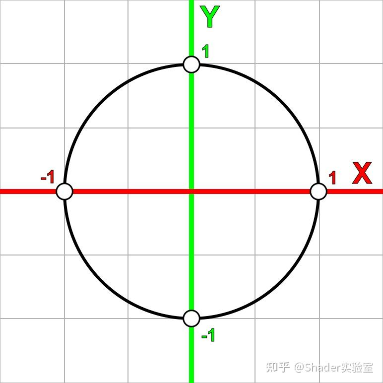
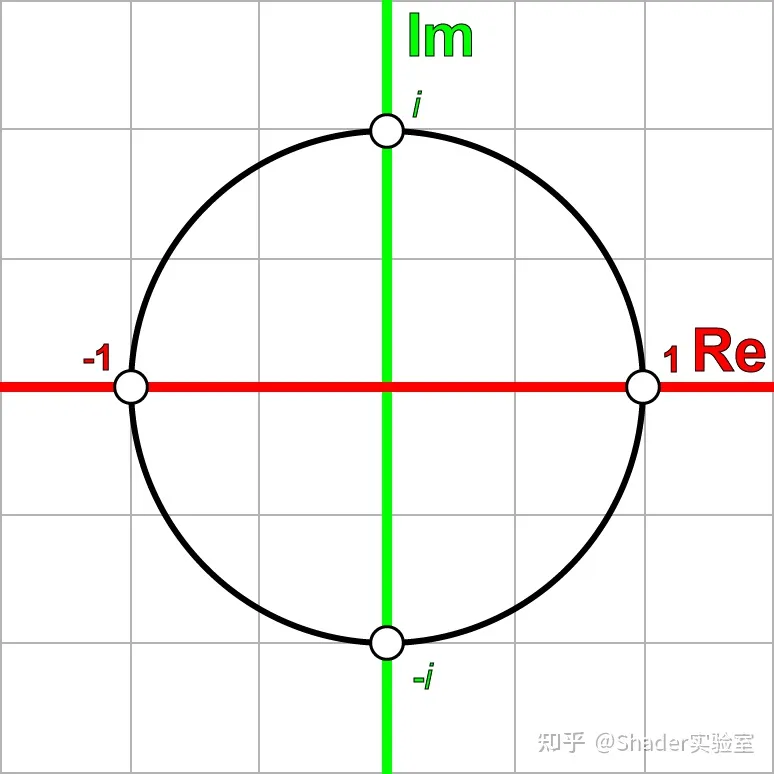
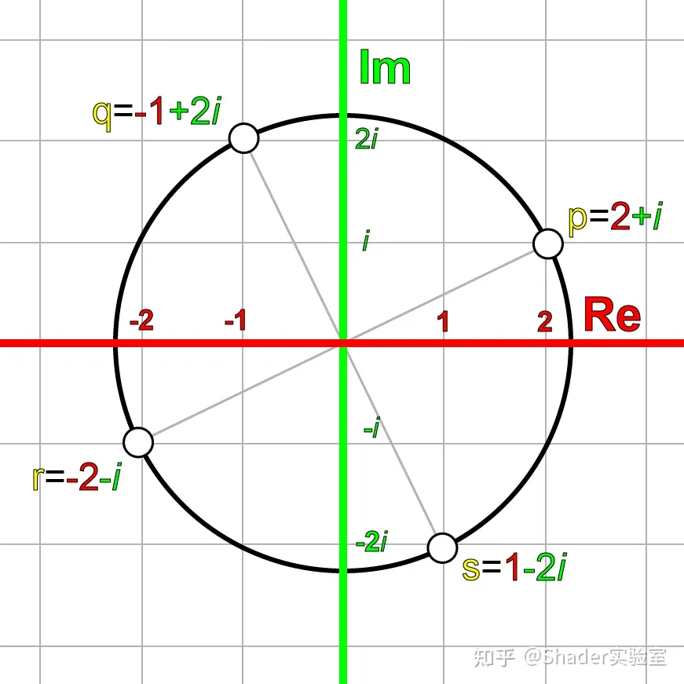
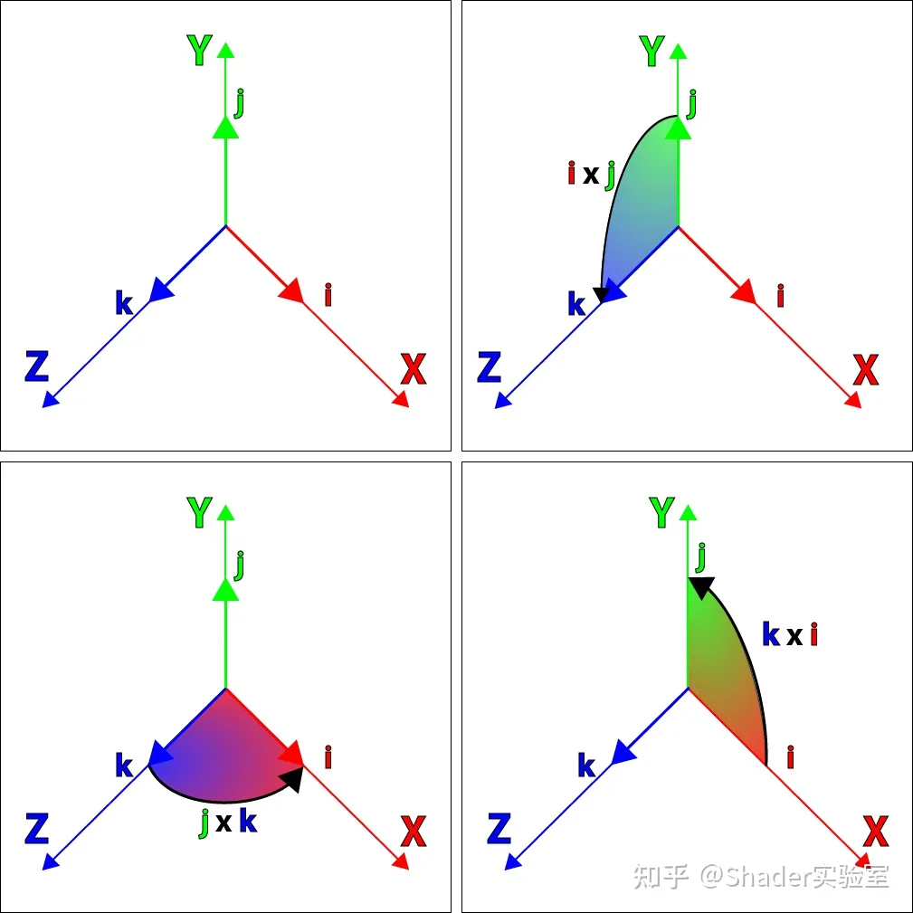
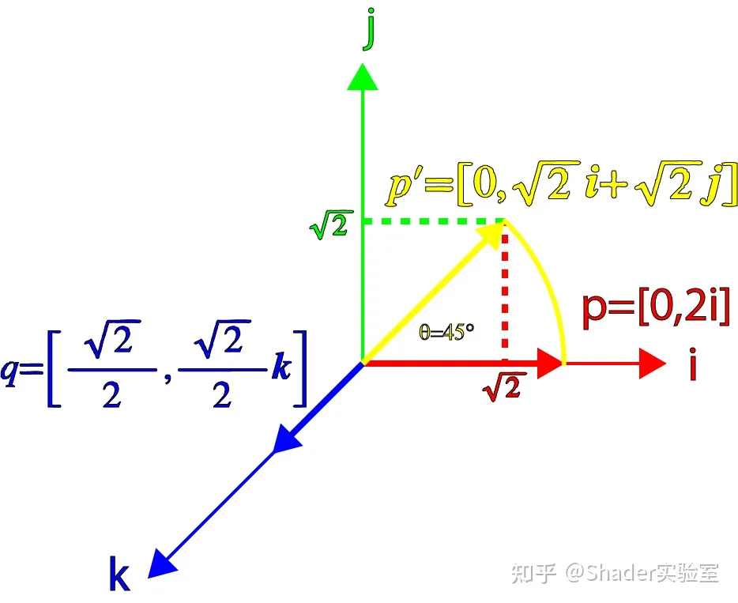
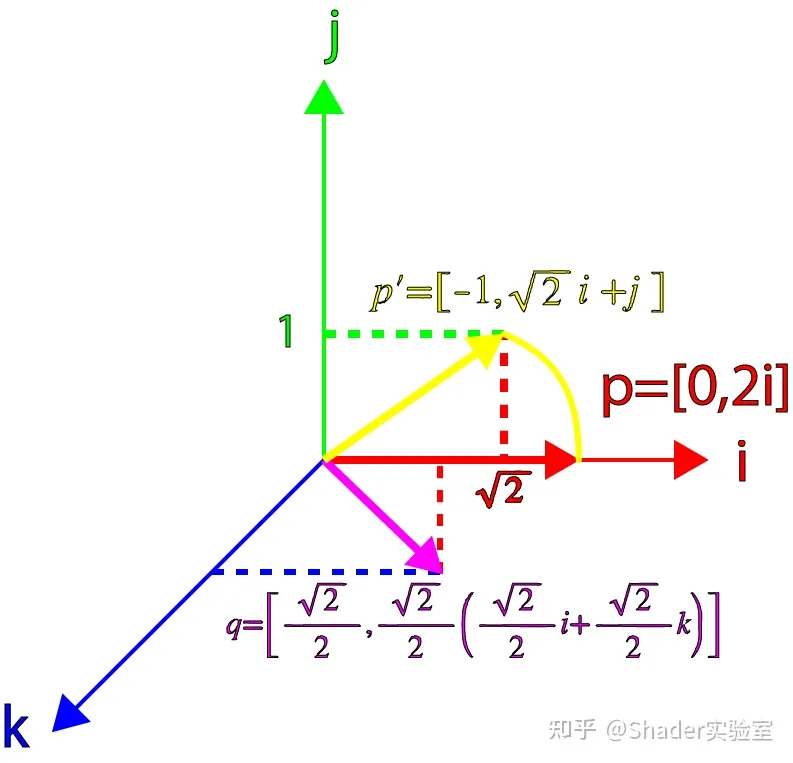

## 四元数      （为什么使用四元数描述旋转，因为欧拉角具有万向节死锁的问题）

本篇笔记的文章来源 https://zhuanlan.zhihu.com/p/442146306

在代数角度上介绍四元数是如何转换的（需要群论与复变知识） 四元数转换成矩阵的公式是怎么推理出来的? - World VIII的回答 - 知乎
https://www.zhihu.com/question/368553249/answer/991997512

### 定义：四元数是秩为4的超复数

### 复数与复平面

​	复数通常以 $z= a +bi$ 的方式表示，其中 i 是虚数，并且 $i^2 =  -1$ ，虚数是来源是为了解决特定无解的方程。例如：$x^2 +1=0$ 分解得出 $x^2 = -1$ 这是无解的，所以延申出虚数，即 $i^2 =  -1$。

​	复数的表述：$z = a +bi \ \ a,b \in \R, i^2 =  -1$

​	a, b 分别表示 z 的虚部与实部， 因此复数 z 可以使用 two-tuple 二元组符号 $(a,b)$ 表示。

​	

​	加法减法： 复数可以分别通过加减实数和虚数部分来作加减运算。

​	标量与复数乘法：复数与标量相乘是通过将复数的实部与虚部分别乘以标量来作乘法运算。

​						$\lambda(a +bi)= \lambda a+ \lambda b$

​	复数与复数乘法：两个复数的乘法可以通过应用普通代数规则相乘。

​	复数的平方：复数也可以通过与自身相乘求取平方值。

​	

​	共轭复数：两个实部相等，虚部互为相反数的复数互为共轭复数 （conjugate complex number）。复数z的共轭复数记作z（上加一横），有时也可表示为Z* 

​						$z = (a +bi) \\ z^*=(a-bi)$

​						复数与其共轭复数相乘会得到特殊的结果

​							$z = (a +bi) \\ z^*=(a-bi) \\ zz^* =(a +bi) (a-bi) \\  = a^2 -abi +abi+b^2 \\ = a^2 +b^2$

​						可以用复数的共轭来计算复数的绝对值(或模)。复数的绝对值是复数乘以它的共轭复数的平方根，记为|z|。

​	   复数的幂：

​			既然我们已经知道了 i² = -1，那么对i进行其它次幂的运算同样可以知道结果。其结果总会得到下述规律：$(0,i,-1, -i,1,i,-1,-i,1 ...)$。 

​			负次幂的规律是：$(i^0=1,i^{-1}=-i,i^{-2}=-1, i^{-3}=i,i^{-4}=1,i^{-5}=-i,i^{-6}=-1,i^{-7}=-i,i^{-8}=1 ...)$

​			笛卡尔坐标系中见过类似的规律，但形式是(x, y，−x，−y, x，…)，它是通过在二维笛卡尔平面上逆时针把一个点旋转90°生成的，而另一种序列形式(x，−y，−x, y, x，…)是通过在二维笛卡尔平面上顺时针对一个点旋转90°生成的。

​		可以根据笛卡尔坐标系的方式将复数映射到一个称为**复平面**的二维坐标系中，方法是将实数部分映射到横轴上，将虚数部分映射到纵轴上。

​		根据前面的规律，我们可以发现，如果我们将一个复数乘以i，它可以在复平面上以90°的增量进行旋转。

​		证明上述推断：在**复平面**上取任意点 p ： $p = 2 + i$

​											p 乘以 i 得到   q：$q = -1 + 2i$

​											q 乘以 i 得到   r：$r = -2 - i$

​											r 乘以 i 得到   s：$s = 1 -2i $

​											s 乘以 i 得到   t：$t = 2 + i$

​		可以知道最后的结果t与p相等，上述变换过程可以通过下图描述：

​		我们也可以在复平面上进行顺时针旋转，它是将复数乘以−i完成。

​		

​	

### 复平面旋转

​		上面我们通过乘上i或-i对坐标点在复平面上以90°为单位进行的旋转变换，下面我们需要求取任意角度的旋转，我们定义了复数q： $q = \cos\theta + i\sin\theta$

​		接着我们让任意复数乘以复数q进行任意角度的旋转变换：

​					$p = a +bi \\  q = \cos\theta + i\sin\theta \\ pq = (a +bi)(\cos\theta + i\sin\theta) \\ a' +b'i = a\cos\theta - b\sin\theta + (a\sin\theta + b\cos\theta)i $

​		写成矩阵的形式：

​					$\begin{bmatrix} a'\\ b'  \end{bmatrix} = \begin{bmatrix} \cos\theta \ -\sin\theta \\  \sin\theta \ \cos\theta  \end{bmatrix}\begin{bmatrix} a\\ b \end{bmatrix}$

​		可知，旋转矩阵是对**单位向量** (1, 0) 和 (0, 1) 两坐标轴所形成的坐标系进行的旋转操作：

​				    $\begin{pmatrix} \cos\theta \ -\sin\theta \\  \sin\theta \ \cos\theta  \end{pmatrix}\begin{pmatrix} 1 \ 0 \\ 0 \ 1 \end{pmatrix}$

​		上述矩阵的乘法可以理解为是对以单位向量(1, 0), (0, 1)两坐标轴形成的坐标系旋转θ角度的操作，其中(1, 0)，(0, 1)两坐标轴互相垂直。**映射为上述复平面的公式就可以理解为是对以 (1, 0i),  (0, 1i) 两坐标轴形成的坐标系旋转 θ 角度的操作。**

​		**所以它是绕原点逆时针旋转复平面上任意点的方法。**

### Quaternions 四元数

​		有了复数系统和复平面的储备，我们可以将其扩展到三维空间，在三维空间中我们使用四元数表示，除了虚数i之外，在四元数中额外加入了两个虚数，它的一般形式为：

​		$z = s + xi+yj+zk \ \ s,x,y,z \in \R, i^2 =j^2 =k^2 =ijk =  -1$

​		并且：

​		$ij = k \  \ jk = i  \ \ ki = j \\ ji = -k \ \ kj = -i \ \ ik = -j$

​		可以注意到i，j和k之间的关系非常类似于单位笛卡尔坐标轴向量的叉乘规则:

​		$x\times y = z \  \ y \times z = x  \ \ z \times x = y \\ y \times x = -z \ \ z \times y = -x \ \ x \times z = -y$

​		同时三个虚数i、j和k可以分别用来表示三个笛卡尔坐标轴的单位向量，它们具有与虚数相同的性质，如 i² = j² = k² = −1。

​		上图显示了由i、j和k组成的笛卡尔单位坐标轴向量之间的关系。

### 四元数的有序数对表示  

​		以将四元数表示为有序数对：$q= [s,\rm{v}]  \ s \in \R, v \in \R^3$   哈密顿在发明四元数后，使用vector一词描述了四元数的虚部。

​		其中 **v** 也可以用它的各个分量来表示: $q= [s,xi+yj+zk]  \ s,x,y,z \in \R$ 。

​		四元数可以像复数一样进行加减运算：

​				$q_a= [s_a,\rm{a}]  \\ q_b= [s_b,\rm{b}] \\ q_a+q_b = [s_a+s_b,\rm{a} + \rm{b}] \\  q_a-q_b = [s_a-s_b,\rm{a} - \rm{b}]$

​		也可以计算两个四元数的乘积：（可以查看上面虚数轴相乘的方向判断）

​				$q_a= [s_a,\rm{a}]  \\ q_b= [s_b,\rm{b}] \\ q_aq_b = [s_a,\rm{a}]   [s_b,\rm{b}] \\ =(s_a + x_ai+y_aj+z_ak)(s_b+x_bi+y_bj+z_bk) \\ =(s_as_b - x_ax_b - y_ay_b-z_az_b) \\ + (s_ax_b + s_bx_a+y_az_b-y_bz_a)i \\ +(s_ay_b + s_by_a+z_ax_b-z_bx_a)j  \\ + (s_az_b + s_bz_a+x_ay_b-x_by_a)k$

​		

​				相乘的结果可以得到另一个四元数，如果将上面表达式中的虚数 $i \ k  \ j$ 替换为有序对：

​				 $i= [0,i]  \ \ j = [0,j] \ \ k = [0,k] $

​				 实数部分可以看作乘以有序对 [1, 0] ，将这些有序对带入上式：

​				 $ [s_a,\rm{a}]   [s_b,\rm{b}] =  =(s_a + x_ai+y_aj+z_ak)(s_b+x_bi+y_bj+z_bk) \\ =(s_as_b - x_ax_b - y_ay_b-z_az_b)[1,0] \\ + (s_ax_b + s_bx_a+y_az_b-y_bz_a)[0,i] \\ +(s_ay_b + s_by_a+z_ax_b-z_bx_a)[0,j] \\ + (s_az_b + s_bz_a+x_ay_b-x_by_a)[0,k]$

​				

​				 将所得结果用有序对的和来表示：

​				 $ [s_a,\rm{a}]   [s_b,\rm{b}] =[s_as_b - x_ax_b - y_ay_b-z_az_b, 0] \\ + [0,(s_ax_b + s_bx_a+y_az_b-y_bz_a)i] \\ +[0,(s_ay_b + s_by_a+z_ax_b-z_bx_a)j] \\ + [0,(s_az_b + s_bz_a+x_ay_b-x_by_a)k]$

​				 展开后得到：

​				$ [s_a,\rm{a}]   [s_b,\rm{b}] =[s_as_b - x_ax_b - y_ay_b-z_az_b, 0] \\ + [0,s_a(x_bi + y_bj + z_bk) + s_b(x_ai+y_aj+z_ak)  \\+ (y_az_b-y_bz_a)i + (z_ax_b-z_bx_a)j + (x_ay_b-x_by_a)k]$

​				上述求解结果可以看到它是由两个有序对(四元数)构成。第一个有序对是实四元数(相当于复数的实数)，第二个有序对是纯四元数(相当于复数的纯虚数)。这两个有序对可以组合为一个新的有序对：

​				$ [s_a,\rm{a}]   [s_b,\rm{b}] =[s_as_b - x_ax_b - y_ay_b-z_az_b,  \\ s_a(x_bi + y_bj + z_bk) + s_b(x_ai+y_aj+z_ak)  \\+ (y_az_b-y_bz_a)i + (z_ax_b-z_bx_a)j + (x_ay_b-x_by_a)k]$

​				可以把**a**与**b**的实际值代入到上式：

​					$\rm{a} = x_ai+y_aj+z_ak \\ \rm{b} = x_bi + y_bj + z_bk \\  \rm{a} \cdot \rm{b} = x_ax_b + y_ay_b+z_az_b \\ \rm{a} \times \rm{b} = (y_az_b-y_bz_a)i + (z_ax_b-z_bx_a)j + (x_ay_b-x_by_a)k$

​			

​				最后得到四元数乘积一般式：

​						$ [s_a,\rm{a}][s_b,\rm{b}] = [s_as_b - \rm{a} \cdot \rm{b}, s_a\rm{b} + s_b\rm{a} + \rm{a} \times \rm{b}] $		

### 实四元数与纯四元数  A Real Quaternion  & A Pure Quaternion

#### 实四元数

​	实四元数是向量项为**0**的四元数: $q = [s, 0]$

​	两个实四元数的乘积是另一个实四元数:   $q_a = [s_a,0] \\ qb = [s_b,0] \\ q_aq_b = [s_a,0][s_b,0] = [s_as_b,0]$

​	这类似于两个包含零虚数项的复数的乘积。

#### 纯四元数

​		与实四元数类似，也将纯四元数定义为具有零标量项的四元数:  $q = [0,\rm{v}]$

​		或者用实际的组成部分来描述: $q = xi+yj+zk$

​		我们还可以计算两个纯四元数的乘积: $q_a = [0, \rm{a}] \\ q_b = [0,\rm{b}] \\ q_aq_b = [0,\rm{a}][0,\rm{b}] = [- \rm{a} \cdot \rm{b}, \rm{a} \times \rm{b}]$

​		 和四元数一般式做一个对比：$ [s_a,\rm{a}][s_b,\rm{b}] = [s_as_b - \rm{a} \cdot \rm{b}, s_a\rm{b} + s_b\rm{a} + \rm{a} \times \rm{b}] $		

​		

​		 可以将四元数表示为实四元数和纯四元数的加法操作:  $q = [s,\rm{v}] = [s, \rm{0}]+[\rm{0},v]$

​		  

#### 单位四元数

​	给定一个任意向量v，我们可以把这个向量描述为向量的长度和该向量的单位向量的乘积：

​			$\textrm{v} = v\hat{\textrm{v}}  \ , v = |\textrm{v}|  \ and \ |\hat{\textrm{v}} |=1$

​	将这个定义与纯四元数的定义结合起来，得到:

​			$q = [0, \textrm{v}] \\ = [0, v \hat{\textrm{v}}] \\ =v[0, \hat{\textrm{v}}] $

​	所以我们也可以这样描述一个单位四元数，它有一个标量为0和一个单位向量:

​			$\hat{q} = [0, \hat{\textrm{v}}]$

​	 

	#### 四元数的二元形式

​		现在，我们可以将单位四元数的定义和四元数的加法形式结合起来，就可以创建一个新的四元数表示形式，它类似于复数的表述方式:

​			$q = [s, \textrm{v}] \\ = [s,0] + [ 0, \textrm{v}] \\ [s,0] + v[ 0, \hat{\textrm{v}}] \\ =s +v\hat{q} $

​		这样它与复数的表述形式就一致了：

​		$z = a + bi \\  q=s +v\hat{q} $

#### 共轭四元数

​		共轭四元数可以通过对四元数的向量部分求反来计算:

​		$q = [s, \textrm{v}] \\ q* =[s, \textrm{-v}]$

​		四元数与其共轭四元数的乘积为:

​		$qq^*  = [s, \textrm{v}][s, \textrm{-v}] \\ = [s^2 - \rm{v} \cdot \rm{-v}, -s\rm{v} + s\rm{v} + \rm{v} \times \rm{-v}] \\ = [s^2 + \rm{v} \cdot \rm{v}, 0] \\ = [s^2 + {v^2, 0}] 	$

#### 四元数取模

​		回顾下如何求取复数的模以及复数与共轭复数相乘的结果：

​		$|z| = \sqrt{a^2+b^2} \\ zz^* = |z|^2$

​		类似地，四元数的模求取方式为:

​		$q = [s, \rm{v}] \\ |q|=\sqrt{s^2+v^2}$	

​		所以四元数与其共轭四元数相乘的结果为：

​		$qq* = |q|^2$

​	

#### 四元数归一化

​		四元数是通过除以四元数的模长 |q| 进行归一化:

#### 		$q'=\frac{q}{\sqrt{s^2+v^2}}$

​		例如定义一个四元数q：

​		$q = [1,4i+4j-4k]$

​		首先，我们必须计算四元数的模长:

​		$|q| = \sqrt{1^2+4^2+4^2+(-4)^2}\\=\sqrt{49}\\=7$

​		然后，我们用四元数除以它自身的模长来计算归一化四元数:

​		$q'=\frac{q}{|q|} \\ =\frac{(1+4i+4j-4k)}{7} \\ =\frac{1}{7}+\frac{4}{7}i+\frac{4}{7}j-\frac{4}{7}k$	

​		

#### 四元数的逆

​		四元数的逆记为q^-1(q的负一次方)。为了计算四元数的逆，我们取四元数的共轭并除以它模长的平方:

​		$q^-1=\frac{q*}{|q|^2}$

​		为了验证上式成立，我们可以用四元数与其四元数的逆相乘：

​		$qq^{-1} = [1,0]=1$

​		再把上式的左右两边同时乘以四元数的共轭得到：

​		$q^*qq^{-1} = q^*$		

​		通过代换等式可以得到：

​		$|q|^2q^{-1} = q^* \\ q^{-1}=\frac{q^*}{|q|^2} $

​		对于模长为1的单位四元数，我们可以写成：

​		$q^{-1}={q^*} $

#### 四元数的点积

​		类似于两个向量的点积，我们也可以通过将相应的标量部分相乘并将结果相加来计算两个四元数之间的点积:		

​		$q_1=[s_1 , x_1i+y_1j+z_1k] \\ q_2=[s_2, x_2i+y_2j+z_2k] \\ q_1 \cdot q_2 = s_1s_2+x_1x_2+y_1y_2+z_1z_2$ 

​		还可以使用两个四元数的点积来计算它们之间的夹角:

#### 		$\cos\theta = \frac{s_1s_2+x_1x_2+y_1y_2+z_1z_2}{|q_1||q_2|}$

​		对于单位四元数我们可以简化计算过程：

​		$\cos\theta = s_1s_2+x_1x_2+y_1y_2+z_1z_2$

### 四元数的旋转

​		复数相关内容介绍中我们知道在复平面上我们通过定义下述公式来旋转复平面上的点：

​		$ q = \cos\theta + i\sin\theta $

​		然后再根据四元数与复数的相似性，我们可以定义一个四元数，同样也可以用于在3d空间中旋转一个点:

​		$q = [\cos\theta, \sin\theta\rm{v}]$

​		为了验证这个结论的合理性，我们通过计算四元数**q**和向量**p**的乘积来验证这个理论是否成立。首先，我们可以将向量**p**表示为纯四元数，形式如下:

​		$p = [0,\rm{p}]$

​		而四元数**q**的形式如下：

​		$q = [s,\lambda \hat{\rm{v}}]$

​		然后可得转换后的向量p'：

​		$p' = qp \\= [s,\lambda \hat{\rm{v}}] [0,\rm{p}] \\= [-\lambda\hat{\rm{v}}\cdot \rm{p}, sp+\lambda\hat{\rm{v}}\times p]$

​		可以看到，结果是一个具有标量以及向量部分的普通四元数。

​		让我们首先考虑向量**p**垂直于单位向量**v**的“特殊”情形，在这种情况下，点积项−λ**v**⋅**p**=0，结果就变成了纯四元数:

​		$p'= [0, sp+\lambda\hat{\rm{v}}\times p]$

​		在这种情况下，要让向量**p**围绕单位向量**v**旋转，我们只需代入s=cosθ 和 λ=sinθ，可得：

​		$p'= [0, \cos\theta p+\sin\theta\hat{\rm{v}}\times p]$

​		

#### 固定轴旋转

​		例如，让我们围绕z轴旋转向量 **p** 到45°角，那么我们的四元数**q**就变为:

​		$q= [\cos\theta ,\sin\theta \rm{k}] \\ =[\frac{\sqrt{2}}{2},0\rm{i} + 0\rm{j}+\frac{\sqrt{2}}{2}\rm{k}]$

​		

​		我们可以取一个向量**p**，它满足**p**垂直于向量**k**(四元数空间中的k轴)：

​		$p = [0,\rm{2i} + 0j + 0k]$

​		现在我们可以求取**q**与**p**的乘积:

​		$p' = qp \\=[\frac{\sqrt{2}}{2},\frac{\sqrt{2}}{2}\rm{k}][0,\rm{2i}] \\= [0,2\frac{\sqrt{2}}{2}\rm{i}+2\frac{\sqrt{2}}{2}\rm{k}\times i] \\ =[0, \sqrt{2}\rm{i}+\sqrt{2}\rm{j}]$

​		

​		这就得到了一个围绕**k**轴旋转45°的纯四元数。我们还可以验证它的结果向量的模长是不变的:		$|p'|=\sqrt{\sqrt{2}^2+\sqrt{2}^2} \\=2$

​		我们可以用下图进行可视化:

​		

​		

#### 任意轴旋转

​		上面我们考虑的是向量p与四元数垂直(正交)的情况，现在让我们重新考虑与p没有互相垂直(正交)的情形。如果我们重新定义四元数的向量部分，它可以让向量p旋转45°，我们得到:

​		$\rm\hat{v}=\frac{\sqrt{2}}{2}i+\frac{\sqrt{2}}{2}\rm{k} \\ \rm{p}=2i \\ q = [\cos\theta ,\sin\theta \rm{\hat{v}}] \\ p = [0,\rm{p}]$

​		用向量**p**乘以四元数**q**，得到:

​		$p' = qp \\ = [\cos\theta ,\sin\theta \rm{\hat{v}}][0, \rm{p}] \\ =[-\sin\theta\hat{\rm{v}}\cdot \rm{p}, \cos\theta p+\sin\theta\hat{\rm{v}}\times p]$

​		

​		代入单位向量**v**和**p**以及θ = 45°，我们得到：

​		$p'  =\rm{[-\frac{\sqrt{2}}{2}(\frac{\sqrt{2}}{2}\rm{i}+\frac{\sqrt{2}}{2}\rm{k})\cdot(2i),\frac{\sqrt{2}}{2}2i+\frac{\sqrt{2}}{2}(\frac{\sqrt{2}}{2}i+\frac{\sqrt{2}}{2}k)\times 2i ]} \\ = \rm{[-1, \sqrt{2}i+j]}$

​		它的结果不再是纯四元数，并且，也没有旋转45°角，而且向量部分的模长也不再等于2(反而变小了，成了根号3)。

​		严格意义上讲，在3D空间中表示四元数p'是不正确的，因为四元数实际上是一个4维空间。这里为了简单起见，只对四元数的向量的分量部分进行可视化

