# Lecture 7: Shading 1 (Illumination, Shading and Graphics Pipeline) + 作业2

## Visibility / occlusion


### Painter's Algorithm

#### 	Inspired by how painters paint

#### 	Paint from back to front, overwrite in the framebuffer

###### 	画家算法 一种来自于绘画过程中的直观体现，画家在绘画时，总会先画远处的物体，再去画近处的物体，如果反过来 front to back 那么远处的物体就会把近处物体掩盖。

###### 按照图形学的流程来说：

1. ###### 对于一个场景，先把场景远处的内容光栅化到屏幕上，然后再光栅化近处的内容

2. ###### 若此时新光栅化的内容与已经光栅化的内容产生重叠，则新的内容会覆盖旧的内容

3. ###### 场景内所有内容从远到近光栅化完毕，就可以得到一个具有近处遮盖远处内容的结果

​	

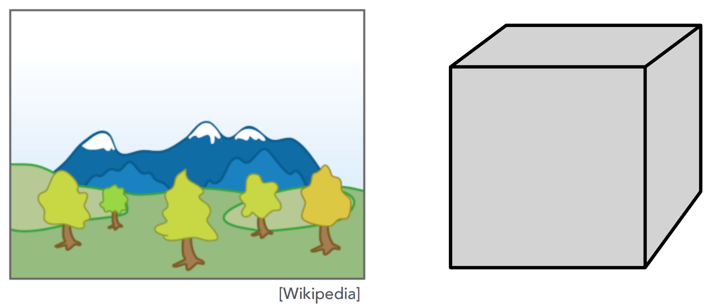

#### 	Requires sorting in depth (O(n log n) for n triangles)

#### 	Can have unresolvable depth order

​	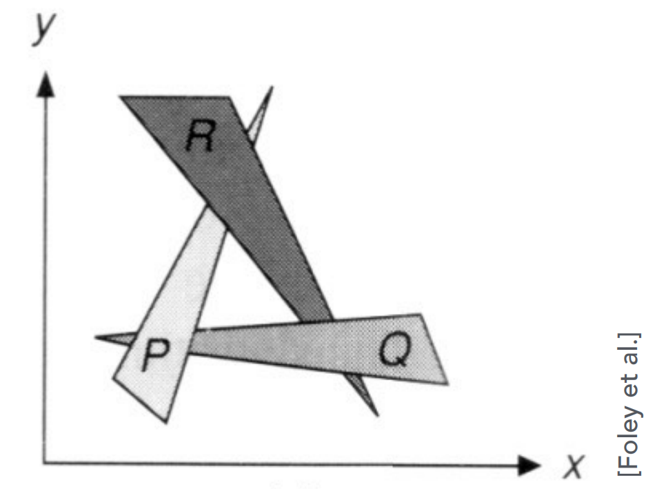

###### 		通过画家算法难以判断这三个三角形的深度顺序，三个三角形两两覆盖从而形成了一个环，在深度上存在互相遮挡关系，所以无法定义三角形们的前后顺序。当我们无法使用Painter‘s Algorithm时，引入 Z-Buffer来解决这个问题。

​	

### Z-Buffer

#### 	This is the algorithm that eventually won.

#### 	Idea:

- ##### Store current min.  z-value for each sample (pixel)

- ##### Needs an additional buffer for depth values

  - ##### frame buffer stores color value

  - ##### depth buffer (z-buffer) stores depth

#### 	IMPORTANR : For simplicity  we suppose

#### 		$ \textcolor{red}{ z \ is \ always \ positive} $  (smaller z -> close, larger z -> further) 		

##### 由于相机是放在坐标原点指向 -z轴，因此我们看到的图像深度都是负值，因此一个物体的z坐标越小，该物体就离相机越远，z的坐标越大，离相机就越近。 当我们计算物体深度时，将深度转化为一个大于0的数值，所以我们取 深度值 z的绝对值作为一个物体的深度，z越大则离相机越远，z越小则离相机越近。

### Z-Buffer Example

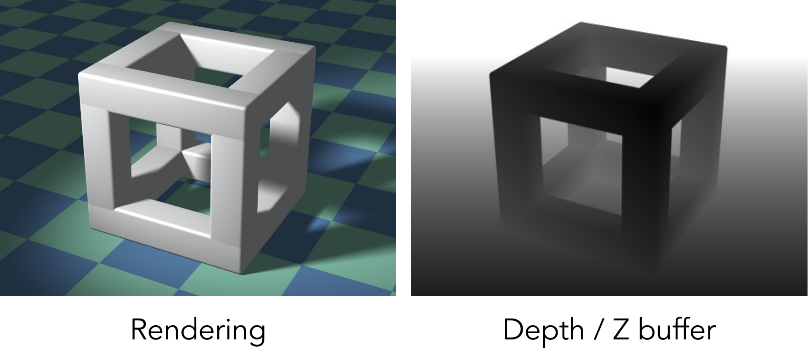

#####  这幅图的左侧是frame buffer 右侧为 depth buffer。左侧为物体最终渲染的结果，右侧的 depth buffer 存储每个像素点的深度值 z。在Depth /  Z-Buffer 上一个像素的深度值越大，则那个点越白，像素的深度值越小，则点越黑。我们设取色范围为[ 0, 1 ]，color = 0为黑，color = 1 为白,当我们的深度值小，对应的颜色值也就小，因此就接近黑色。当我们的深度值大,对应的颜色值也就大，因此也就接近于白色。


### Z-Buffer Algorithm

#### 	Initialize depth buffer to $\infty$ (重要的一步：先把所有像素的深度值都初始化为无限大)

#### 	During rasterization:

```
for (each triangle T)
	for (each sample (x,y,z) in T)
		if (z < zbuffer[x,y])		// closest sample so far 如果像素点的深度值小于深度缓冲中的深度值
			framebuffer[x,y] = rgb;	// update color 在该像素点绘制深度值小的三角形颜色
			zbuffer[x,y] = z; 		// update depth 将深度缓冲的的深度值更新为当前绘制三角形的在该点的深度值
			
			; 						// do nothing, this sample is occluded 如果深度值大于之前，则什么都不做。每个采样点展示的就是最靠近屏幕的（最近的）信息，后面的被前面覆盖了 这就是back to front。
```

​	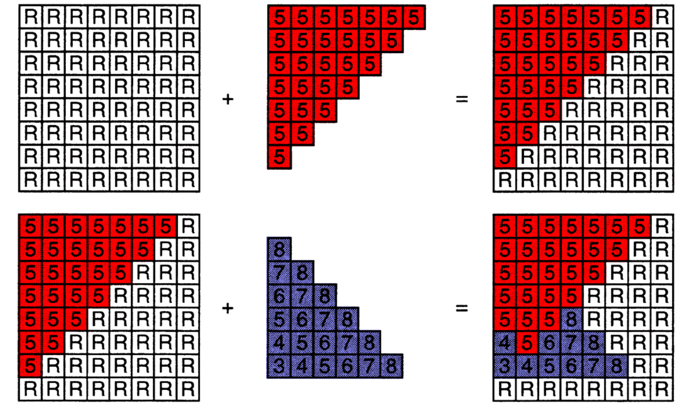

###### 可以看出，紫色三角形深度值大于5的部分在重叠时被红色三角形遮盖住了，这样就形成了图像覆盖的层次关系


### Z-Buffer Complexity

#### Complexity

- #### O(n) for n triangles (assuming constant coverage)

- #### How is it possible to sort n triangles in linear time?

  - ##### 这个算法能够在线性时间内完成的原因是算法并没有对三角形进行排序，而是仅仅在每个像素上做了一次深度值的判断，如果深度值小于之前就进行覆盖，如果深度值大于之前就什么都不做。所以这个算法所执行的就是：三角形的个数  $\times$  n个三角形所覆盖的像素个数； 得到一个 $O(n)$复杂度的算法。 

- #### Drawing triangles in different orders?

  - ##### 在这个过程中，三角形的绘制顺序并不重要，因为Z-Buffer只记录了当前绘制图像的深度值，和顺序并没有关系。在实际操作中并不是对每个像素进行深度值统计，例如在 MSAA 中对于每个像素分成更小的采样点也会进行统计，因此实际上是对每个采样点进行深度值比较。
  
- #### Most important visibility algorithm

  - ##### Implemented in hardware for all GPUs


## Shangding

###			Illumination & Shading

### 		Graphics Pipeline


### What We've Covered So Far

​		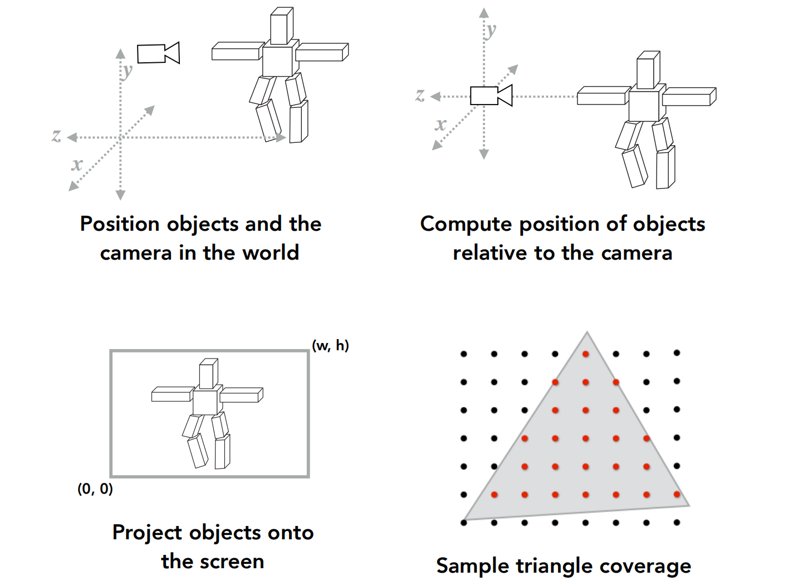


### Shading: Definition

- 	#### In Merriam-Webster Dicitionary

  - ##### The darkening or coloring of an illustration or diagram with parallel lines or a block of color.

- #### In this course

  - ##### The process of applying a material to an object.

##### 	darkening:	 引入明暗的不同，有些地方明亮一些，有些地方暗一些

##### 	coloring:	有些地方有颜色，有些地方有不同的颜色，有些地方没有颜色。

##### 	在图形学上：对其的定义是：对不同的物体应用不同的材质进行着色。


### A Simple Shading Model (Blinn-Phong Reflectance Model)

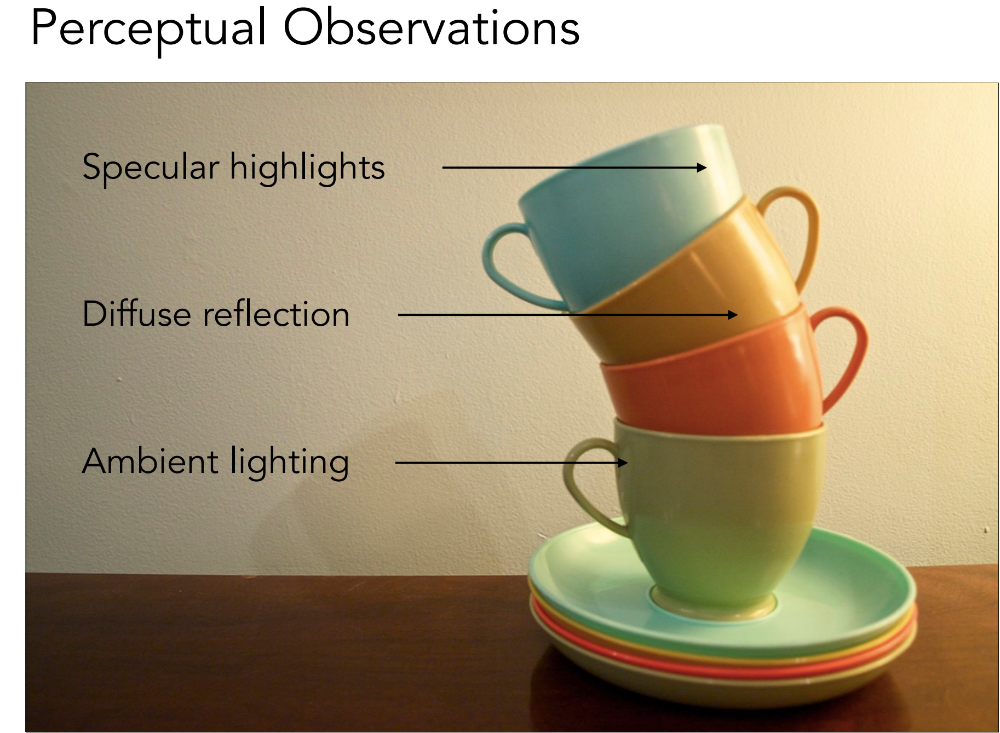

##### 			光源在右上的方向，光源照亮了所有的茶杯，可以看到茶杯上有一些颜色不同的地方

##### 			茶杯上有一个 高光（Specular highlights), 高光是由于光线照射到了光滑的表面，其光线反射方向接近镜面反射方向，因此形成了高光。

##### 			 茶杯表面除了高光外，其余颜色变化并不剧烈的地方，我们称之为漫反射(diffuse reflection)。

##### 			 光源在右上，在茶杯的背面应该看不到这个光源，那么茶杯的背面应该是黑色。但是我们看到 了这个茶杯的背面并不是黑色，也就是说有一些的光从茶杯的背面反射到了我们的眼里，那么这个点一定是接受到了光。但是这个点接受到的并不是直接光照，而是间接光照。比如说光线照射到墙上，墙面发生了一个漫反射将光反射到了桌面上，光再经过桌面的反射就能到茶杯的背面。假如说任何一个点都能够接收到来自四面八方的反射光，这个反射光就是环境关照 (Ambient lighting)，且这个光是一个常量。

​	

### Shading is Local 着色点的光照

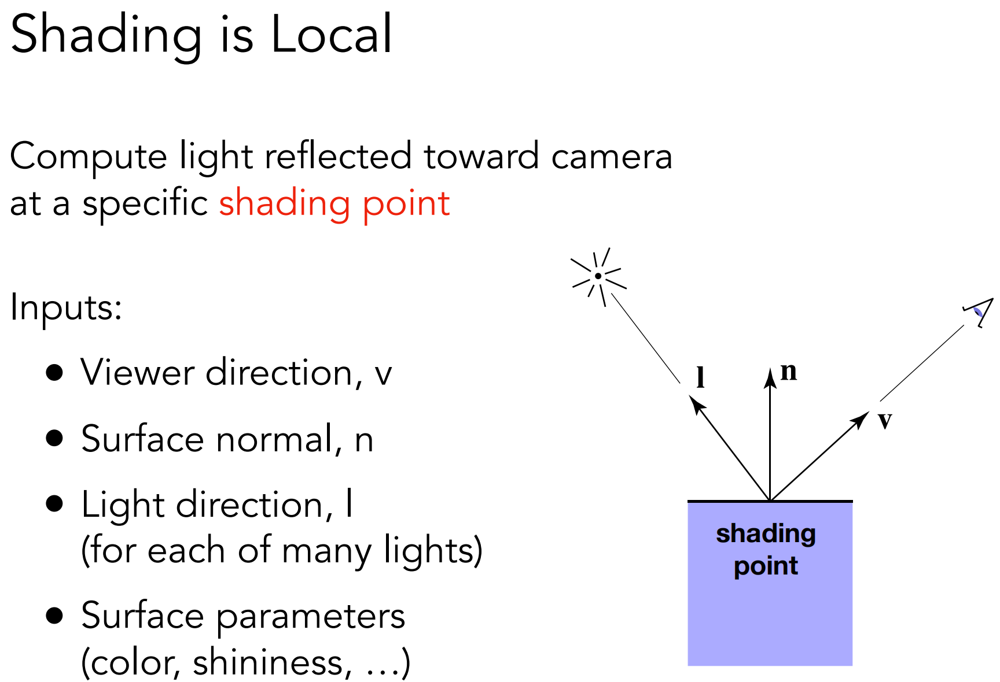

###### 							定义多个属性用于判断着色点的光照


#### No shadows will be generated! （$shading \neq shadow$） 


###### 						  着色的局部性，在考虑一个点的着色时，最多考虑光照与观测方向并不考虑阴影。

###### 						  如图，可知光源在左侧，因此模型应该会产生阴影，但是我们不考虑光线是否被其他

###### 						  物体遮挡，因此不考虑阴影问题，这里着色只能得到物体表面上的光照效果。

​	

### Diffuse Reflection

##### Light is scattered uniformly in all direction

##### 	Surface color is the same for all viewing directions

​									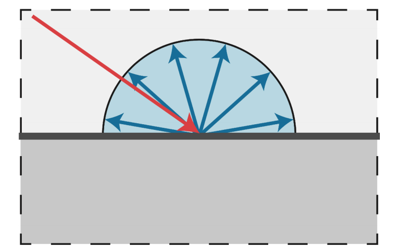


### How mush light (energy) is received?

#### 	Use Lambert's cosine law

​	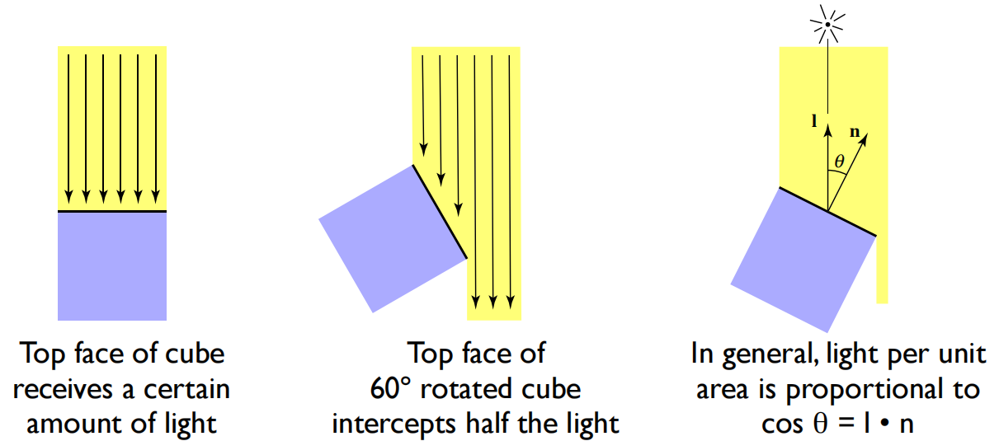

##### 		假设光是离散的，就可以使用不同的光线去代替，每根光线的能量是一样的，其物体的亮暗程度其实就算接受了多少光照的能量。

##### 		第一幅图可以看出，当光照与物体表面垂直时，可以接收光线的全部能量，因此会非常亮。

##### 		第二幅图中将物体旋转了60°，这时，发现接收的光线少了一半，也就少了一半的能量，会显得更加暗淡。

##### 		那么是不是可以给出一种规律，物体接收的能量或明暗程度由物体表面法线与光线的夹角来决定。要考虑一个着色点能够接收多少能量，需要看这个着色点周围的单位面积 unit area 能接收多少能力，着色点周围的单位面积始终是不变的，那就得考虑法向量与光线之间的夹角。

##### 		在图形学中，一个着色点 shading point 附近的单位面积接收到的光线能量与光线的入射角度有关，这就是 Lambert‘s cosine law。

##### 		定理定义了单位面积接收到光线的能量和光线方向与着色点的角度的 cosine 值成正比，当着色点法线与光线平行时 $cos(\theta)$ 为 1时， 此时单位面积接收到的光线最多，此时是最亮的，而当着色点法线与光线垂直时 $cos(\theta)$ 为 0 时，物体表面就几乎无法接收到光线，也就变的非常暗。


### Light Falloff 光线衰减

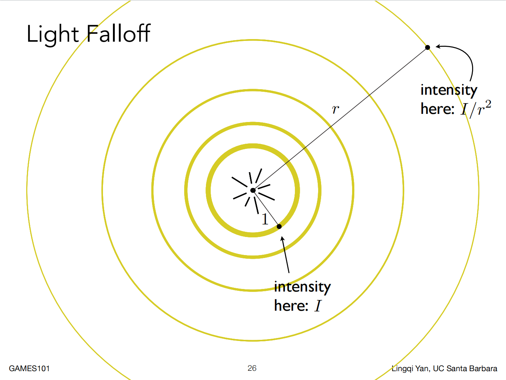

##### 	在图中的理想模型中光在真空中传播，真空中光线传播没有能量损失。我们以球壳的方式标相光向外发射能量的过程，在某一时间点上，光源发射出的所有光线的终点可以形成一个球体。

##### 	在光线的传播过程中没有能量损失，结合能量守恒定律，那么在每个球壳上的能量大小应该是相同的，在靠近光源的小的光线球壳上包含的能量与外圈大球壳上包含的光的能量是相同的。

##### 	在图中，可以看到在半径为1的球壳上的一点的光线强度为 $I$ ，而半径为 $r$ 的球壳上一点的光线强度为 $\frac{I}{r^{2}}$ ,根据能量守恒定律，远近球壳的总能量是相同的，则可以根据公式： 近处光照强度 $I \times$ 近处球壳总面积 $4\pi = $ 远处光照强度 $\times$ 远处球壳面积 $4\pi r^{2}$ 。 所以可以得到光线强度衰减与光源距离的关系为  $\frac{I}{r^{2}}$。 

  	

### Lambertian (Diffuse) Shading

#### 	Shading independent of view direction

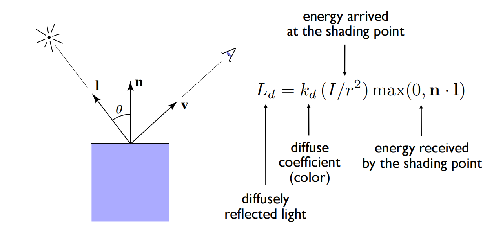

##### 			$max(0, n \cdot l)$ 当中的 $n \cdot l$ 可以帮助我们求出当前shading point接收的能量大小， 通过判断这个点乘结果是否大于0是因为当点乘结果为复数时，我们认为这种情况是有一条光线从物体下面穿过物体到达了物体表面，但我们考虑的是反射，而非折射，所以把值设为0。


### Produces diffuse appearance

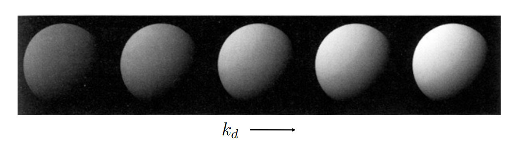

##### 		 shading point之所以会有颜色，只有一个可能性，那就是shading point吸收了一部分能量，也就是吸收了一部分光，反射出没被吸收的光。 如果不同的点有不同的吸收率，那么得到的结果就会是不同的颜色。 

##### 		如果我们定义一个系数$kd$ 来表达能量吸收了多少，如果$kd =1$,则表示这个点完全不吸收，进入的能量 = 出去的能量。如果$kd = 0$,那么表示进入的能量全部被吸收。 $kd$是一个系数，代表的是一个物体本身的颜色，或者是材质。因为不同的材质和光线作用的结果不同，所以还要再乘以这个反射系数 diffuse coefficient。


笔记补充 https://blog.csdn.net/weixin_43391563/article/details/111313567

