## Lecture 8: Shading 2 (Shading, Pipeline and Texture Mapping)    还差部分内容关于Per-Vertex Normal Vectors

## Specular Term (Blinn-Phong)

#### Intensity depends on view direction

- #### Birght near mirror reflection direction

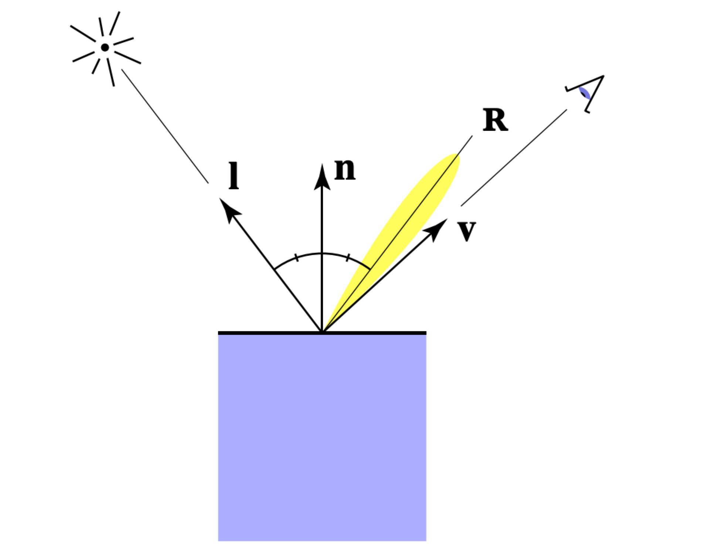

###### 		高光的产生：当观察者观察物体的视角与光源角度正好是镜面对称时，即可看到高光。在上图中可以发现，与光线 $l$  基于法线对称的 $R$ 是镜面反射方向 (但高光并非完全只有一条反射光线，在 视角 $v$ 与 $R$ 越来越接近时，镜面反射效果越明显)

### V close  to mirror direction $\Leftrightarrow$ half vector near normal

- ### Measure "near" by dot product of unit vectors

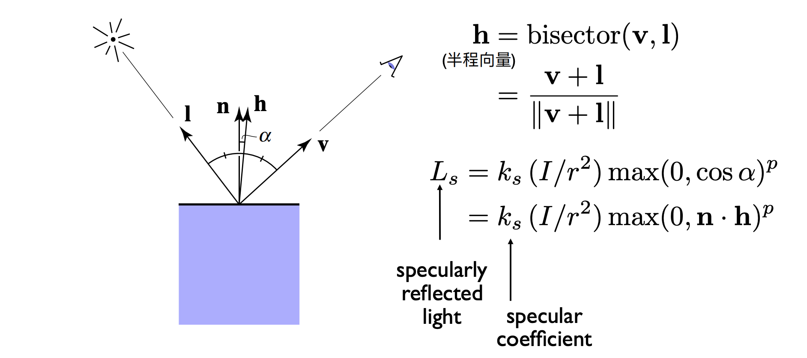

###### 半程向量(半角向量) $h$ 为了精简计算观察角度$v$ 与 反射角度$R$ 的接近率，从图一可以看出，物体的法线方向正好是光源向量 $l$  和反射向量 $R$ 的角平分向量，通过对比法向量$n$与半程向量$h$的接近程度，使用$cos(\alpha) = n\cdot h$表示高光强度， $cos\alpha \in [0,1]$可以对反射点的高光强度归一化，综合以上可以得到高光模型公式。

###					$L_{s} = K_{s}(\frac{I}{r^{2}})max(0, n\cdot h)^{p}$

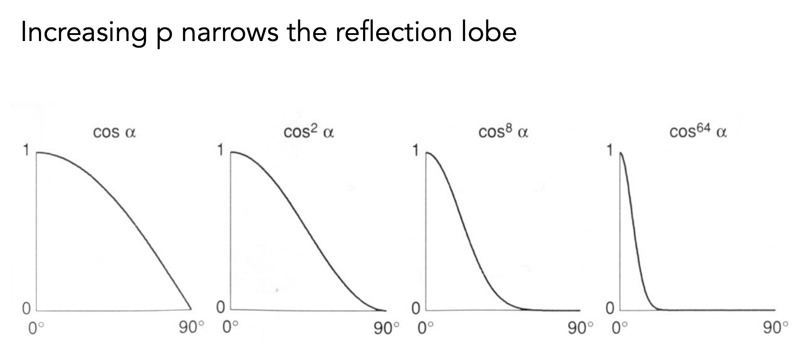

###### 指数p用于加快函数的衰减程度，由于在现实世界中高光在物体表面上只存在很小的一部分，而$cos\alpha$的衰减速度太慢，通过携带指数，可以促进衰减速度，使得高光只能在与法线向量$n$ 非常接近的情况下才能被视角看见。

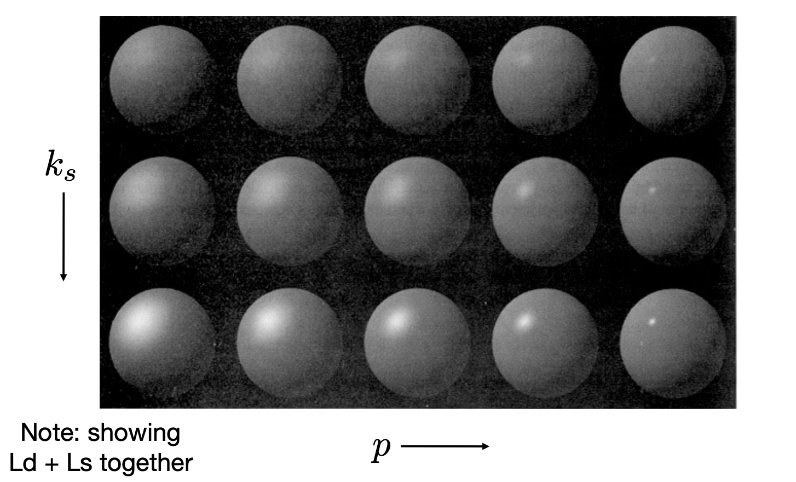

### Ambient Term

#### Shading that does not depend on anything

- #### Add constant color to account for disregarded illumination and fill in black shadows
- #### This is approximate / fake!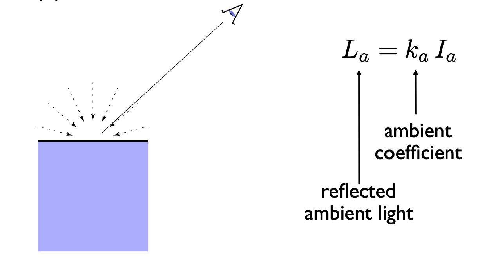

###### 环境光照射在其他物体反射到观察物体上再通过观察物体表面反射至观察者视角。在Blinn-Phong模型中，假设物体表面接收到的各种环境光都是相同强度的。这样的模型大大简化了计算环境光的步骤，强度相同，意味着反射光的强度也相同，由于环境光来自四面八方的物体反射，所以该物体表面反射环境光的方向也是四面八方的。在这样的模型中，环境光与光源的角度无关，与观察角度也无关，是一个常数。

### 														$L_{a}= K_{a}I_{a}$

### Blinn-Phong Reflection Model

#### Ambient + Diffuse + Specular = Blinn-Phong Reflection

###### Ambient 由于环境光是常数，所以作用在物体的每一个点上都有相同的光照强度

###### Diffuse 漫反射光与观察角度相关，当观察视角与物体表面顶点法线越接近，光照强度越大

###### Specular 高光与观察角度相关，只有半程向量与顶点法线偏差非常小时，才能看到高光效果

#### 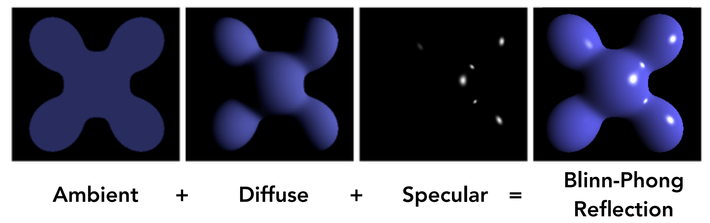

#### 							$L = L_{a} +L_{d}+L{s} \\ =k_{a}I_{a} + k_{d}(\frac{I}{r^{2}})max(0, n\cdot l) + k_{s}(\frac{I}{r^{2}})max(0, n\cdot h)^{p}$

### Shading Frequencies

#### What caused the shading difference？

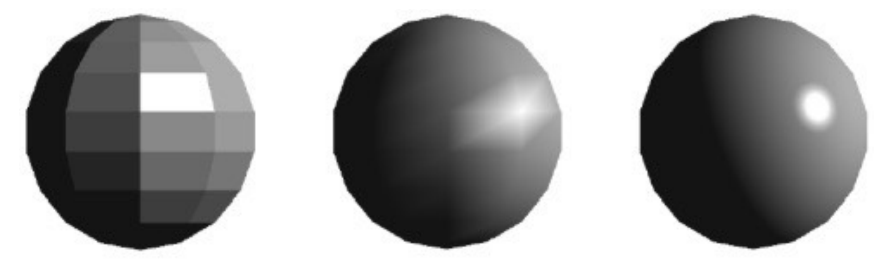

### Shade each triangle (flat shading)

#### Flat shading	

- #### Triangle face is flat — one normal vector

- #### Not good for smooth surfaces

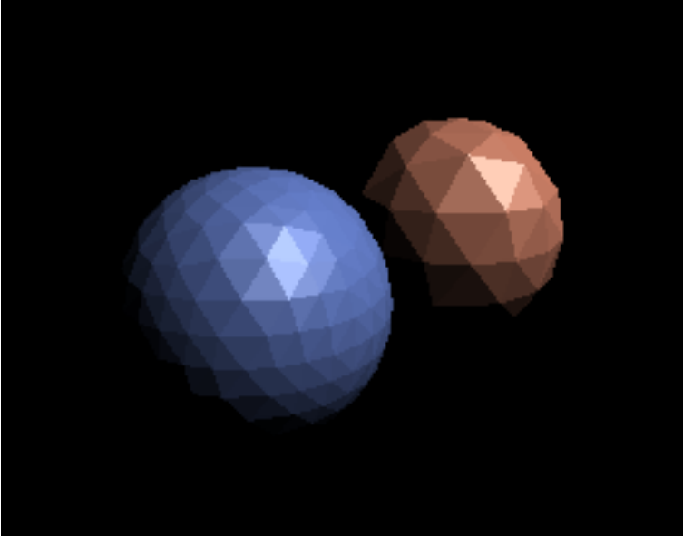

### Shade each vertex (Gouraud shading)

#### Gouraud shading

- #### Interpolate colors from vertices across triangle

- #### Each vertex has a normal vector 

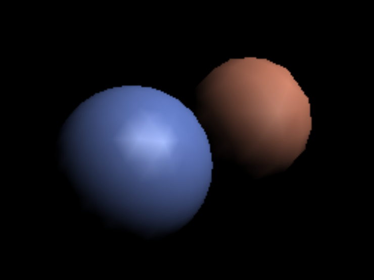

### Shade each pixel (Phong shading)

#### Phong shading

- #### imterpolate normal vectors across each triangle

- #### Compute full shading model at each pixel

- #### Not the Blinn-Phong Reflectance Model

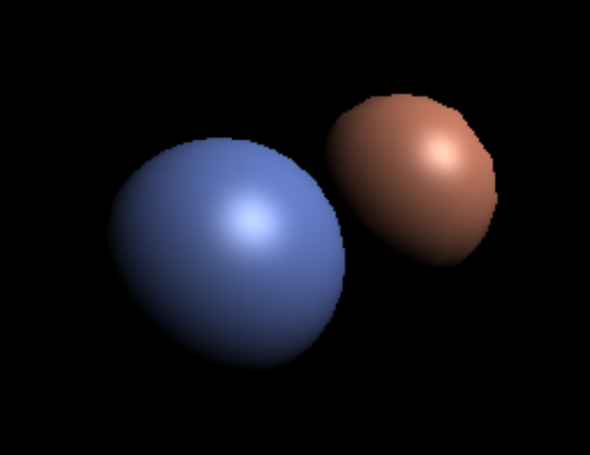

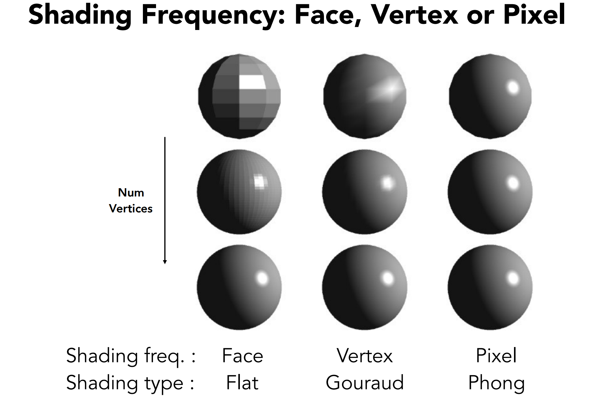

### Defining Per-Vertex Normal Vectors

#### Best to get vertex normals from the underlying geometry

- e.g. consider a sphere

#### Otherwise have to infer vertex normals from triangle faces

- Simple scheme: average surrounding face normals

### 	$N_{v} = \frac{\sum_{i}N_{i}}{|| \sum_{i}N_{i}||}$

### Defining Per-Pixel Normal Vectors

#### barycentric interpolation (introducing soon) of vertex normals

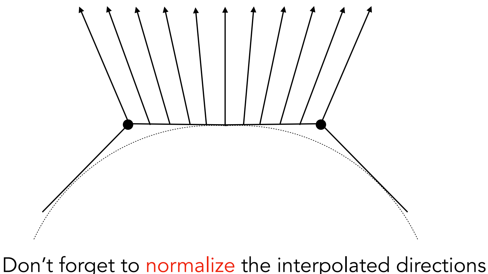

### Graphics (Real-time Rendering) Pipeline

#### Graphics Pipeline

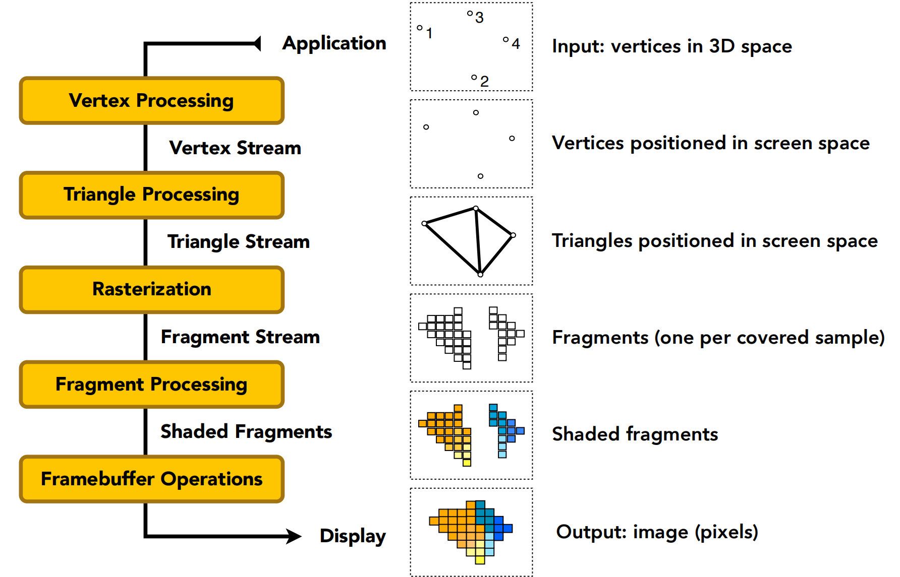

#### Graphics Pipeline Implementation： GPUs

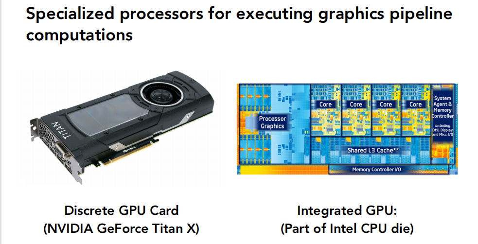

#### GPU: Heterogeneous, Multi-Core Procesor

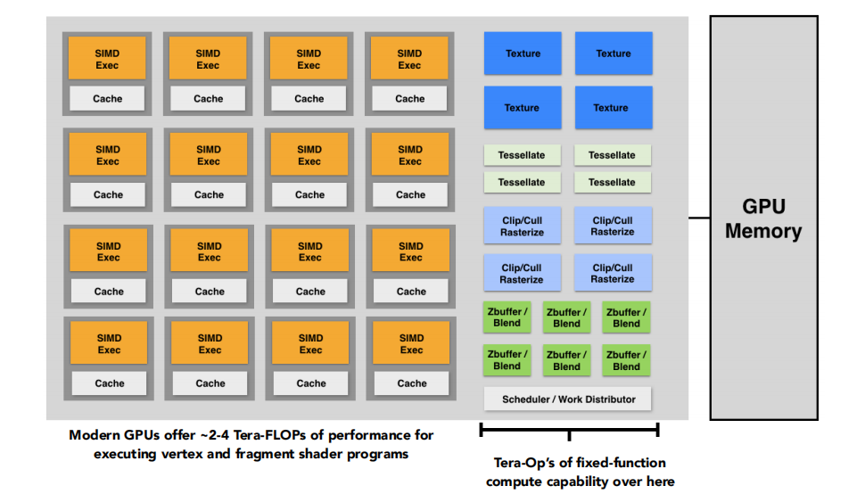

## Texture Mapping

#### Different Colors at Different Places?

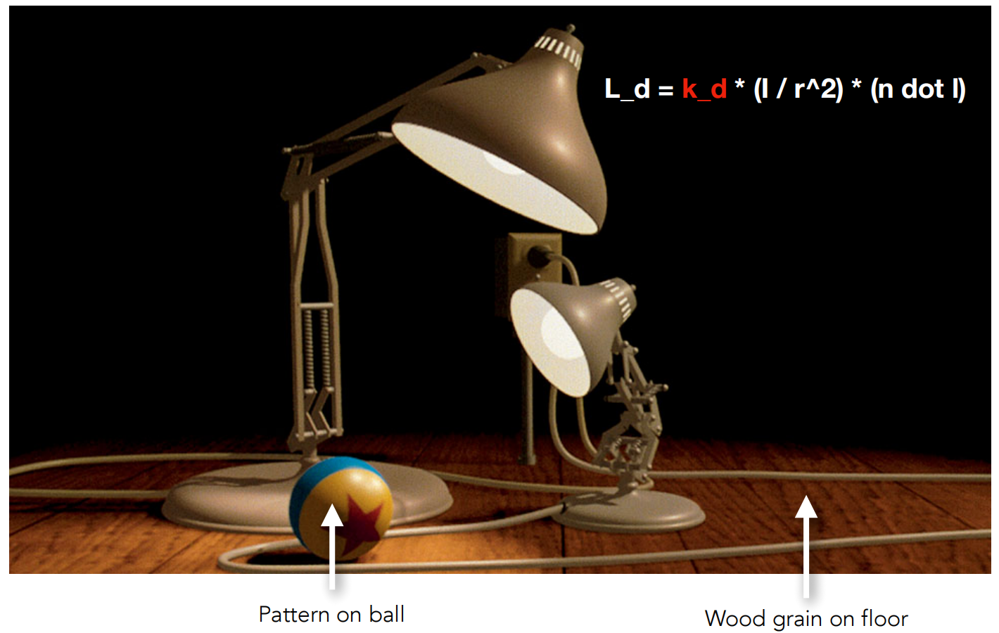

###### 										图中球与地板的漫反射系数 $k_d$ 是不同的，在光照下产生不同的效果

###### 		   为什么需要纹理映射：

###### 				上图中可以看出，不同的物体有着不同的漫反射系数 $k_d$ ，每个着色点的 $k_d$ 都不相同，那么如何去设置不同着色点的 $k_d$ ，此时纹理映射就可以解决这个问题。

###### 				我们显示的三维物体，其实都是三维物体的表面，这些表面本质上都是二维的图形，这些物体表面由一个个三角形组成，只需要从中撕开一些口中，就可以把它们展开为一个二维表面。就像是剥橘子一样。

###### 				这样，就可以把三维的物体与二维的图像联系在一起了，就像是地球仪与地图的关系，三维地球仪上任意一个地方，可以同样对应到二维地图上的位置。

###### 				纹理映射的纹理，指的就是我们前面所说的这些二维的图片，假设这些图片可以随意的拉伸扭曲，那么就可以把这些图包裹到三维球体上，这个过程则被称之为纹理映射，例如把地图包裹到一个球上面，这个球就变成了地球仪。

###### 				纹理映射的映射，在纹理映射时，我们只需要知道物体上的着色点与纹理的对应关系，***即三维表面的某个着色点是纹理上的哪个位置，然后着色时 $k_d$ 的取值按照纹理上的值即可。***

###### 				

#### Surfaces are 2D

- ##### Surface lives in 3D world space

- ##### Every 3D surface point also has a place where it goes in the 2D image (texture).

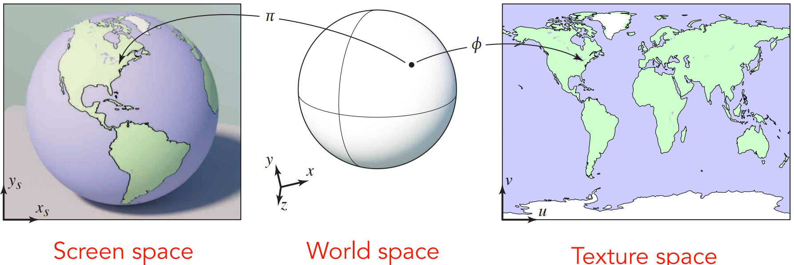

### Visualization of Texture Coordinates

#### Each triangle vertex is assigned a texture coordinate (u, v)

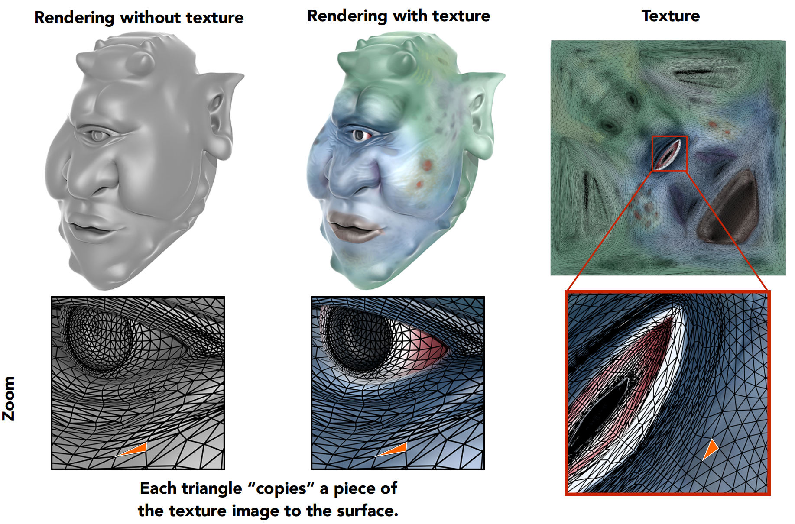

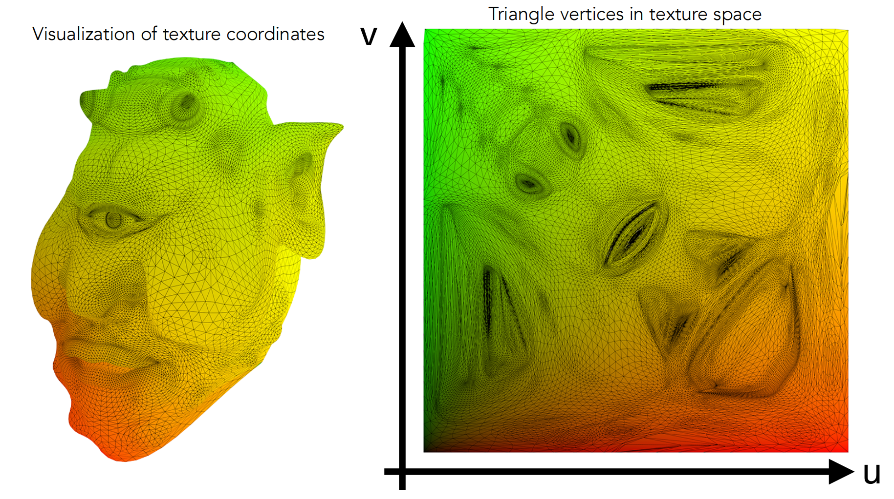

###### 			纹理坐标 UV

###### 				前面既然提到了纹理上的某个位置，那么我们是不是就可以在二维的纹理上定义一个二维的坐标系，这样纹理上任意一点的位置我们就可以使用 (x, y) 的方式来表述了。事实上，就是这样的，不过对于纹理的坐标系我们通常用uv来表示**，而不是xy，但是意义是一样的，**u代表纹理的横坐标，v代表纹理的纵坐标。

###### 				我们知道不同的纹理，它们的大小可能都是不一样的，有些可能是正方形，有些是长方形，因此纹理坐标UV的定义和纹理尺寸以及形状没有关系。我们认为对于任何一个纹理，它的U和V的值都是从0到1，例如uv（0,0）代表纹理的左下角，uv (0.5,0.5) 代表纹理的中心，uv (1,1) 代表纹理的右上角。

######  				这样，当我们知道一个三角形三个顶点对应到纹理上的UV坐标后，我们就可以通过重心坐标计算出该三角形内任意一点所对应的UV。然后我们通过UV坐标即可在纹理上采样到对应的颜色值作为该点的漫反射系数的值，这样就等于把贴图贴到（映射到）了物体上。

### Visualization of texture coordinates

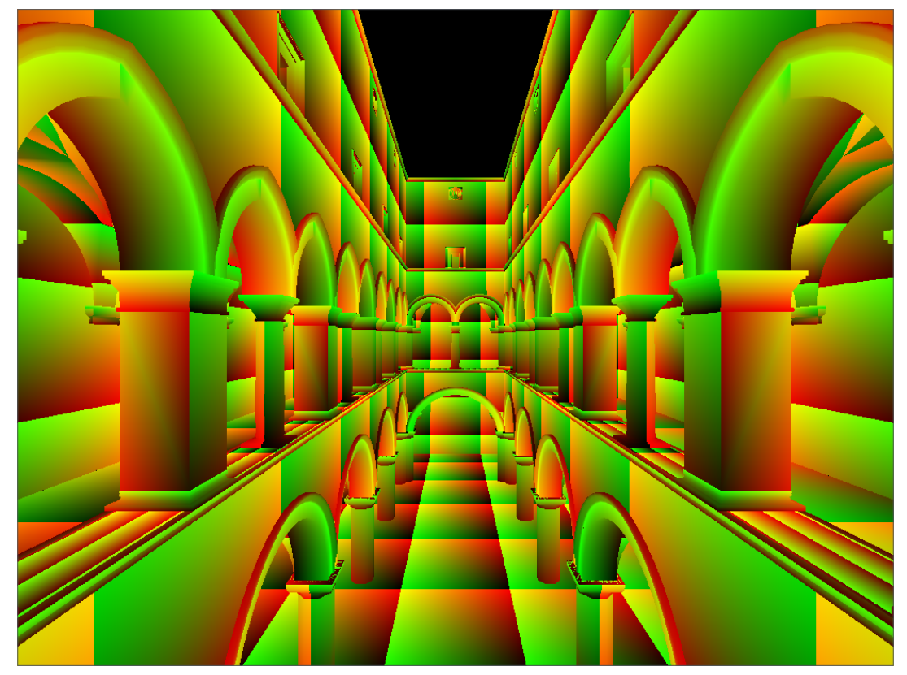

###### 

补充笔记 https://zhuanlan.zhihu.com/p/352209183

