# Lecture 9: Shading 3 (Texture Mapping)

​	

## Interpolation Across Triangles: Barycentric Coordinates

### Why do we want to interpolate?

- #### Specify values at vertices

- #### Obtain smoothly varying values across triangles

### What do we want to interpolate?

- #### Texture coordinates, colors, normal vectors, …

### How do we interpolate?

- #### Barycentric coordinates

  

### Barycentric Coordinates

#### 	A coordinate system for triangles $(\alpha,\beta,\gamma)$

​											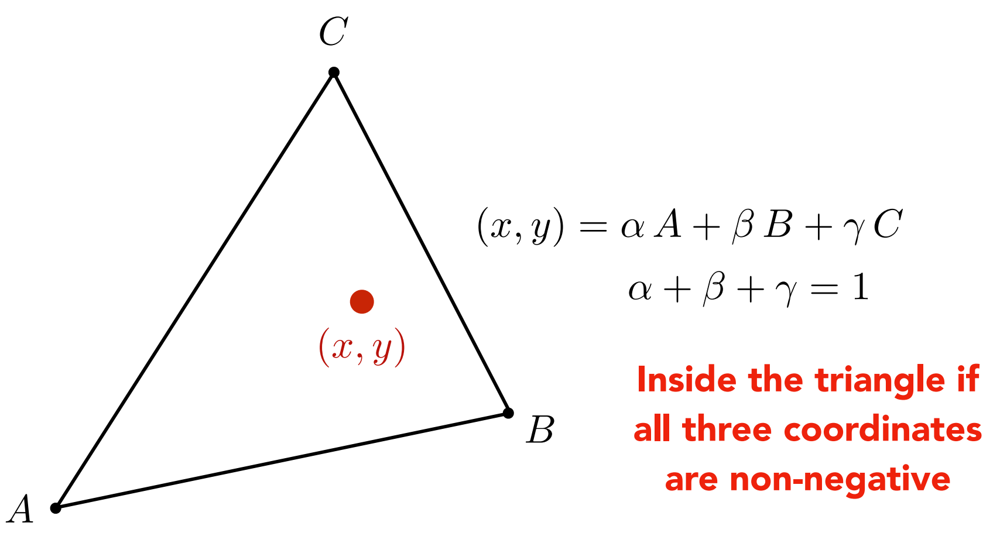

#### 	What's the barycentric coordinate of A?

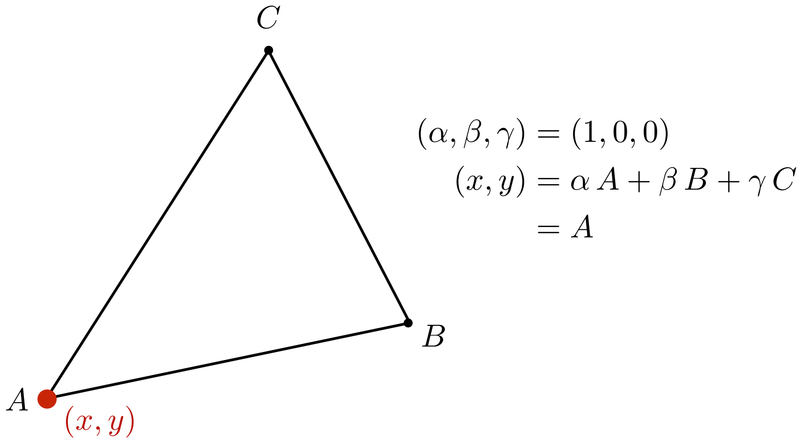

#### 	Geometric viewpoint — proportional areas

​												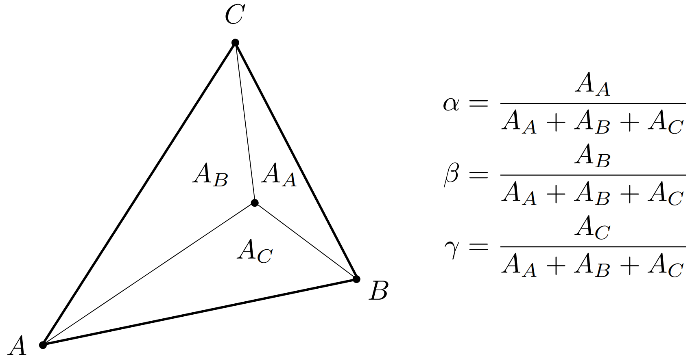

#### 	What's the barycentric coordinate of the centroid?

​														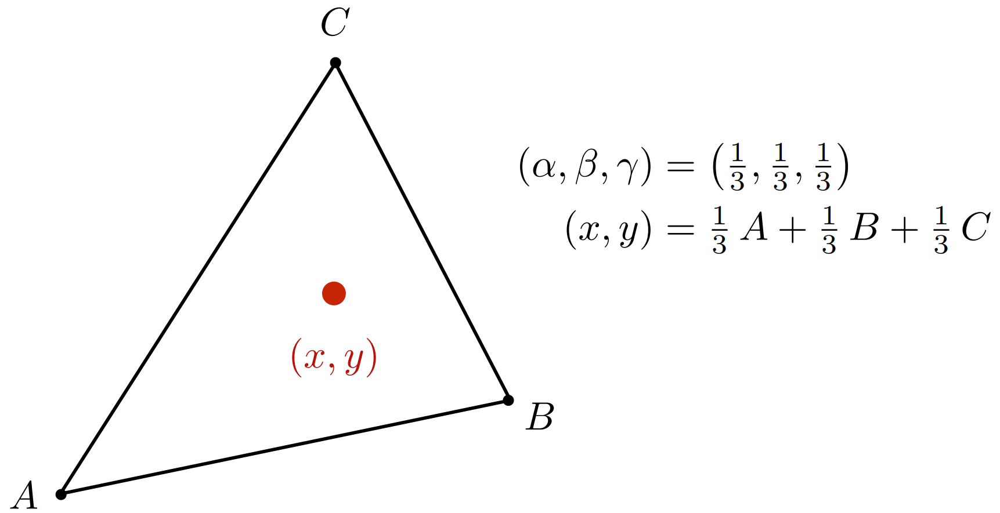

#### 	Barycentric Coordinates: Formulas

​											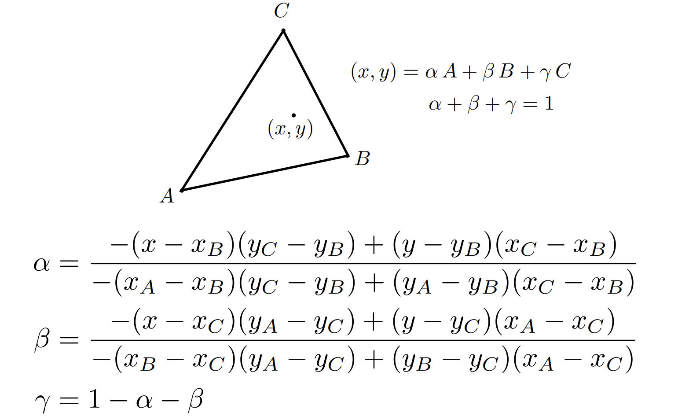	


#### 	Using Barycentric Coordinates

##### 		Linearly interpolate values at vertices

​												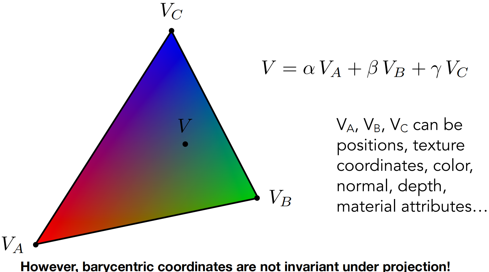

​	质心(重心)坐标并非一个固定的值，通过三角形内不同位置的质心，可以得到不同位置与三个顶点属性的比例。


## Applying Textures


### Simple Texture Mapping: Diffuse Color

```  c
for each rasterized screen sample (x, y):       (Usually a pixel's center)

(u, v) = evaluate texture coordinate at (x, y)   (Using barycentric coordinates!)

texcolor = texture.sample(u, v);

set sample's color to texcolor;

(usually the diffuse albedo $Kd$ recall the Blinn-Phong reflectance model)```
```

### Texture Magnification (What if the texture is too small?)

### 	Texture Magnification - Easy Case

##### 		Generally don't want this - insufficient texture resolution

##### 		A pixel on a texture - a texel (纹理元素 纹素)

​		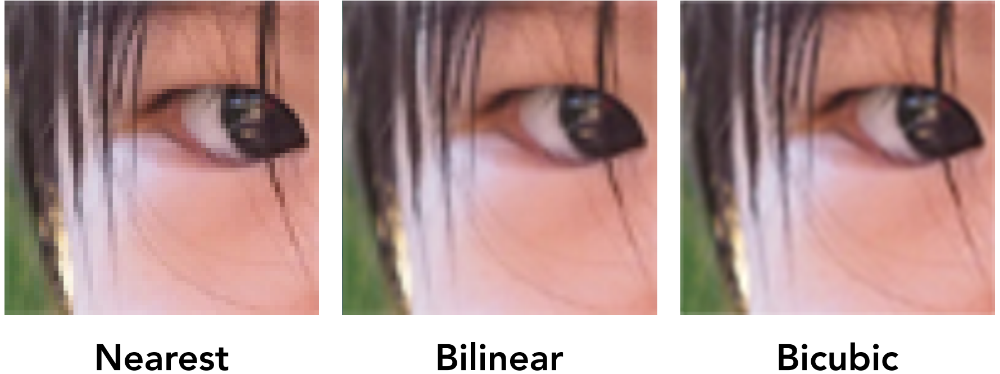

###### 		第一张模糊的图片可以发现很多的锯齿，本质上模糊和锯齿的原理是一样的。

###### 		纹理其实就是一张图片，因此它也存在自己的分辨率，即由像素组成，每个像素有自己的下标，纹理上的像素通常被称为纹理元素 Texel。 UV对应的像素坐标也是可以计算出来的，例如纹理每行有1000个像素，那么当U = 0.25时 （UV的范围都是从0至1），对应的像素横坐标就是249，V方向也是同理。

###### 		而我们的物体表面最终会显示在屏幕上，屏幕自然也有它的像素，屏幕像素我们称为pixel。我们每个屏幕像素都会对应到三角形内的一个点，而三角形内的点会有它对应的UV坐标，然后我们通过UV坐标可以找到纹理上对应的纹理像素，也就是说在使用纹理映射时，屏幕像素会对应到纹理像素上。

###### 		那么当纹理分辨率低时，也就是纹理内部的像素少，这样屏幕像素对应到纹理像素上，可能就不是一个整数下标的纹理像素，而是变成了浮点数。比如屏幕像素(50, 50) 对应到纹理像素(5, 5), 屏幕像素(51, 50)对应到纹理像素(5.1, 5)，屏幕像素(52, 50)对应到纹理像素(5.2, 5)，然后对于浮点数我们会四舍五入成整数，那么上面三个屏幕像素对应的纹理像素都是(5, 5)，也就是说当我们纹理太小的时候，多个屏幕像素会对应到一个相同的纹理像素上，所以产生了模糊或锯齿。

#### Bilinear Interpolation

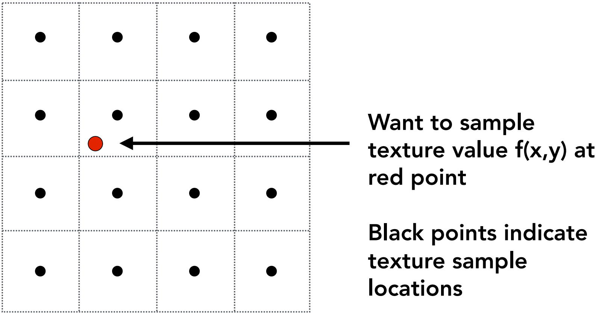

###### 							黑点代表了贴图采样位置，红点是屏幕像素对应的纹理像素位置。

###### 							如果按照四舍五入的方式（Nearest 最近邻插值），此时红点的颜色应该就是 $u_{11}$点所在的纹理像素的颜色，就会造成模糊与锯齿的问题。

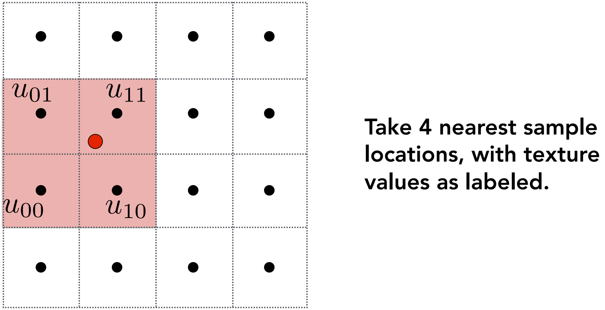

###### 				take 4 nearest sample locations, use these location to interpolation

​							   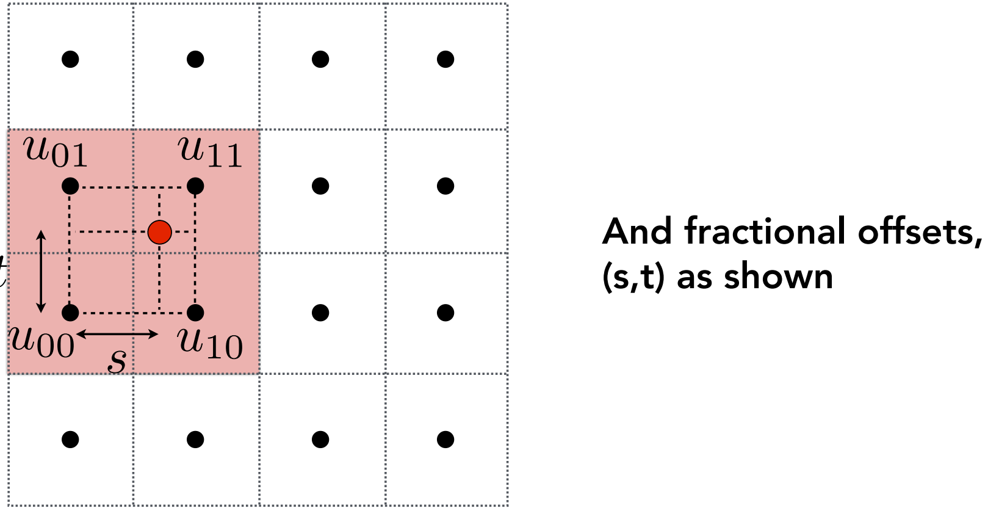

​		

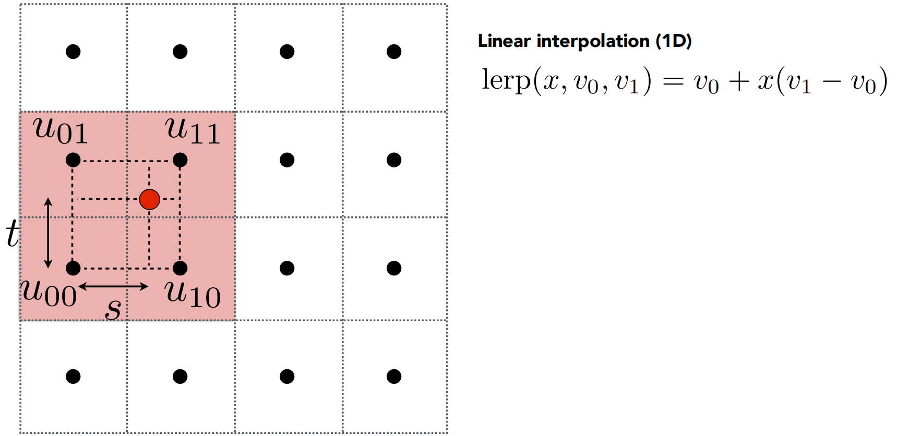

###### 								lerp is Linear interpolation

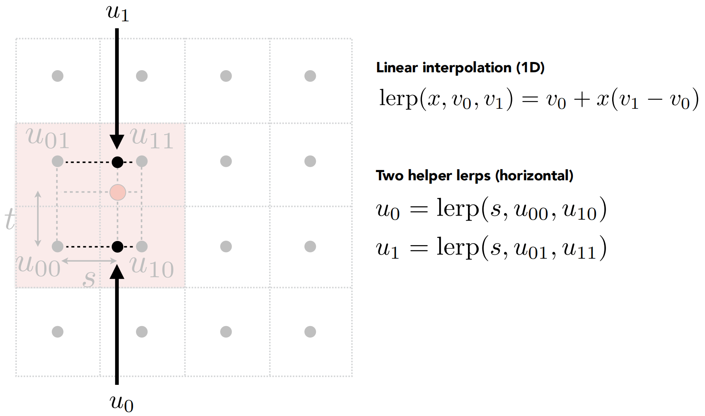

###### 							get sample point horizontal coordinate

​							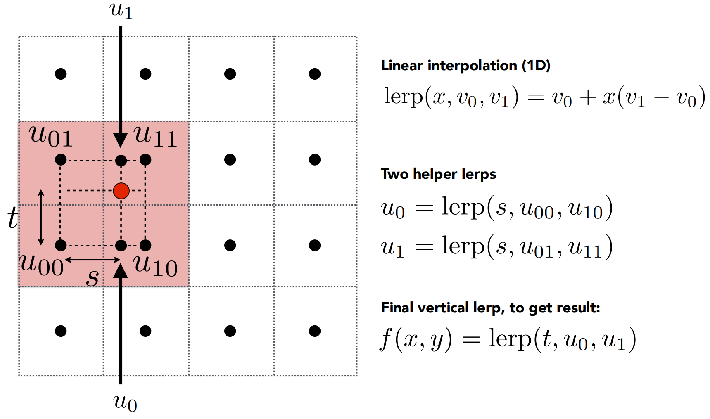

###### 													use thrice interpolation (horizontal twice, vertical once) get result.

###### 		以上流程描述了双线性插值的一个处理流程，可以看出通过这套流程下来，可以得出区域内任意一点的颜色，深度等信息，双线性插值不仅可以向上述流程中以横向进行两次lerp纵向一次lerp，也可以纵向两次lerp，横向一次lerp，可以得到一样的结果。从上述流程看出总共进行了三次插值。

###### 	单线性插值：

###### 				已知数据$(x_0, y_0)与(x_1,y_1)$要计算$[x_0, x_1]$区间内某一位置 $x$在直线上的$y$值，因为直线上的函数值是线性变化的，只需要通过计算 $x_0 \ x$两点斜率和$x_0 \ x_1$两点的斜率，令二者相等可以得到方程。

​				

​																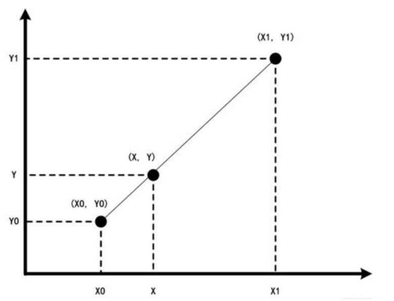

###### 				直线的斜率相等，所以可得  

### 												$\frac{y-y_0}{x-x_0}=\frac{y_1-y_0}{x_1-x_0}$

### 										$y =\frac{x_1-x}{x-x_0}y_0 +\frac{x-x_0}{x_1-x_0}y_1$

###### 		双线性插值：

###### 								为什么需要这样的双线性插值流程，首先，图中我们知道了4个顶点的属性，再通过两次插值得到了横向两点的属性，最后插值得到这两点间的属性，总共进行了三次单线性插值。

###### 			双线性插值后，红色点的颜色会和边上4个纹素结合起来，而不是简单的等于 $u_{11}$ 的颜色，这样当多个屏幕像素对应到一个纹素时这几个屏幕像素的颜色也会有一个线性的变换，而不是一模一样，锯齿与模糊就会减弱。	

​																

​																		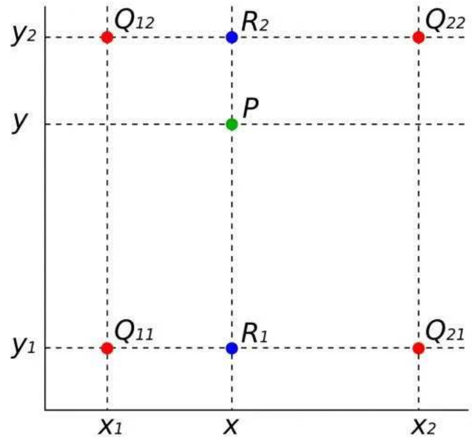

###### 			在x方向做插值  ($f(Q_{11}) = y1$）：

#### 										$f(R_1) = f(x, y_1) \approx \frac{x_2-x}{x_2-x_1}f(Q_{11})+\frac{x-y_1}{x_2-x_1}f(Q_{21})$

#### 									   $f(R_2) = f(x, y_2) \approx \frac{x_2-x}{x_2-x_1}f(Q_{12})+\frac{x-y_1}{x_2-x_1}f(Q_{22})$

###### 			在y方向做插值 ：

#### 									  $f(x, y) \approx \frac{y_2-y}{y_2-y_1}f(R_{1})+\frac{y-y_1}{y_2-y_1}f(R_{2})$

​			

#### 		Bilinear interpolation usually gives pretty good results at reasonable costs


## Texture Magnification (hard case) 

#### 	(What if the texture is too large?)

### Point Sampling Textures - Problem

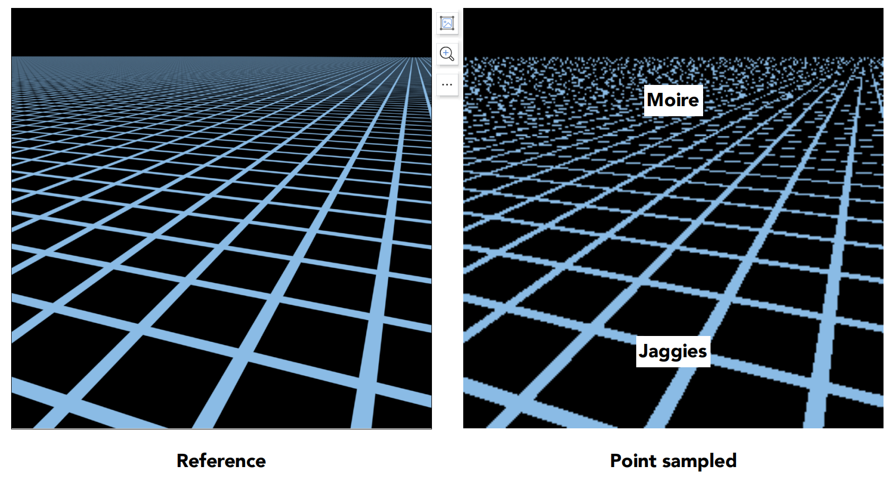

###### 																						图中可以看到经过点采样后的的图片在近处出现了锯齿 在远处出现了摩尔纹，为什么会出现这种情况呢，依然还是需要从屏幕像素和纹理像素的对应关系进行理解。

###### 			从纹理图可以看出，格子的大小其实是一样大的，也就是说每个格子所占的纹理像素是一样多的。但是因为透视投影带来的近大远小效果，近处的格子看起来就会很大，也就是说会有很多的屏幕像素来显示一个格子，就会产生上面描述的多个屏幕像素对应一个纹理像素的问题，就导致了模糊与锯齿。而在远处则相反，会有极少的屏幕像素显示一个或多个格子，也就是一个屏幕像素会对应多个纹理像素，就产生了摩尔纹。

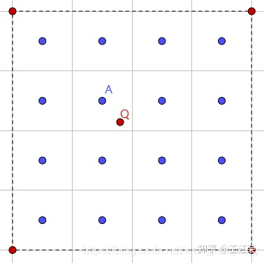

###### 				我们假设在远处一个屏幕像素覆盖了16个纹理像素，该屏幕像素中心点对应到图中的Q点。根据四舍五入的做法，我们知道Q点的颜色就是A点对应纹理像素的颜色，同时这个颜色也代表了该屏幕像素覆盖的十六个纹理像素的颜色，这显然是不对的。

###### 				在反走样 Antialiastion 中，我们通过 MSAA 在一个像素中增加采样点求平均的方式来解决反走样的问题。例如上图，原本一个屏幕像素一个采样点，覆盖了16个纹理像素，那么如果我们在一个像素里使用16个采样点，那么覆盖的纹理像素就基本可以被采样到，然后利用它们的平均值来代表这个屏幕像素的颜色，而不是某个纹理像素的颜色值来代表，这样会得到不错的效果，但是会增加计算量，造成性能消耗。

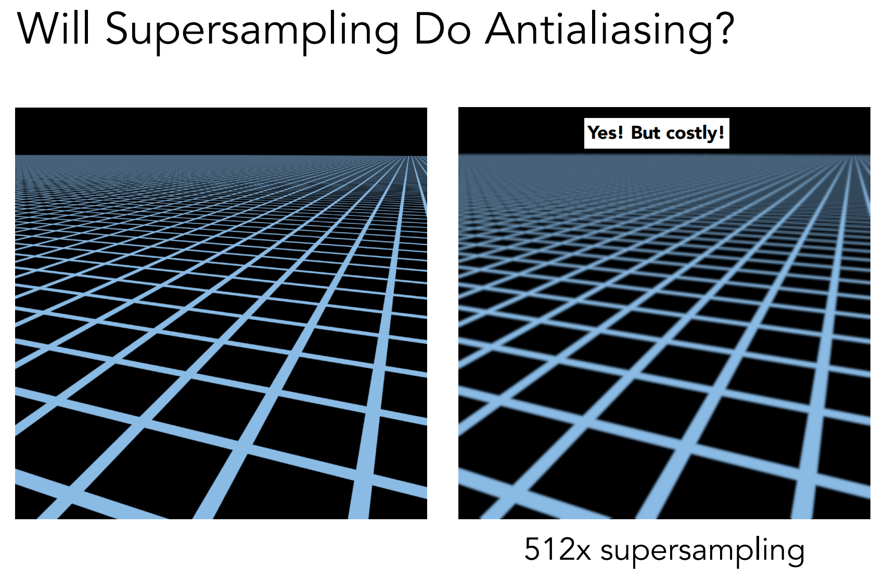

###### 											图中是对每个像素增加512个采样点后的结果，会消耗大量的性能


### Screen Pixel "Footprint" in Texture

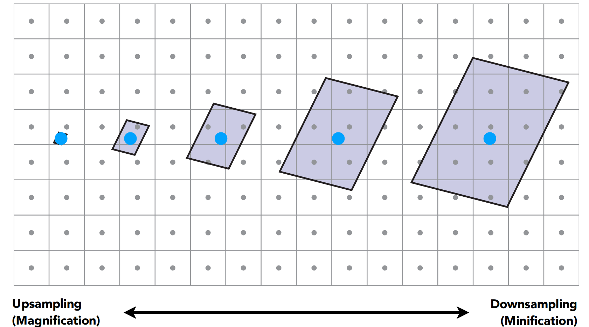

###### 					为什么会出现这种走样的情况，在近处，一个像素所覆盖的纹理区域是比较小的，而在远处，一个像素覆盖的纹理区域非常大，再使用像素中心去采样就会出现问题。


### Will Supersampling Do Antialiasing?

###### 					为了消除上面的锯齿，可以通过超采样技术对每个像素进行512次采样，得出一个非常不错的结果，但是，这样做会有什么优点或缺点呢。

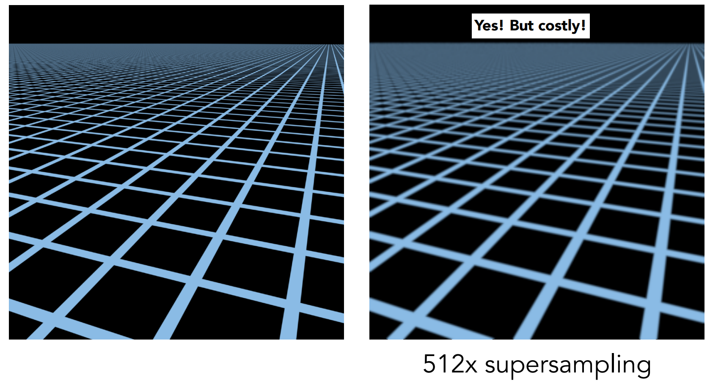

### Antialiasing	Supersampling?

#### Will supersampling work?

- Yes, high quality, but costly
- When highly minified, many texels in pixel footprint
- Signal frequency too large in a pixel
- Need even higher sampling frequency

#### Let's understand this problem in another way

- What if we don't sample?
- Just need to get the average value within a range!


### Point Query vs. (Avg.) Range Query

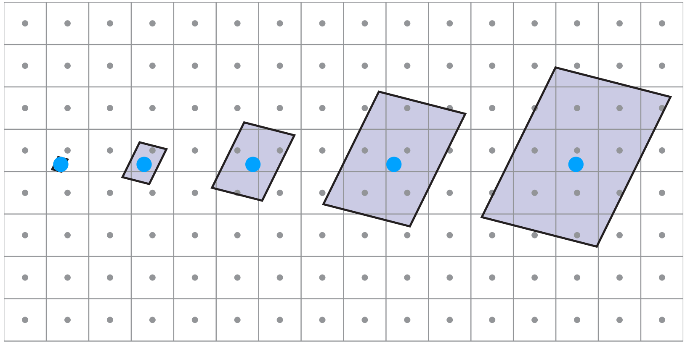

###### 			点查询Point Query与范围查询 Range Query

###### 			在上面说到的双线性插值就是一种点查询，我们得知纹理上任意一点，要得知其对应的颜色值。

###### 			而对于摩尔纹，我们要用的则是范围查询，即我们知道一定范围的纹理像素，要查出它的平均值。当然对于不同的情况我们可以查询一个范围内的最大值或最小值。那么当我们得知一个范围后，如果能立刻得知它的平均值，就可以在不增加运算量的情况下，解决摩尔纹的问题。

### Different Pixels  $\rightarrow$ Different-Sized Footprints

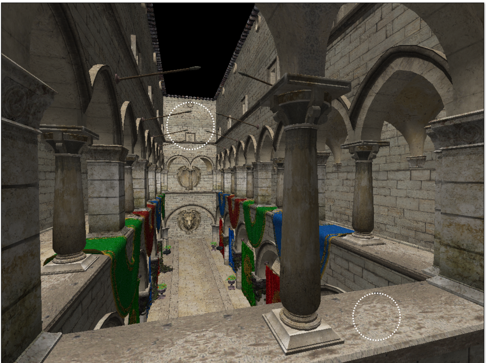

###### 			从图中可以看出，图中近处的圆形区域中，每个像素所映射的纹素是比较少的，而在远处的圆形区域中，每个像素都需要映射大量的纹素，导致出现走样的问题。

### 问题： 通过范围查询使用加载不同的mipmap，可以实现位置移动视角变换时进行不同贴图的加载？（openGL是如何处理多级渐远纹理的？），当我们离上图中远处墙面的圆形区域越近，加载的mipmap也就越大，为什么看起来效果并不会走样。


## Mipmap   Allowing($\color{red}{fast, approx, suqare}$) range queries

###### 		Mipmap是一种可以帮我们实现范围查询的方法，它速度快，但并不是特别的准确，结果是一个近似值，此外它只能做正方形的范围查询。

###### 		Mipmap的本质，就是通过一张纹理生成一系列的纹理:

#### 	  Mipmap(L. Williams 83)	

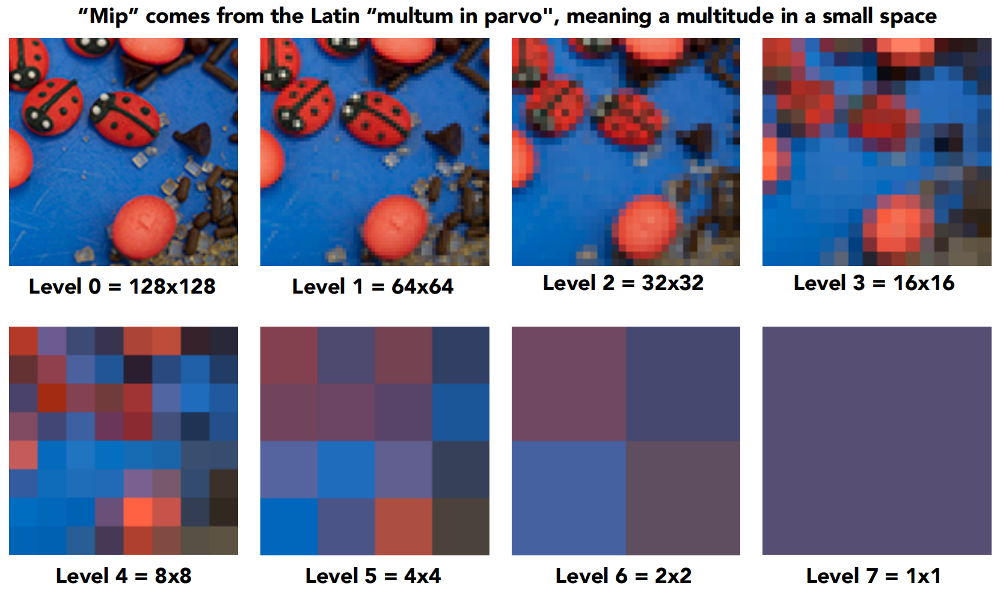

​			


###### 		我们假设原本的纹理是n*n大小的，为第0层，然后基于这个原始的纹理增加更多层的纹理，每一层的长宽都是上一层的一半，那么总共会有$\log{n}$层。

###### 		这样我们只需要在使用前生成好mipmap，然后使用时直接使用它做查询，就可以节省下做点查询或范围查询的时间，减少计算量提升性能。

##### 				为什么使用Mipmap仅仅只增加原texture内存的$\frac{1}{3}$, 正常来说，Mipmap会生成很多级别的纹理，每个级别的宽高都是上一级别的 $\frac{1}{2}$ (n*n的纹理)，也就是说面积为上一个级别的$\frac{1}{4}$ ,直到最后只有 1 x 1分别率的大小。

##### 		那么，Mipmap总共增加了多少大小呢：

#### 			$S = \frac{1}{4} + \frac{1}{16}+\frac{1}{64} + \cdots + \frac{1}{4^n}$

#### 			$4S = 1+ \frac{1}{4} + \frac{1}{16} + \cdots + \frac{1}{4^{n-1}}$

#### 			$4S - S = 3S = 1- \frac{1}{4^n}$

#### 			$\lim\limits_{n \to \infty}1-\frac{1}{4^n} =1  = 3S$

#### 			可以得出 $S = \frac{1}{3}$

##### 			   Mipmap使用的面积增加了$\frac{1}{3}$, 却减少了大量的即时计算消耗，下图可以看出这个公式的几何表现：

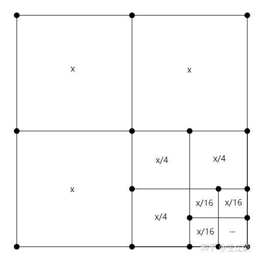

###### Mipmap 中的多级纹理尺寸逐个减半，其建立取决于两个因素：

###### 		一是**滤波方式**，即从高分辨率纹理生成低分辨率纹理时，用哪种滤波函数，效果最差的是 box滤波，好一点的则是如：Gaussian、Lanczos 等。

###### 		二是**伽马校正**，因为很多纹理是存储在 sRGB 非线性空间的，直接进行缩放会产生错误，所以在建立 Mipmap 时，需要先将纹理转到线性空间，进行缩放后，再转回 sRGB 空间。

###### 		如图建立了一系列 Mipmap，其中 d 代表细节级别，从下往上依次 d = 0,1,2 ... ：

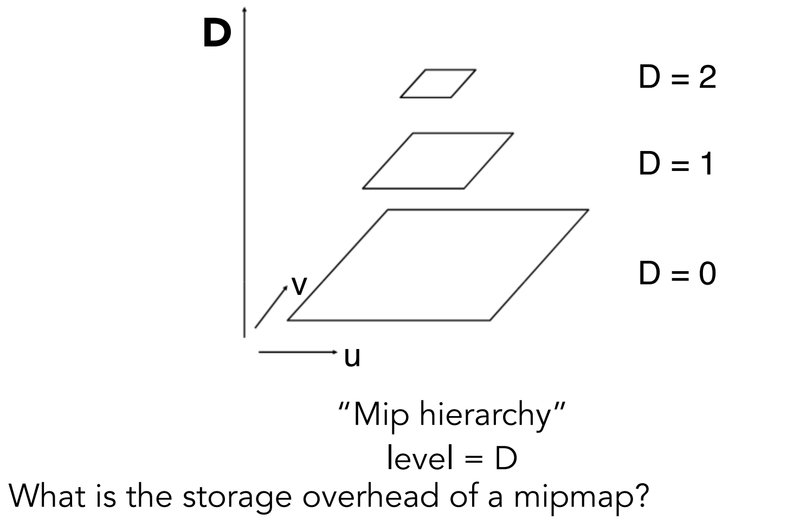


### Computing Mipmap Level D

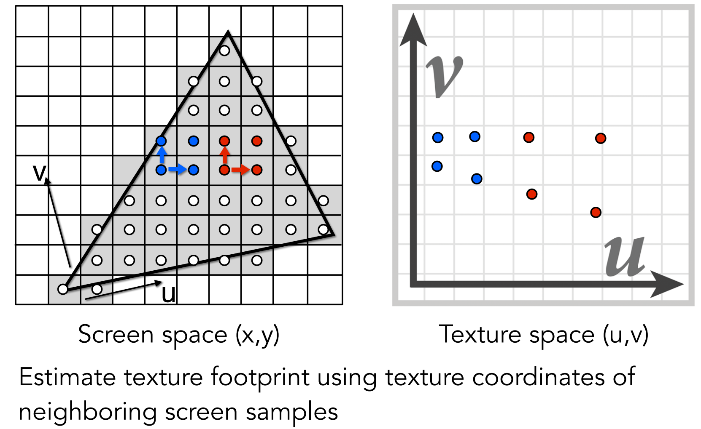

###### 		使用Mipmap如何建立查询关系呢，我们应该如何知道我们的某个屏幕像素应该使用哪个层级的Mipmap呢。前面说道，一个屏幕像素会覆盖多个纹理像素的情况，由于Mipmap只能进行正方形查询，因此就要把覆盖范围近似成正方形，假设边长为L。

###### 		那么加入一个屏幕像素覆盖率4个左右的纹理像素，即L = 2，那么我们需要使用第一层的Mipmap，要是覆盖了16个左右像素，L = 4，就应该用第二层的，也就是说如果一个屏幕像素覆盖了L * L 个纹理像素，那么就应该使用 $\log{L}$ 层Mipmap，我们就要知道我们的一个屏幕像素到底覆盖了多少的纹理像素， 也就是求 L 的值。 

###### 								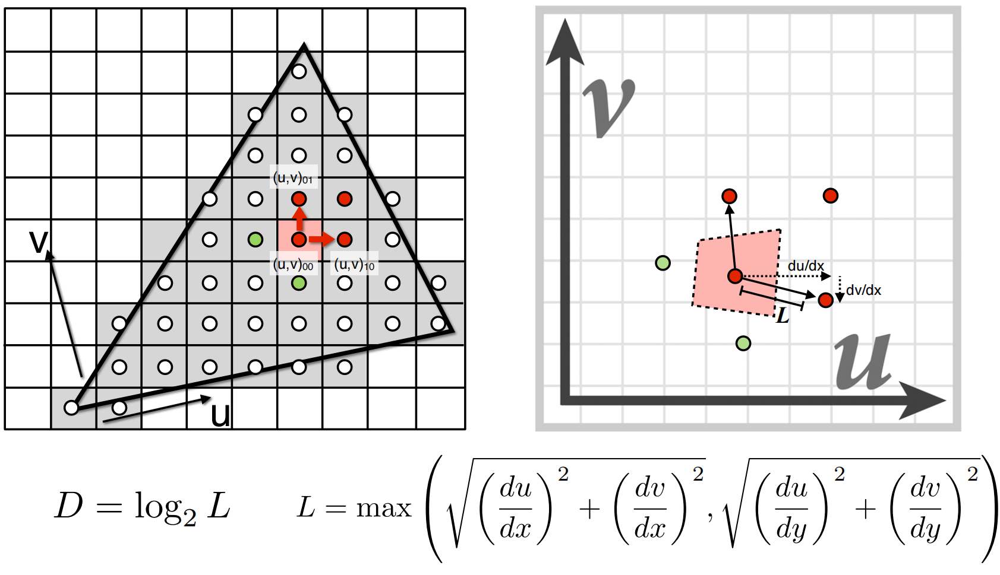				如何对 L 进行计算，首先对屏幕像素的00点进行采样，得到它对应的一块纹理像素的中心点为 $(u,v)$（上图uv坐标系中的红色区域中心）。				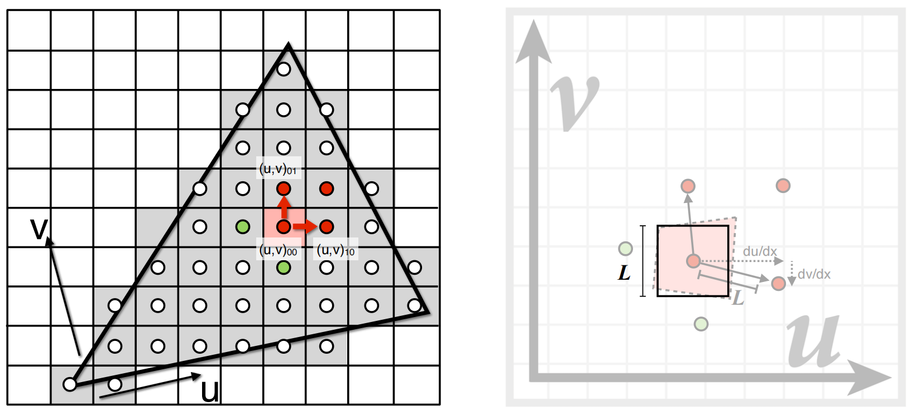

###### 			在得知屏幕像素采样点的纹理区域中心点后，我们再去采样点周边的一个屏幕像素，例如$(x+ dx, y+ dy)$，得到这个点的纹理像素中心点，算出对应的纹理像素坐标$(u+du,v+dv)$,那么我们可以近似求出L的值。 在上图中，分别取了两个点10，01代表x方向与y方向，并且在公式中也对这两个屏幕像素对应的纹理像素中心点到00像素对应的纹理像素的中心点的距离进行了取最大值的判断，近似出一个矩形的纹理覆盖。这样就获得了L的大小。可以知道应该使用哪一层的Mipmap。

### 			$L= max(\sqrt{(\frac{du}{dx})^2 + (\frac{dv}{dx})^2}, \sqrt{(\frac{du}{dy})^2 + (\frac{dv}{dy})^2})$


### Visualizatin of Mipmap Level

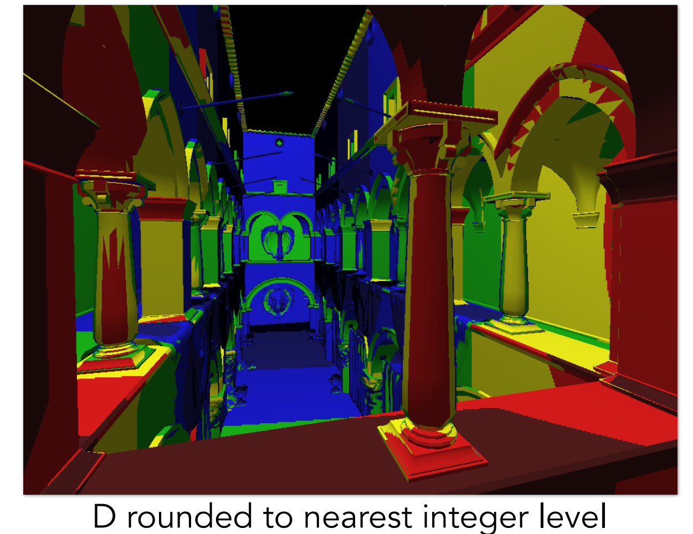

###### 				图中是Mipmap层数为整数倍的效果，可以看出在部分区域的变换非常迅速，并不是线性的变换，因为在实际情况下，从远处到近处，L的值是线性增长的，但是由于$log{L}$ 的值为整数，当 L = 1时，D = 0， L = 2时，D = 1，但是从 L =3到5时，D都等于2，也就是说当 L = 3 时，不存在 D = 1.58的情况，就会造成屏幕像素的颜色不是线性变化的。

###### 				为了解决这个问题获得更好的效果，我们使用三线性插值的的方式进行混合。


### Trilinear interpolation

#####       		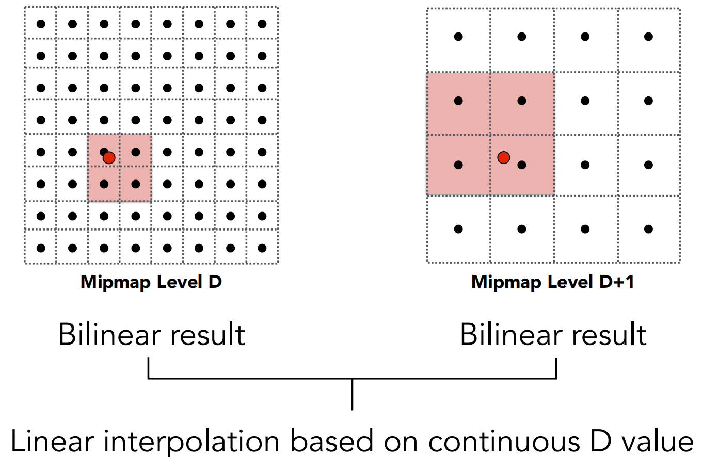  

###### 				首先使用双线性插值分别对D层级以及D+1层级的屏幕像素采样点进行求值，计算出该点的纹理贴图颜色值，然后再用一次线性插值求出D + x层的值 （x范围为0 - 1），这样等于在双线性插值的基础上再做了一趟线性插值，所以我们称之为三线性插值。这样就可以使得Mipmap层与层之间的颜色变化是连续的。

###### 		使用三线性插值后，模拟图使用了连续的D值，减少了不连续的过度。

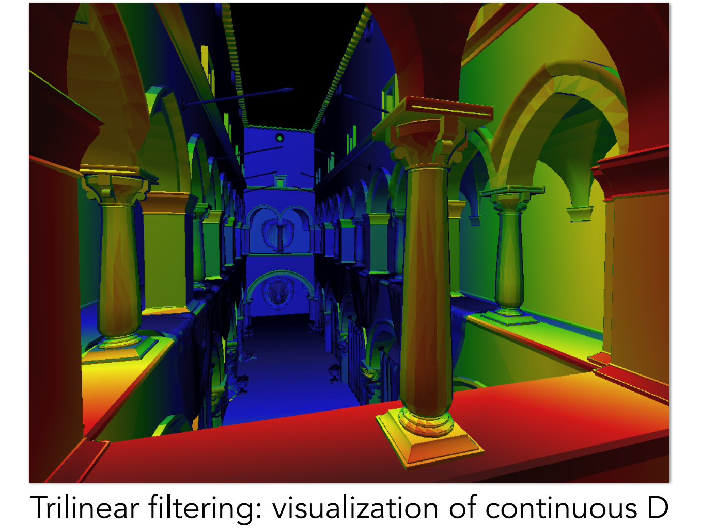


### 	Mipmap Limitations  									

###### 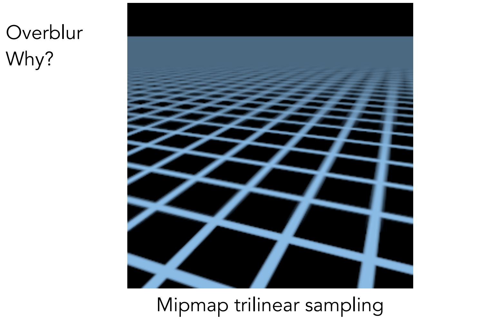										经过Mipmap三次线性插值采样后的结果，在远处非常模糊，丢失了很多细节

##### 			Mipmap的优点与带来的问题：

###### 			优点是Mipmap建立好后，占用内存固定，且使用时计算量固定。

​									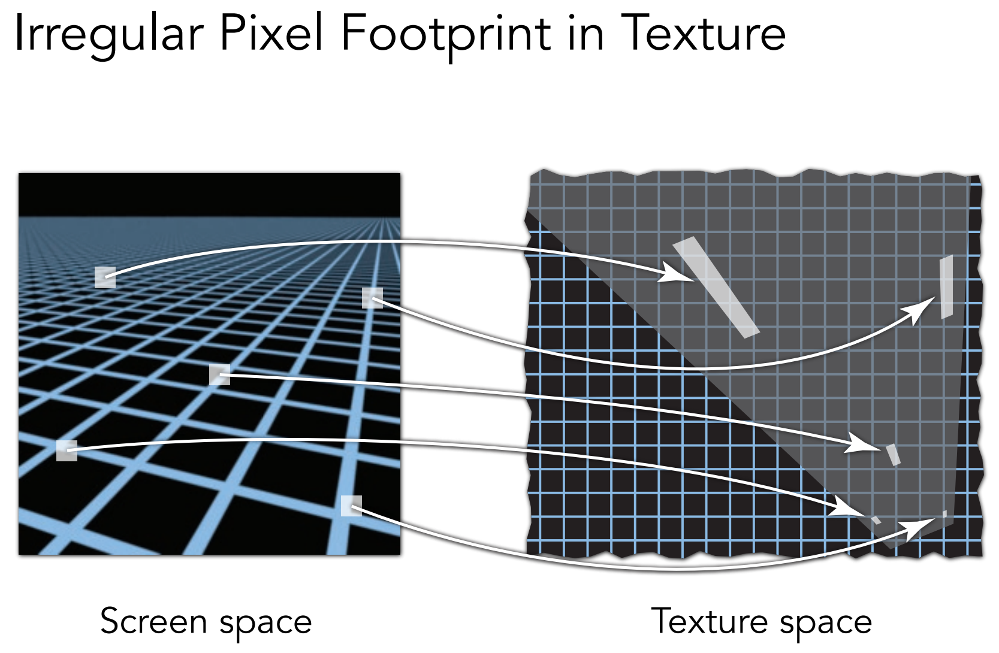			

###### 		从图中可以看出，如果采样点所对应的纹理区域是个不规则的长条形或者长宽比较大的区域，就会产生一些问题。

###### 		缺点是各向同性，当同一个pixel在横纵方向覆盖的texel的个数不同时，却对横纵两个方向计算了相同的纹理细节等级。比如横向长度大于纵向，且由此去定了细节等级D，那么纵向就会过度模糊。这个问题可以通过各向异性解决。

​		

### Anisotropic Filtering

##### 	Ripmaps and summed area tables

- Can look up **axis-aligned rectangular zones**
- Diagonal footprints still a problem

​	

### Summed-Area Table

​		简称SAT，是一种各项异性技术，其思想为：确定该pixel在纹理空间上覆盖texel区域四边形的轴线最小，包围盒(Axis-Aligned Bound Box， AABB)，然后求取该包围盒的纹理值的平均值，作为该pixel的采样纹理值 c

​		如下图所示：

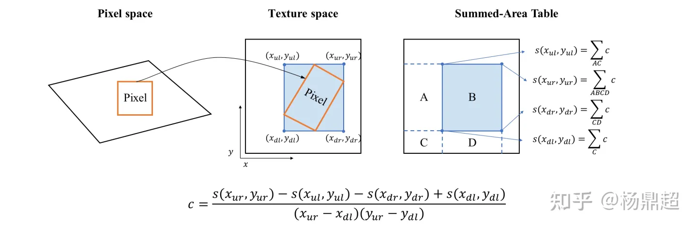

###### 																公式计算出了蓝色包围盒区域的平均采样值

​		此技术需要事先计算好和texture尺寸相同，但是深度更深的一个数组，其中每个元素保存了当前位置与左下角形成的矩阵区域内所有纹理值的总和，所以此数组称为：Summed-Area Table，在使用时，不经过遍历累加，就可以算出纹理中任意 AABB 的纹理值总和。

​		SAT技术用 AABB 去近似 pixel 覆盖的texel区域，可以预想，当该区域很狭长且沿对角线朝向时，误差会很大，会引起过度模糊。

​							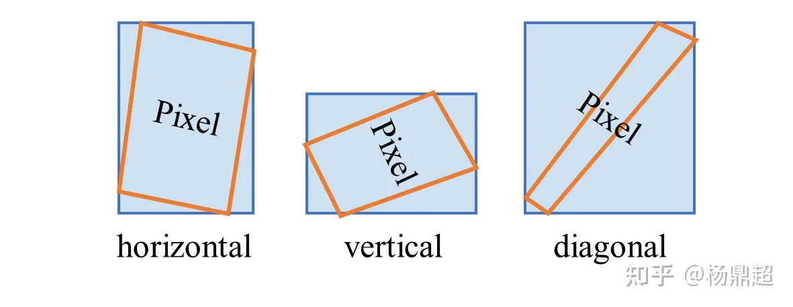

​		总结 SAT 技术的优缺点：

​			   优点：解决了横向和纵向过度模糊与抗锯齿的平衡问题

​			   缺点：SAT 纹理内存占用过高，不能解决对角线方向的过度模糊问题				

### Anisotropic Filtering  (Ripmap)						

​		**各向同性：对不同方向都采用相同的参数。**比如 Mipmap 中统一用长边来确定纹理等级，没有兼顾不同方向的 pixel 对 texel 的覆盖情况，就会导致某一个方向会过度模糊。

​		**各项异性：对不同方向采用了不同的参数。**虽然 SAT 技术对于对角线方向处理不好，但是对于横向和纵向都求取了不同的 AABB，所以可以同时兼顾横纵两个方向。

<center>
	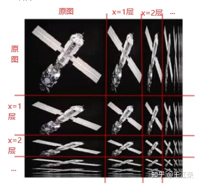
	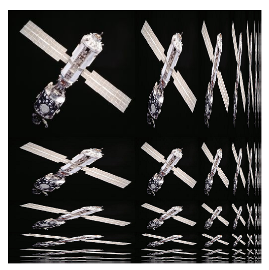
</center>

​		而各向异性过滤可以很好地解决各个方向上的过度模糊问题，由于大部分硬件都支持了 Mipmap 的特性，所以很多各向异性过滤技术也是依赖 Mipmap 算法进行改进的。

​	其中一种算法 Texram 是：沿着主方向增加采样点，再平均混合:


​		上左图的 pixel 覆盖的 texel 四边形如上右图所示：**四边形的短边用于确定 Mipmap 中的纹理等级，以避免过于模糊；四边形的长边确定主方向，长边与短边的比值确定沿主方向添加几个采样点**

​		比如：长边与短边的比值在1~2之间，就用两个采样点，采取和普通 Mipmap 相同的三线性插值后得到两个纹理值，再对两个纹理值平均混合可得到最终此 pixel 的纹理采样值。

​		游戏中的各向异性过滤常见的选项有 x4、x8 和 x16，此选项决定了在主方向最大采样点个数。比如当设置为 x4，但长边与短边的比值为 5 ，那么此时采样点也只能是 4 个。所以这个设置越大效果越好，但越耗性能。

​		以及还有将四边形区域近似为椭圆形，然后设置椭圆形的核函数进行加权混合的方法，称之为Elliptical Weighted Average(EWA)  

​		

#### 对于纹理缩小的情况，下图对比了几种不同采样方式的效果：

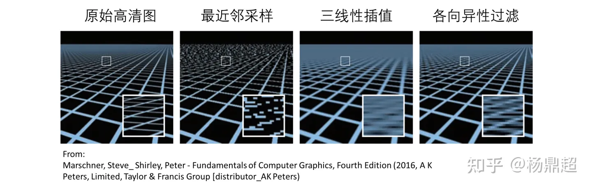


mipmap的粗略介绍 https://blog.csdn.net/qq_42428486/article/details/118856697

mipmap占用的介绍 https://zhuanlan.zhihu.com/p/36939174

纹理映射补充1：纹理映射（Texture mapping） - 王江荣的文章 - 知乎 https://zhuanlan.zhihu.com/p/364045620

纹理映射补充2：图形学基础 - 纹理 - 纹理映射流程 - 杨鼎超的文章 - 知乎 https://zhuanlan.zhihu.com/p/369977849


